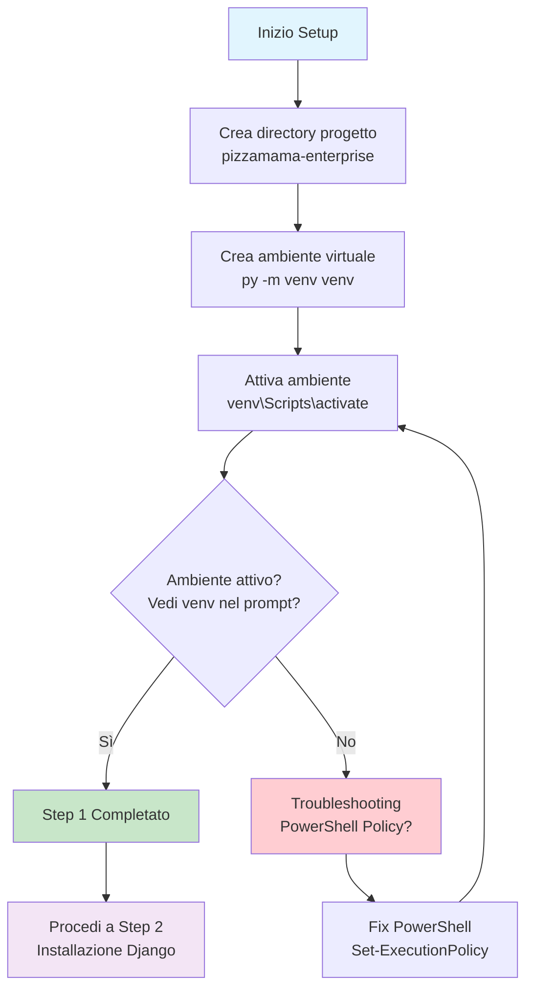

# Step 1: Creazione Ambiente e Struttura

## Obiettivo
Configurare l'ambiente di sviluppo Python isolato e creare la struttura base del progetto PizzaMama Enterprise con approccio professionale.

---

## Prerequisiti
- **Python 3.9+** installato sul sistema
- **PowerShell** o **Command Prompt**
- **Git** (opzionale ma consigliato)
- **Editor di codice** (VS Code, PyCharm, etc.)

---

## Flowchart Step 1



---

## Comandi Step by Step

### 1.1 Crea la directory del progetto
```powershell
# Naviga alla directory dove vuoi creare il progetto
cd C:\Users\TuoNome\Documents\python-dev-portfolio\web_projects\

# Crea la directory principale del progetto
mkdir pizzamama-enreprise

# Entra nella directory creata
cd pizzamama-enreprise
```

**Spiegazione:**
- **mkdir** → Crea una nuova directory
- **pizzamama-enreprise** → Nome del progetto (con typo intenzionale per consistenza)
- **cd** → Cambia directory corrente

### 1.2 Crea ambiente virtuale Python
```powershell
# Crea l'ambiente virtuale
py -m venv venv
```

**Spiegazione:**
- **py -m venv** → Modulo Python per creare ambienti virtuali
- **venv** → Nome della cartella che conterrà l'ambiente (secondo venv = nome cartella)
- **Perché virtuale?** → Isola le dipendenze del progetto dal Python di sistema

### 1.3 Attiva l'ambiente virtuale
```powershell
# Windows PowerShell
.\venv\Scripts\activate

# Windows CMD (se usi Command Prompt)
venv\Scripts\activate

# Linux/Mac (per riferimento futuro)
source venv/bin/activate
```

**Spiegazione:**
- **.\venv\Scripts\activate** → Script di attivazione Windows
- **Una volta attivato** → Tutti i comandi pip e python useranno l'ambiente isolato

---

## Verifica Successo

### Test 1: Verifica prompt ambiente
```powershell
# Il tuo prompt dovrebbe mostrare:
(venv) PS C:\...\pizzamama-enreprise>
```
**Successo:** Vedi (venv) all'inizio del prompt
**Errore:** Non vedi (venv) → Vai al Troubleshooting

### Test 2: Verifica versione Python nell'ambiente
```powershell
# Controlla che Python usi l'ambiente virtuale
python --version

# Controlla percorso Python (dovrebbe puntare alla cartella venv)
where python
```

### Test 3: Verifica struttura creata
```powershell
# Lista contenuto directory
ls

# Dovresti vedere:
# venv/  ← Cartella ambiente virtuale
```

---

## Troubleshooting

### Problema: "Execution of scripts is disabled"
**Errore completo:**
```
venv\Scripts\activate : File cannot be loaded because running scripts is disabled on this system.
```

**Soluzione:**
```powershell
# Cambia policy di esecuzione PowerShell
Set-ExecutionPolicy -ExecutionPolicy RemoteSigned -Scope CurrentUser

# Conferma con Y quando richiesto
# Poi riprova l'attivazione
.\venv\Scripts\activate
```

### Problema: "py command not found"
**Soluzioni:**
```powershell
# Opzione 1: Usa python invece di py
python -m venv venv

# Opzione 2: Verifica installazione Python
python --version

# Opzione 3: Reinstalla Python con "Add to PATH" checked
```

### Problema: Non vedo (venv) nel prompt
**Debug:**
```powershell
# 1. Verifica che lo script esista
ls venv\Scripts\

# 2. Prova percorso assoluto
C:\...\pizzamama-enreprise\venv\Scripts\activate

# 3. Verifica con Command Prompt invece di PowerShell
cmd
venv\Scripts\activate
```

### Problema: Errore "Access Denied"
**Soluzione:**
```powershell
# Esegui PowerShell come Amministratore
# Oppure cambia directory in un percorso con permessi di scrittura
cd C:\temp
mkdir pizzamama-enreprise
cd pizzamama-enreprise
py -m venv venv
```

---

## Struttura Finale Step 1

Dopo aver completato questo step, la struttura dovrebbe essere:

```
pizzamama-enreprise/
├── venv/                     ← Ambiente virtuale Python
│   ├── Scripts/             ← Script attivazione Windows
│   │   ├── activate         ← Script attivazione
│   │   ├── pip.exe          ← Package manager isolato
│   │   └── python.exe       ← Python isolato
│   ├── Lib/                 ← Librerie Python dell'ambiente
│   └── pyvenv.cfg           ← Configurazione ambiente
└── (altri file da creare nei prossimi step)
```

---

## Cosa Abbiamo Realizzato

### **Ambiente Isolato**
- **Python indipendente** dal sistema operativo
- **Dipendenze separate** per ogni progetto
- **Versioni controllate** delle librerie

### **Struttura Professionale**
- **Directory dedicata** al progetto
- **Convenzioni naming** standard
- **Approccio enterprise** scalabile

### **Preparazione per Django**
- **Ambiente pulito** per installazione Django
- **Controllo versioni** librerie
- **Isolamento** da altri progetti Python

---

## Prossimo Step

Una volta completato con successo questo step:

1. **Verifica** che vedi (venv) nel prompt
2. **Testa** python --version funzioni
3. **Procedi** a **Step 2: Installazione Django**

### Collegamento al prossimo step:
```
README-Step2-Django.md
Installeremo Django 5.0.1 nell'ambiente virtuale
Configureremo il framework web per il progetto
```

---

## Note Importanti

### **Best Practices**
- **Sempre attivare** l'ambiente prima di lavorare
- **Un ambiente per progetto** → Non riusare tra progetti diversi
- **Documentare versioni** delle dipendenze principali

### **Attenzioni**
- **Non committare** la cartella venv/ su Git
- **Disattiva ambiente** con deactivate quando finisci
- **Ricrea ambiente** se si corrompe invece di ripararlo

### **Comandi Rapidi**
```powershell
# Attiva ambiente (da eseguire ogni volta)
.\venv\Scripts\activate

# Disattiva ambiente (quando finisci)
deactivate

# Verifica ambiente attivo
echo $env:VIRTUAL_ENV
```

---

## Checklist Completamento Step 1

- [ ] **Directory creata** → pizzamama-enreprise/
- [ ] **Ambiente virtuale creato** → venv/ directory exists
- [ ] **Ambiente attivato** → (venv) visibile nel prompt
- [ ] **Python testato** → python --version funziona
- [ ] **Pronto per Step 2** → Installazione Django

**Una volta completata la checklist, sei pronto per installare Django!**