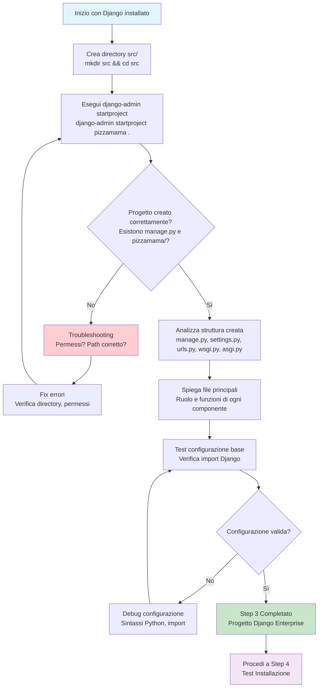

# Step 3: Creazione Progetto Django

## Obiettivo
Creare il progetto Django con struttura enterprise utilizzando la directory `src/` e configurare i file principali per un'architettura professionale scalabile.

---

## Prerequisiti
- **Step 2 completato** → Django 5.0.1 installato
- **django-admin** comando disponibile
- **Ambiente virtuale attivo** → (venv) nel prompt

---

## Flowchart Step 3



---

## Comandi Step by Step

### 3.1 Crea directory src/ (approccio enterprise)
```powershell
# Dalla root del progetto (pizzamama-enreprise/)
# Verifica di essere nella directory corretta
pwd

# Crea directory src per codice sorgente
mkdir src

# Entra nella directory src
cd src
```

**Spiegazione approccio enterprise:**
- **Separazione codice/configurazione** → src/ contiene solo codice applicazione
- **Deploy pulito** → Copi solo src/ in produzione
- **Organizzazione scalabile** → Altre directory per docs/, scripts/, tests/

### 3.2 Crea progetto Django
```powershell
# Crea progetto Django nella directory corrente
django-admin startproject pizzamama .
```

**Spiegazione comando:**
- **django-admin** → CLI tool per gestione progetti Django
- **startproject** → Subcommand per creare nuovo progetto
- **pizzamama** → Nome del progetto Django
- **.** → Crea progetto nella directory corrente (IMPORTANTE!)

**Differenza con/senza punto:**
```powershell
# CON il punto (corretto)
django-admin startproject pizzamama .
# Risultato: manage.py nella directory corrente

# SENZA il punto (crea directory extra)
django-admin startproject pizzamama
# Risultato: pizzamama/pizzamama/ (directory doppia)
```

### 3.3 Verifica struttura creata
```powershell
# Lista contenuto directory src/
ls

# Dovresti vedere:
# manage.py
# pizzamama/
```

---

## Struttura Creata Dettagliata

Dopo il comando `django-admin startproject pizzamama .` ottieni:

```
src/
├── manage.py                    ← File principale gestione Django
└── pizzamama/                   ← Package configurazione progetto
    ├── __init__.py             ← Marker package Python
    ├── settings.py             ← Configurazioni Django
    ├── urls.py                 ← URL routing principale
    ├── wsgi.py                 ← Server produzione WSGI
    └── asgi.py                 ← Server asincrono ASGI
```

---

## Analisi File Principali

### **manage.py** - Command Line Interface
```python
#!/usr/bin/env python
"""Django's command-line utility for administrative tasks."""
import os
import sys

if __name__ == '__main__':
    os.environ.setdefault('DJANGO_SETTINGS_MODULE', 'pizzamama.settings')
    # ... resto del codice
```

**Funzioni principali:**
- **runserver** → Avvia server di sviluppo
- **migrate** → Applica migrazioni database
- **createsuperuser** → Crea utente amministratore
- **collectstatic** → Raccoglie file statici per produzione

### **pizzamama/settings.py** - Configurazioni
```python
# Configurazioni principali che troveremo:
DEBUG = True                    # Modalità sviluppo
ALLOWED_HOSTS = []             # Host autorizzati
INSTALLED_APPS = [             # App Django installate
    'django.contrib.admin',
    'django.contrib.auth',
    # ...
]
DATABASES = {                  # Configurazione database
    'default': {
        'ENGINE': 'django.db.backends.sqlite3',
        'NAME': BASE_DIR / 'db.sqlite3',
    }
}
```

**Sezioni importanti:**
- **INSTALLED_APPS** → Lista app Django attive
- **MIDDLEWARE** → Pipeline request/response
- **DATABASES** → Configurazione connessioni database
- **STATIC_URL** → URL file statici (CSS, JS, immagini)

### **pizzamama/urls.py** - URL Routing
```python
from django.contrib import admin
from django.urls import path

urlpatterns = [
    path('admin/', admin.site.urls),
]
```

**Funzione:**
- **URL dispatcher** → Mappa URL a view functions
- **Pattern matching** → Regex e path patterns
- **Include mechanism** → Collegamento URL app multiple

### **pizzamama/wsgi.py** - Server Produzione
```python
import os
from django.core.wsgi import get_wsgi_application

os.environ.setdefault('DJANGO_SETTINGS_MODULE', 'pizzamama.settings')
application = get_wsgi_application()
```

**Utilizzo:**
- **Production deployment** → Gunicorn, uWSGI, Apache mod_wsgi
- **WSGI standard** → Python Web Server Gateway Interface
- **Synchronous** → Request/response tradizionale

### **pizzamama/asgi.py** - Server Asincrono
```python
import os
from django.core.asgi import get_asgi_application

os.environ.setdefault('DJANGO_SETTINGS_MODULE', 'pizzamama.settings')
application = get_asgi_application()
```

**Utilizzo:**
- **Async deployment** → Daphne, Uvicorn, Hypercorn
- **WebSockets** → Real-time communication
- **HTTP/2** → Performance migliorata

---

## Verifica Configurazione

### Test 1: Verifica file creati
```powershell
# Controlla che tutti i file esistano
ls manage.py
ls pizzamama/
ls pizzamama/settings.py
ls pizzamama/urls.py
```

### Test 2: Verifica sintassi Python
```powershell
# Test import settings (deve essere senza errori)
python -c "import pizzamama.settings"

# Test import WSGI application
python -c "from pizzamama.wsgi import application"

# Test import ASGI application
python -c "from pizzamama.asgi import application"
```

### Test 3: Verifica manage.py funziona
```powershell
# Test comando help (senza errori)
python manage.py help

# Test check configurazione
python manage.py check --deploy
```

---

## Troubleshooting

### Problema: "No module named 'pizzamama'"
**Cause possibili:**
- Non sei nella directory src/
- Nome progetto scritto male
- __init__.py mancante

**Soluzioni:**
```powershell
# Verifica directory corrente
pwd
# Dovrebbe essere: .../pizzamama-enreprise/src

# Verifica struttura
ls pizzamama/

# Se manca __init__.py, crealo
echo. > pizzamama/__init__.py
```

### Problema: "Permission denied creating files"
**Soluzioni:**
```powershell
# Opzione 1: Cambia proprietà directory
takeown /f . /r

# Opzione 2: Esegui come amministratore
# Right-click PowerShell → "Run as Administrator"

# Opzione 3: Usa directory diversa
cd C:\temp
mkdir test-django
cd test-django
django-admin startproject pizzamama .
```

### Problema: "django-admin not found"
**Debug:**
```powershell
# Verifica ambiente virtuale attivo
echo $env:VIRTUAL_ENV

# Se non attivo, attivalo
cd ..
.\venv\Scripts\activate
cd src

# Verifica Django installato
pip show Django
```

### Problema: Directory doppia (pizzamama/pizzamama/)
**Causa:** Dimenticato il punto nel comando

**Fix:**
```powershell
# Rimuovi tutto e ricrea correttamente
cd ..
rm -r src
mkdir src
cd src
django-admin startproject pizzamama .
```

---

## Struttura Finale Step 3

Dopo completamento, struttura completa del progetto:

```
pizzamama-enreprise/                ← Root progetto
├── venv/                          ← Ambiente virtuale Python
│   ├── Scripts/
│   ├── Lib/
│   └── ...
└── src/                           ← Codice sorgente (NEW)
    ├── manage.py                  ← CLI Django (NEW)
    └── pizzamama/                 ← Configurazione progetto (NEW)
        ├── __init__.py            ← Package marker (NEW)
        ├── settings.py            ← Configurazioni Django (NEW)
        ├── urls.py                ← URL routing (NEW)
        ├── wsgi.py                ← WSGI server (NEW)
        └── asgi.py                ← ASGI server (NEW)
```

---

## Cosa Abbiamo Realizzato

### **Progetto Django Enterprise**
- **Struttura professionale** → Directory src/ separata
- **Configurazione base** → Settings, URL, server configs
- **CLI management** → Tool manage.py per sviluppo

### **Architettura Scalabile**
- **Separation of concerns** → Codice separato da configurazioni
- **Production ready** → WSGI/ASGI entry points
- **Development friendly** → Debug settings attivi

### **Foundation Completa**
- **URL routing** → Sistema dispatch richieste
- **Settings management** → Configurazione centralizzata
- **Database ready** → SQLite configurato di default

---

## Concetti Chiave Django

### **MVT Pattern (Model-View-Template)**
- **Model** → Logica dati e database
- **View** → Logica business e controllo
- **Template** → Presentazione e HTML

### **App vs Project**
- **Project** → Configurazione generale (quello che abbiamo creato)
- **App** → Moduli funzionali specifici (creeremo nei prossimi step)

### **Settings Module**
- **Environment-specific** → settings/dev.py, settings/prod.py
- **Configuration as code** → Tutto versionato
- **12-factor app** → Best practices deployment

---

## Prossimo Step

Una volta completato con successo questo step:

1. **Verifica** manage.py esiste e funziona
2. **Testa** python -c "import pizzamama.settings" senza errori
3. **Procedi** a **Step 4: Test Installazione**

### Collegamento al prossimo step:
```
README-Step4-Test.md
Avvieremo il server di sviluppo Django
Verifichiamo la pagina di benvenuto
Testiamo che tutto funzioni correttamente
```

---

## Note Importanti

### **Convenzioni Django**
- **Nome progetto** → Evita nomi come "django", "test", keywords Python
- **Directory structure** → Segui convenzioni community
- **Settings security** → Non committare secret keys

### **Approccio Enterprise**
- **src/ directory** → Separazione codice sorgente
- **Environment isolation** → Virtual environment sempre attivo
- **Configuration management** → Settings modulari

### **Best Practices**
```powershell
# Sempre esegui comandi Django dalla directory con manage.py
cd src/
python manage.py command

# Non da directory superiori
cd ..
python src/manage.py command  # Evita questo
```

---

## Checklist Completamento Step 3

- [ ] **Directory src/ creata** → Approccio enterprise
- [ ] **Progetto Django creato** → manage.py e pizzamama/ esistono
- [ ] **File configurazione presenti** → settings.py, urls.py, wsgi.py, asgi.py
- [ ] **Import funziona** → python -c "import pizzamama.settings" ok
- [ ] **manage.py funzionale** → python manage.py help senza errori
- [ ] **Pronto per Step 4** → Test server sviluppo

**Una volta completata la checklist, sei pronto per testare il server di sviluppo Django!**