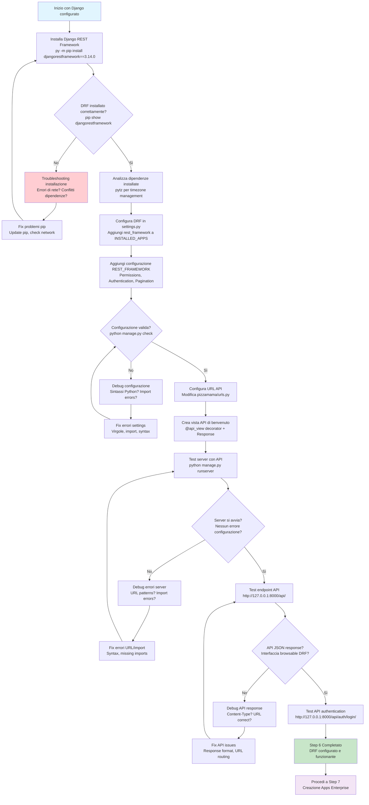

# Step 6: Django REST Framework Setup

## Obiettivo
Installare Django REST Framework per creare API REST professionali, configurare le impostazioni API e creare il primo endpoint di benvenuto per testare il sistema.

---

## Prerequisiti
- **Step 5 completato** → Database e admin panel funzionanti
- **Ambiente virtuale attivo** → (venv) nel prompt
- **Django 5.0.1** → Framework base installato

---

## Flowchart Step 6



---

## Comandi Step by Step

### 6.1 Installa Django REST Framework
```powershell
# Installa versione specifica di DRF
py -m pip install djangorestframework==3.14.0
```

**Spiegazione installazione:**
- **djangorestframework==3.14.0** → Versione stabile e compatibile con Django 5.0.1
- **API REST completo** → Serializers, ViewSets, Permissions, Authentication
- **Browsable API** → Interfaccia web per testare API

### 6.2 Verifica installazione DRF
```powershell
# Verifica package installato
pip show djangorestframework

# Lista tutti i package per controllo
pip list
```

**Output atteso:**
```
Name: djangorestframework
Version: 3.14.0
Summary: Web APIs for Django, made easy.
Dependencies: django, pytz
```

---

## Analisi Dipendenze DRF

### **Dipendenze automaticamente installate:**

#### **pytz (2025.2)**
- **Scopo:** Gestione timezone completa per Python
- **Funzione:** Supporto timezone-aware datetime objects
- **DRF usage:** Serializzazione date/orari con timezone
- **Produzione:** Essenziale per API internazionali

---

## Configurazione Django Settings

### 6.3 Configura DRF in settings.py
```powershell
# Apri file configurazione Django
code pizzamama/settings.py
```

#### **Aggiungi DRF a INSTALLED_APPS:**
Trova la sezione `INSTALLED_APPS` e modifica così:

```python
INSTALLED_APPS = [
    'django.contrib.admin',
    'django.contrib.auth',
    'django.contrib.contenttypes',
    'django.contrib.sessions',
    'django.contrib.messages',
    'django.contrib.staticfiles',
    
    # Third party apps
    'rest_framework',          # ← AGGIUNGI QUESTA RIGA
]
```

#### **Aggiungi configurazione REST_FRAMEWORK:**
Aggiungi alla fine del file `settings.py`:

```python
# Django REST Framework Configuration
REST_FRAMEWORK = {
    'DEFAULT_PERMISSION_CLASSES': [
        'rest_framework.permissions.IsAuthenticated',
    ],
    'DEFAULT_AUTHENTICATION_CLASSES': [
        'rest_framework.authentication.SessionAuthentication',
        'rest_framework.authentication.BasicAuthentication',
    ],
    'DEFAULT_PAGINATION_CLASS': 'rest_framework.pagination.PageNumberPagination',
    'PAGE_SIZE': 20
}
```

**Spiegazione configurazione:**

#### **DEFAULT_PERMISSION_CLASSES**
- **IsAuthenticated** → Solo utenti loggati possono accedere alle API
- **Security first** → Protezione default per tutte le API
- **Override possibile** → Singole view possono cambiare permessi

#### **DEFAULT_AUTHENTICATION_CLASSES**
- **SessionAuthentication** → Usa sessioni Django standard
- **BasicAuthentication** → HTTP Basic Auth per testing
- **Production ready** → Token/JWT authentication da aggiungere dopo

#### **DEFAULT_PAGINATION_CLASS**
- **PageNumberPagination** → Paginazione tipo ?page=2
- **PAGE_SIZE: 20** → 20 elementi per pagina default
- **Performance** → Evita response troppo grandi

### 6.4 Verifica configurazione
```powershell
# Test che configurazione sia syntactically correct
python manage.py check
```

**Output atteso:**
```
System check identified no issues (0 silenced).
```

---

## Configurazione URL API

### 6.5 Configura URL routing per API
```powershell
# Apri file URL principale
code pizzamama/urls.py
```

**Sostituisci tutto il contenuto con:**
```python
from django.contrib import admin
from django.urls import path, include
from rest_framework.decorators import api_view
from rest_framework.response import Response

@api_view(['GET'])
def api_root(request):
    return Response({
        'message': 'Benvenuto alle API di PizzaMama!',
        'version': '1.0',
        'endpoints': {
            'admin': '/admin/',
            'api-auth': '/api/auth/login/',
        }
    })

urlpatterns = [
    path('admin/', admin.site.urls),
    path('api/', api_root, name='api-root'),           # ← Homepage API
    path('api/auth/', include('rest_framework.urls')), # ← Login/logout DRF
]
```

**Spiegazione URL configuration:**

#### **@api_view(['GET']) decorator**
- **DRF decorator** → Trasforma funzione in API view
- **HTTP methods** → Specifica metodi accettati
- **Auto serialization** → Response automaticamente in JSON

#### **Response object**
- **DRF Response** → Non HttpResponse Django standard
- **Content negotiation** → JSON, XML, HTML based su Accept header
- **Browsable API** → HTML interface per browser

#### **URL patterns**
- **api/** → Homepage API con informazioni generali
- **api/auth/** → Include URL DRF per login/logout
- **admin/** → Mantiene admin panel Django

---

## Test Configurazione DRF

### 6.6 Test server con DRF configurato
```powershell
# Avvia server di sviluppo
python manage.py runserver
```

**Output atteso (nuovo con DRF):**
```
System check identified no issues (0 silenced).
...
Starting development server at http://127.0.0.1:8000/
```

### 6.7 Test API endpoint JSON
```
URL: http://127.0.0.1:8000/api/
```

**Response JSON attesa:**
```json
{
    "message": "Benvenuto alle API di PizzaMama!",
    "version": "1.0",
    "endpoints": {
        "admin": "/admin/",
        "api-auth": "/api/auth/login/"
    }
}
```

### 6.8 Test interfaccia browsable DRF
**Stessa URL nel browser:** `http://127.0.0.1:8000/api/`

**Interfaccia attesa:**
- **Header:** "Django REST framework"
- **Content:** JSON response formattato
- **Options:** Raw data, JSON, API formats
- **Navigation:** Breadcrumbs, browsable links

### 6.9 Test API authentication
```
URL: http://127.0.0.1:8000/api/auth/login/
```

**Interfaccia login DRF:**
- **Form fields:** Username, Password
- **Django styling** → Consistent con admin panel
- **Login functionality** → Usa superuser creato in Step 5

---

## Troubleshooting

### Problema: "No module named 'rest_framework'"
**Causa:** DRF non installato nell'ambiente virtuale corretto

**Soluzioni:**
```powershell
# Verifica ambiente attivo
echo $env:VIRTUAL_ENV

# Se non attivo, attiva
.\venv\Scripts\activate

# Reinstalla DRF nell'ambiente corretto
py -m pip install djangorestframework==3.14.0
```

### Problema: "ImproperlyConfigured" per REST_FRAMEWORK
**Errore tipico:**
```
django.core.exceptions.ImproperlyConfigured: 
Requested setting REST_FRAMEWORK, but settings are not configured.
```

**Soluzioni:**
```powershell
# Verifica sintassi settings.py
python -c "import pizzamama.settings"

# Controlla:
# - Virgole dopo ogni elemento in INSTALLED_APPS
# - Indentazione corretta in REST_FRAMEWORK dict
# - Quotes corrette per stringhe
```

### Problema: "URL pattern not found" per /api/
**Debug:**
```powershell
# Verifica URL patterns
python manage.py show_urls  # Se django-extensions installato

# Oppure test manuale:
python -c "
from pizzamama.urls import urlpatterns
for pattern in urlpatterns:
    print(pattern)
"
```

### Problema: "AttributeError: 'function' object has no attribute 'csrf_exempt'"
**Causa:** Missing import o decorator errato

**Fix:**
```python
# Verifica import corretti in urls.py
from rest_framework.decorators import api_view
from rest_framework.response import Response

# Verifica decorator syntax
@api_view(['GET'])  # Non @api_view() o @api_view
def api_root(request):
    # ...
```

### Problema: Browser mostra HTML invece di JSON
**Causa:** Content negotiation DRF

**Spiegazione:**
- **Normale behavior** → DRF mostra HTML browsable per browser
- **JSON per API clients** → Usa curl o Postman per JSON puro
- **Test JSON via browser** → Aggiungi ?format=json all'URL

**Test JSON puro:**
```powershell
# Con curl (se disponibile)
curl http://127.0.0.1:8000/api/

# Con browser + format parameter
# http://127.0.0.1:8000/api/?format=json
```

---

## Struttura Finale Step 6

Dopo completamento, nessun nuovo file, ma configurazioni aggiornate:

```
pizzamama-enreprise/
├── venv/
│   └── Lib/site-packages/
│       └── rest_framework/        ← DRF package (NEW)
└── src/
    ├── manage.py
    ├── db.sqlite3
    └── pizzamama/
        ├── settings.py             ← Updated: INSTALLED_APPS + REST_FRAMEWORK
        ├── urls.py                 ← Updated: API endpoints + DRF includes
        ├── wsgi.py
        └── asgi.py
```

---

## Cosa Abbiamo Realizzato

### **API REST Framework**
- **DRF installed** → Framework API completo
- **Configuration** → Permissions, authentication, pagination
- **URL routing** → API endpoints configurati

### **API Endpoints Funzionanti**
- **Homepage API** → /api/ con informazioni sistema
- **Authentication** → /api/auth/login/ e /api/auth/logout/
- **Browsable interface** → HTML interface per development

### **Enterprise-Ready Configuration**
- **Security first** → IsAuthenticated default
- **Multiple auth** → Session + Basic authentication
- **Pagination** → Performance optimization built-in

### **Development Tools**
- **Browsable API** → Interface web per testing
- **Multiple formats** → JSON, XML, HTML content negotiation
- **Debug friendly** → Error messages dettagliati

---

## Prossimo Step

Una volta completato con successo questo step:

1. **Verifica** API endpoint /api/ restituisce JSON
2. **Testa** interfaccia browsable DRF funziona
3. **Procedi** a **Step 7: Creazione Apps Enterprise**

### Collegamento al prossimo step:
```
README-Step7-Apps.md
Creeremo le app Django modulari enterprise
Configureremo accounts, products, orders apps
Implementeremo struttura scalabile per business logic
```

---

## Note Importanti

### **DRF vs Django Views**
- **Django views** → Restituiscono HTML templates
- **DRF views** → Restituiscono JSON/XML data
- **Compatibili** → Possono coesistere nello stesso progetto

### **API Authentication Strategy**
- **Development** → SessionAuthentication per browser testing
- **Production** → TokenAuthentication o JWT per mobile/SPA
- **BasicAuthentication** → Solo per development/testing

### **Content Negotiation**
- **Accept header** → Client specifica formato preferito
- **Format suffix** → ?format=json force formato specifico
- **Default** → JSON per API clients, HTML per browser

### **Permissions Hierarchy**
```
1. View-level permissions (più specifico)
2. DEFAULT_PERMISSION_CLASSES (fallback)
3. AllowAny (se specificato esplicitamente)
```

---

## Checklist Completamento Step 6

- [ ] **DRF installato** → pip show djangorestframework successful
- [ ] **INSTALLED_APPS updated** → rest_framework aggiunto
- [ ] **REST_FRAMEWORK configured** → Permissions, auth, pagination
- [ ] **URL patterns configured** → /api/ e /api/auth/ funzionanti
- [ ] **API endpoint tested** → JSON response da /api/
- [ ] **Browsable interface** → HTML interface accessibile
- [ ] **Pronto per Step 7** → Apps enterprise creation

**Una volta completata la checklist, sei pronto per creare la struttura apps enterprise modulare!**