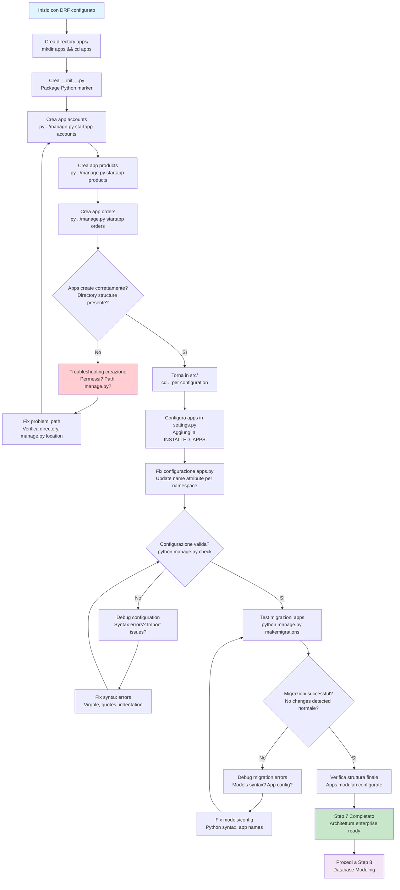

# Step 7: Creazione Apps Enterprise

## Obiettivo
Creare la struttura apps Django modulare con approccio enterprise, configurare le app accounts, products e orders nella directory apps/ e preparare l'architettura scalabile per business logic separata.

---

## Prerequisiti
- **Step 6 completato** → Django REST Framework configurato
- **API endpoints funzionanti** → /api/ e /api/auth/ testati
- **Struttura Django base** → Project configurato

---

## Flowchart Step 7



---

## Comandi Step by Step

### 7.1 Crea directory apps/ (devi essere in src/)
```powershell
# Verifica di essere nella directory src/
pwd
# Output atteso: .../pizzamama-enreprise/src

# Crea directory per apps enterprise
mkdir apps

# Entra nella directory apps
cd apps
```

**Spiegazione approccio enterprise:**
- **Separazione logica** → Apps business logic separate da project config
- **Modularità** → Ogni app ha responsabilità specifica
- **Scalabilità** → Facile aggiungere nuove app senza confusione
- **Team development** → Team diversi possono lavorare su app diverse

### 7.2 Crea file __init__.py per package Python
```powershell
# Windows PowerShell
New-Item -Path "__init__.py" -ItemType File -Force

# Oppure comando universale
echo $null > __init__.py

# Linux/Mac (per riferimento)
touch __init__.py
```

**Spiegazione __init__.py:**
- **Python package marker** → Indica che directory è package Python
- **Import support** → Permette import come apps.accounts
- **Namespace isolation** → Evita conflitti naming

### 7.3 Crea le app Django una alla volta
```powershell
# Crea app accounts (gestione utenti)
py ../manage.py startapp accounts

# Crea app products (catalogo pizze)
py ../manage.py startapp products

# Crea app orders (gestione ordini)
py ../manage.py startapp orders
```

**Spiegazione comando:**
- **py ../manage.py** → Esegue manage.py dalla directory parent
- **startapp** → Django command per creare app
- **app_name** → Nome app diventa nome directory

**Business logic per app:**
- **accounts** → User management, authentication, profiles, addresses
- **products** → Pizza catalog, ingredients, categories, pricing
- **orders** → Shopping cart, orders, payments, delivery

### 7.4 Verifica struttura creata
```powershell
# Lista contenuto directory apps/
ls

# Output atteso:
# __init__.py
# accounts/
# products/
# orders/
```

**Struttura dettagliata:**
```
apps/
├── __init__.py                    ← Package marker
├── accounts/                      ← User management app
│   ├── migrations/
│   ├── __init__.py
│   ├── admin.py
│   ├── apps.py
│   ├── models.py
│   ├── tests.py
│   └── views.py
├── products/                      ← Catalog app
│   ├── migrations/
│   ├── __init__.py
│   ├── admin.py
│   ├── apps.py
│   ├── models.py
│   ├── tests.py
│   └── views.py
└── orders/                        ← Orders app
    ├── migrations/
    ├── __init__.py
    ├── admin.py
    ├── apps.py
    ├── models.py
    ├── tests.py
    └── views.py
```

---

## Configurazione Apps in Django

### 7.5 Torna in src/ per configurazione
```powershell
# Torna alla directory src/ (parent directory)
cd ..

# Verifica di essere in src/
pwd
ls manage.py  # Deve esistere
```

### 7.6 Configura apps nei Django settings
```powershell
# Apri file configurazione
code pizzamama/settings.py
```

**Aggiorna INSTALLED_APPS:**
Trova la sezione `INSTALLED_APPS` e aggiorna così:

```python
INSTALLED_APPS = [
    'django.contrib.admin',
    'django.contrib.auth',
    'django.contrib.contenttypes',
    'django.contrib.sessions',
    'django.contrib.messages',
    'django.contrib.staticfiles',
    
    # Third party apps
    'rest_framework',
    
    # Local apps
    'apps.accounts',    # ← AGGIUNGI
    'apps.products',    # ← AGGIUNGI
    'apps.orders',      # ← AGGIUNGI
]
```

**Spiegazione naming convention:**
- **apps.accounts** → Full Python path per import
- **Namespace apps** → Evita conflitti con package esterni
- **Enterprise structure** → Scalabile per progetti grandi

---

## Fix Configurazione App (IMPORTANTE!)

### 7.7 Fix file apps.py per ogni app creata

Django crea apps.py con nome relativo, ma noi usiamo namespace. Dobbiamo correggere:

#### **Fix apps/accounts/apps.py:**
```powershell
# Apri file configurazione app accounts
code apps/accounts/apps.py
```

**Cambia il contenuto da:**
```python
from django.apps import AppConfig

class AccountsConfig(AppConfig):
    default_auto_field = 'django.db.models.BigAutoField'
    name = 'accounts'  # ← QUESTO È SBAGLIATO
```

**A:**
```python
from django.apps import AppConfig

class AccountsConfig(AppConfig):
    default_auto_field = 'django.db.models.BigAutoField'
    name = 'apps.accounts'  # ← CORRETTO: namespace completo
```

#### **Fix apps/products/apps.py:**
```powershell
# Apri file configurazione app products
code apps/products/apps.py
```

**Cambia:**
```python
from django.apps import AppConfig

class ProductsConfig(AppConfig):
    default_auto_field = 'django.db.models.BigAutoField'
    name = 'apps.products'  # ← Cambia da 'products' a 'apps.products'
```

#### **Fix apps/orders/apps.py:**
```powershell
# Apri file configurazione app orders
code apps/orders/apps.py
```

**Cambia:**
```python
from django.apps import AppConfig

class OrdersConfig(AppConfig):
    default_auto_field = 'django.db.models.BigAutoField'
    name = 'apps.orders'  # ← Cambia da 'orders' a 'apps.orders'
```

**Spiegazione fix:**
- **name attribute** → Deve corrispondere al path in INSTALLED_APPS
- **Import path** → Django usa questo per trovare l'app
- **Namespace consistency** → Tutti imports devono usare apps.app_name

---

## Verifica Configurazione

### 7.8 Test configurazione Django
```powershell
# Test che configurazione sia corretta
python manage.py check
```

**Output atteso:**
```
System check identified no issues (0 silenced).
```

**Se ci sono errori, typical issues:**
- **ImportError** → Nome app sbagliato in settings.py o apps.py
- **SyntaxError** → Virgole mancanti in INSTALLED_APPS
- **ModuleNotFoundError** → __init__.py mancante in apps/

### 7.9 Test migrazioni apps (opzionale)
```powershell
# Crea migrazioni per le nuove app
python manage.py makemigrations accounts
python manage.py makemigrations products
python manage.py makemigrations orders
```

**Output atteso:**
```
No changes detected in app 'accounts'
No changes detected in app 'products'
No changes detected in app 'orders'
```

**Spiegazione:**
- **No changes detected** → Normale, non abbiamo ancora creato models custom
- **Success** → Django riconosce le app correttamente
- **Preparazione** → Ready per aggiungere models nei prossimi step

---

## Troubleshooting

### Problema: "No module named 'apps'"
**Causa:** __init__.py mancante in directory apps/

**Soluzione:**
```powershell
# Verifica esistenza __init__.py
ls apps/__init__.py

# Se mancante, crealo
echo $null > apps/__init__.py

# Ritest configurazione
python manage.py check
```

### Problema: "ImportError: cannot import name 'AccountsConfig'"
**Causa:** Name mismatch in apps.py

**Debug:**
```powershell
# Verifica contenuto apps.py
cat apps/accounts/apps.py

# Verifica che name = 'apps.accounts'
# Verifica che class name sia AccountsConfig
```

### Problema: "SyntaxError" in settings.py
**Causa:** Virgole mancanti in INSTALLED_APPS

**Fix:**
```python
# SBAGLIATO:
INSTALLED_APPS = [
    'django.contrib.admin',
    'rest_framework'
    'apps.accounts',    # ← Manca virgola sopra
]

# CORRETTO:
INSTALLED_APPS = [
    'django.contrib.admin',
    'rest_framework',    # ← Virgola aggiunta
    'apps.accounts',
]
```

### Problema: "App isn't loaded" durante makemigrations
**Causa:** App non riconosciuta da Django

**Debug steps:**
```powershell
# 1. Verifica app in INSTALLED_APPS
python -c "from django.conf import settings; print(settings.INSTALLED_APPS)"

# 2. Verifica import app config
python -c "from apps.accounts.apps import AccountsConfig; print(AccountsConfig.name)"

# 3. Check Django app registry
python manage.py shell
>>> from django.apps import apps
>>> apps.get_app_config('accounts')
>>> exit()
```

---

## Struttura Finale Step 7

Dopo completamento, struttura enterprise completa:

```
pizzamama-enreprise/                ← Root progetto
├── venv/                          ← Ambiente virtuale
└── src/                           ← Codice sorgente
    ├── manage.py                  ← CLI Django
    ├── db.sqlite3                 ← Database SQLite
    ├── apps/                      ← Apps business logic (NEW)
    │   ├── __init__.py            ← Package marker (NEW)
    │   ├── accounts/              ← User management app (NEW)
    │   │   ├── migrations/
    │   │   ├── __init__.py
    │   │   ├── admin.py
    │   │   ├── apps.py            ← Fixed: name='apps.accounts'
    │   │   ├── models.py
    │   │   ├── tests.py
    │   │   └── views.py
    │   ├── products/              ← Catalog app (NEW)
    │   │   ├── migrations/
    │   │   ├── __init__.py
    │   │   ├── admin.py
    │   │   ├── apps.py            ← Fixed: name='apps.products'
    │   │   ├── models.py
    │   │   ├── tests.py
    │   │   └── views.py
    │   └── orders/                ← Orders app (NEW)
    │       ├── migrations/
    │       ├── __init__.py
    │       ├── admin.py
    │       ├── apps.py            ← Fixed: name='apps.orders'
    │       ├── models.py
    │       ├── tests.py
    │       └── views.py
    └── pizzamama/                 ← Project configuration
        ├── __init__.py
        ├── settings.py            ← Updated: apps in INSTALLED_APPS
        ├── urls.py                ← DRF configured
        ├── wsgi.py
        └── asgi.py
```

---

## Cosa Abbiamo Realizzato

### **Architettura Enterprise Modulare**
- **Apps separate** → Business logic modulare e scalabile
- **Namespace isolation** → apps.* prefix evita conflitti
- **Team development** → Sviluppo parallelo su app diverse

### **Business Logic Structure**
- **accounts app** → User management, profiles, authentication
- **products app** → Catalog management, inventory, pricing
- **orders app** → Cart, checkout, payment, delivery tracking

### **Django Best Practices**
- **App config** → Properly configured AppConfig classes
- **Migration ready** → Prepared per database modeling
- **Import structure** → Consistent Python import paths

### **Scalability Foundation**
- **Modular design** → Easy to add new apps
- **Separation of concerns** → Each app has specific responsibility
- **Team collaboration** → Different teams can own different apps

---

## Concetti Enterprise Django

### **App vs Project**
- **Project** → Overall Django configuration (pizzamama/)
- **App** → Specific business functionality (accounts, products, orders)
- **Reusability** → Apps can be reused across projects

### **Django App Structure**
- **models.py** → Database models and business logic
- **views.py** → Request handling and response logic
- **admin.py** → Admin interface configuration
- **apps.py** → App configuration and metadata
- **migrations/** → Database schema changes tracking

### **Namespace Strategy**
- **apps.accounts** → Clear namespace for large projects
- **Import clarity** → Explicit about app location
- **Conflict avoidance** → Prevents naming conflicts with external packages

---

## Prossimo Step

Una volta completato con successo questo step:

1. **Verifica** python manage.py check senza errori
2. **Testa** makemigrations per tutte le app funziona
3. **Procedi** a **Step 8: Database Modeling**

### Collegamento al prossimo step:
```
README-Step8-ModelsAccounts.md
Creeremo modelli database enterprise per accounts
Implementeremo CustomUser, Profile, Address models
Configureremo sistema utenti avanzato con Pillow
```

---

## Note Importanti

### **Django Apps Philosophy**
- **"Apps should do one thing and do it well"** → Unix philosophy
- **Loose coupling** → Apps should be independent
- **High cohesion** → Related functionality in same app

### **Enterprise Considerations**
- **Microservices ready** → Apps can become separate services
- **API boundaries** → Each app can expose its own API
- **Database separation** → Future: each app can have own database

### **Development Workflow**
```powershell
# Sempre esegui comandi dalla directory src/
cd src/

# Management commands now recognize all apps
python manage.py command --app accounts
python manage.py command --app products
python manage.py command --app orders
```

---

## Checklist Completamento Step 7

- [ ] **Directory apps/ creata** → Namespace enterprise
- [ ] **Apps create** → accounts, products, orders directories
- [ ] **__init__.py presente** → Python package marker
- [ ] **INSTALLED_APPS updated** → Tutte le app aggiunte
- [ ] **apps.py fixed** → Name attribute corretto per namespace
- [ ] **Configuration check** → python manage.py check success
- [ ] **Pronto per Step 8** → Database modeling e CustomUser

**Una volta completata la checklist, sei pronto per creare modelli database enterprise!**