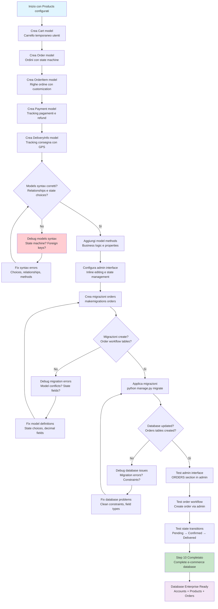

# Step 10: Database Modeling Enterprise - Orders

## Obiettivo
Completare il database modeling enterprise creando modelli Order, OrderItem, Cart e Payment per gestire workflow ordini completo con state machine, tracking delivery e integrazione payment ready.

---

## Prerequisiti
- **Step 9 completato** → Products catalog system funzionante
- **CustomUser e Products** → Database models implementati
- **Admin interface testata** → ACCOUNTS e PRODUCTS sections accessibili

---

## Flowchart Step 10



---

## Creazione Modelli Orders Enterprise

### 10.1 Crea modelli Orders completi
```powershell
# Apri file models dell'app orders
code apps/orders/models.py
```

**Sostituisci tutto il contenuto con:**

```python
from django.db import models
from django.conf import settings
from django.core.validators import MinValueValidator, MaxValueValidator
from decimal import Decimal
from apps.products.models import Pizza, PizzaSize, Ingredient
from apps.accounts.models import Address
import uuid

class Cart(models.Model):
    """
    Carrello temporaneo per utenti (sessione o persistente)
    """
    # Utente (null per carrelli anonimi)
    user = models.ForeignKey(settings.AUTH_USER_MODEL, null=True, blank=True, on_delete=models.CASCADE)
    session_key = models.CharField(max_length=40, null=True, blank=True, help_text="Session ID per utenti anonimi")
    
    # Timestamps
    created_at = models.DateTimeField(auto_now_add=True)
    updated_at = models.DateTimeField(auto_now=True)
    
    class Meta:
        db_table = 'orders_cart'
        verbose_name = 'Carrello'
        verbose_name_plural = 'Carrelli'
    
    @property
    def total_items(self):
        return sum(item.quantity for item in self.items.all())
    
    @property
    def total_price(self):
        return sum(item.subtotal for item in self.items.all())
    
    def __str__(self):
        if self.user:
            return f"Carrello di {self.user.username}"
        return f"Carrello anonimo {self.session_key}"

class CartItem(models.Model):
    """
    Elementi nel carrello con customization pizza
    """
    cart = models.ForeignKey(Cart, on_delete=models.CASCADE, related_name='items')
    pizza = models.ForeignKey(Pizza, on_delete=models.CASCADE)
    size = models.ForeignKey(PizzaSize, on_delete=models.CASCADE)
    quantity = models.PositiveIntegerField(default=1, validators=[MinValueValidator(1)])
    
    # Customization
    extra_ingredients = models.ManyToManyField(Ingredient, blank=True, help_text="Ingredienti extra")
    removed_ingredients = models.ManyToManyField(Ingredient, blank=True, related_name='removed_from_carts')
    special_instructions = models.TextField(blank=True, max_length=500)
    
    # Pricing snapshot
    unit_price = models.DecimalField(max_digits=8, decimal_places=2, help_text="Prezzo unitario al momento aggiunta")
    extra_cost = models.DecimalField(max_digits=8, decimal_places=2, default=0.00)
    
    created_at = models.DateTimeField(auto_now_add=True)
    updated_at = models.DateTimeField(auto_now=True)
    
    class Meta:
        db_table = 'orders_cart_item'
        verbose_name = 'Elemento Carrello'
        verbose_name_plural = 'Elementi Carrello'
    
    @property
    def subtotal(self):
        return (self.unit_price + self.extra_cost) * self.quantity
    
    def __str__(self):
        return f"{self.pizza.name} ({self.size.name}) x{self.quantity}"

class Order(models.Model):
    """
    Ordine principale con state machine e tracking
    """
    ORDER_STATUS_CHOICES = [
        ('pending', 'In Attesa'),
        ('confirmed', 'Confermato'),
        ('preparing', 'In Preparazione'),
        ('ready', 'Pronto'),
        ('out_for_delivery', 'In Consegna'),
        ('delivered', 'Consegnato'),
        ('cancelled', 'Annullato'),
        ('refunded', 'Rimborsato'),
    ]
    
    ORDER_TYPE_CHOICES = [
        ('delivery', 'Consegna a Domicilio'),
        ('pickup', 'Ritiro in Negozio'),
        ('dine_in', 'Consumo sul Posto'),
    ]
    
    # Identificazione
    id = models.UUIDField(primary_key=True, default=uuid.uuid4, editable=False)
    order_number = models.CharField(max_length=20, unique=True, help_text="Numero ordine pubblico")
    
    # Customer info
    user = models.ForeignKey(settings.AUTH_USER_MODEL, on_delete=models.CASCADE, related_name='orders')
    
    # Contact details (snapshot al momento ordine)
    customer_name = models.CharField(max_length=100)
    customer_email = models.EmailField()
    customer_phone = models.CharField(max_length=17)
    
    # Delivery/Pickup
    order_type = models.CharField(max_length=20, choices=ORDER_TYPE_CHOICES, default='delivery')
    delivery_address = models.ForeignKey(Address, null=True, blank=True, on_delete=models.SET_NULL)
    
    # Address snapshot (in caso address viene cancellato)
    delivery_address_text = models.TextField(blank=True)
    
    # Order details
    status = models.CharField(max_length=20, choices=ORDER_STATUS_CHOICES, default='pending')
    special_instructions = models.TextField(blank=True, max_length=1000)
    
    # Pricing
    subtotal = models.DecimalField(max_digits=10, decimal_places=2)
    delivery_fee = models.DecimalField(max_digits=6, decimal_places=2, default=0.00)
    tax_amount = models.DecimalField(max_digits=8, decimal_places=2, default=0.00)
    discount_amount = models.DecimalField(max_digits=8, decimal_places=2, default=0.00)
    total_amount = models.DecimalField(max_digits=10, decimal_places=2)
    
    # Timing
    estimated_delivery_time = models.DateTimeField(null=True, blank=True)
    actual_delivery_time = models.DateTimeField(null=True, blank=True)
    
    # Timestamps
    created_at = models.DateTimeField(auto_now_add=True)
    updated_at = models.DateTimeField(auto_now=True)
    confirmed_at = models.DateTimeField(null=True, blank=True)
    delivered_at = models.DateTimeField(null=True, blank=True)
    
    class Meta:
        db_table = 'orders_order'
        verbose_name = 'Ordine'
        verbose_name_plural = 'Ordini'
        ordering = ['-created_at']
    
    def save(self, *args, **kwargs):
        if not self.order_number:
            # Genera numero ordine sequenziale
            last_order = Order.objects.order_by('-created_at').first()
            if last_order and last_order.order_number:
                last_number = int(last_order.order_number.split('-')[-1])
                self.order_number = f"PME-{last_number + 1:06d}"
            else:
                self.order_number = "PME-000001"
        super().save(*args, **kwargs)
    
    @property
    def is_delivered(self):
        return self.status == 'delivered'
    
    @property
    def can_be_cancelled(self):
        return self.status in ['pending', 'confirmed']
    
    @property
    def total_items(self):
        return sum(item.quantity for item in self.items.all())
    
    def __str__(self):
        return f"Ordine {self.order_number} - {self.customer_name}"

class OrderItem(models.Model):
    """
    Righe ordine con snapshot pricing e customization
    """
    order = models.ForeignKey(Order, on_delete=models.CASCADE, related_name='items')
    pizza = models.ForeignKey(Pizza, on_delete=models.CASCADE)
    size = models.ForeignKey(PizzaSize, on_delete=models.CASCADE)
    quantity = models.PositiveIntegerField(validators=[MinValueValidator(1)])
    
    # Pricing snapshot (importante per storico prezzi)
    unit_price = models.DecimalField(max_digits=8, decimal_places=2)
    extra_cost = models.DecimalField(max_digits=8, decimal_places=2, default=0.00)
    
    # Customization snapshot
    extra_ingredients_snapshot = models.JSONField(default=list, help_text="Lista ingredienti extra al momento ordine")
    removed_ingredients_snapshot = models.JSONField(default=list, help_text="Lista ingredienti rimossi")
    special_instructions = models.TextField(blank=True, max_length=500)
    
    # Status per item specifico
    preparation_status = models.CharField(
        max_length=20,
        choices=[
            ('pending', 'In Attesa'),
            ('preparing', 'In Preparazione'),
            ('ready', 'Pronto'),
        ],
        default='pending'
    )
    
    created_at = models.DateTimeField(auto_now_add=True)
    
    class Meta:
        db_table = 'orders_order_item'
        verbose_name = 'Elemento Ordine'
        verbose_name_plural = 'Elementi Ordine'
    
    @property
    def subtotal(self):
        return (self.unit_price + self.extra_cost) * self.quantity
    
    def __str__(self):
        return f"{self.order.order_number} - {self.pizza.name} x{self.quantity}"

class Payment(models.Model):
    """
    Tracking pagamenti con support multiple payment methods
    """
    PAYMENT_STATUS_CHOICES = [
        ('pending', 'In Attesa'),
        ('processing', 'In Elaborazione'),
        ('completed', 'Completato'),
        ('failed', 'Fallito'),
        ('cancelled', 'Annullato'),
        ('refunded', 'Rimborsato'),
        ('partially_refunded', 'Parzialmente Rimborsato'),
    ]
    
    PAYMENT_METHOD_CHOICES = [
        ('card', 'Carta di Credito'),
        ('paypal', 'PayPal'),
        ('cash', 'Contanti'),
        ('bank_transfer', 'Bonifico'),
        ('voucher', 'Buono'),
    ]
    
    # Identificazione
    id = models.UUIDField(primary_key=True, default=uuid.uuid4, editable=False)
    order = models.ForeignKey(Order, on_delete=models.CASCADE, related_name='payments')
    
    # Payment details
    amount = models.DecimalField(max_digits=10, decimal_places=2)
    method = models.CharField(max_length=20, choices=PAYMENT_METHOD_CHOICES)
    status = models.CharField(max_length=20, choices=PAYMENT_STATUS_CHOICES, default='pending')
    
    # External payment gateway info
    transaction_id = models.CharField(max_length=100, blank=True, help_text="ID transazione gateway")
    gateway_response = models.JSONField(default=dict, blank=True, help_text="Response completa gateway")
    
    # Refund support
    refund_amount = models.DecimalField(max_digits=10, decimal_places=2, default=0.00)
    refund_reason = models.TextField(blank=True)
    
    # Timestamps
    created_at = models.DateTimeField(auto_now_add=True)
    processed_at = models.DateTimeField(null=True, blank=True)
    
    class Meta:
        db_table = 'orders_payment'
        verbose_name = 'Pagamento'
        verbose_name_plural = 'Pagamenti'
        ordering = ['-created_at']
    
    @property
    def is_successful(self):
        return self.status == 'completed'
    
    @property
    def remaining_amount(self):
        return self.amount - self.refund_amount
    
    def __str__(self):
        return f"Pagamento {self.order.order_number} - €{self.amount}"

class DeliveryInfo(models.Model):
    """
    Informazioni consegna con tracking GPS e driver assignment
    """
    DELIVERY_STATUS_CHOICES = [
        ('assigned', 'Assegnato'),
        ('picked_up', 'Ritirato'),
        ('in_transit', 'In Transito'),
        ('arrived', 'Arrivato'),
        ('delivered', 'Consegnato'),
        ('failed', 'Consegna Fallita'),
    ]
    
    order = models.OneToOneField(Order, on_delete=models.CASCADE, related_name='delivery_info')
    
    # Driver assignment
    driver_name = models.CharField(max_length=100, blank=True)
    driver_phone = models.CharField(max_length=17, blank=True)
    vehicle_info = models.CharField(max_length=100, blank=True, help_text="Tipo veicolo, targa")
    
    # Tracking
    status = models.CharField(max_length=20, choices=DELIVERY_STATUS_CHOICES, default='assigned')
    estimated_arrival = models.DateTimeField(null=True, blank=True)
    actual_arrival = models.DateTimeField(null=True, blank=True)
    
    # GPS tracking
    current_latitude = models.DecimalField(max_digits=9, decimal_places=6, null=True, blank=True)
    current_longitude = models.DecimalField(max_digits=9, decimal_places=6, null=True, blank=True)
    
    # Delivery notes
    delivery_notes = models.TextField(blank=True)
    customer_rating = models.PositiveIntegerField(
        null=True, blank=True, 
        validators=[MinValueValidator(1), MaxValueValidator(5)]
    )
    
    # Timestamps
    created_at = models.DateTimeField(auto_now_add=True)
    updated_at = models.DateTimeField(auto_now=True)
    
    class Meta:
        db_table = 'orders_delivery_info'
        verbose_name = 'Info Consegna'
        verbose_name_plural = 'Info Consegne'
    
    def __str__(self):
        return f"Consegna {self.order.order_number} - {self.status}"
```

---

## Analisi Modelli Orders Enterprise

### **Cart & CartItem - Shopping Cart System**

#### **Cart Features**
- **User/Session support** → Carrelli per utenti loggati e anonimi
- **Persistent cart** → Mantiene carrello tra sessioni
- **Total calculations** → Properties per totali automatici

#### **CartItem Advanced**
- **Pizza customization** → Extra ingredients, rimossi, istruzioni
- **Price snapshot** → Prezzi salvati al momento aggiunta
- **Quantity management** → Validazione quantità minima

### **Order - Core Business Model**

#### **State Machine**
```
pending → confirmed → preparing → ready → out_for_delivery → delivered
    ↓           ↓
cancelled   cancelled
```

#### **Business Features**
- **UUID primary key** → Sicurezza e scalabilità
- **Order number generation** → PME-000001 format user-friendly
- **Multiple order types** → Delivery, pickup, dine-in
- **Address snapshot** → Preserva indirizzo anche se cancellato

#### **Pricing Comprehensive**
- **Subtotal** → Somma items
- **Delivery fee** → Costo consegna
- **Tax amount** → IVA/imposte
- **Discount** → Sconti e promozioni
- **Total amount** → Totale finale

### **OrderItem - Order Line Items**

#### **Price Historical Tracking**
- **unit_price snapshot** → Prezzo al momento ordine
- **extra_cost** → Costi personalizzazioni
- **Customization snapshot** → JSON ingredients per storico

#### **Individual Item Status**
- **preparation_status** → Status per singolo item
- **Independent tracking** → Ogni pizza ha suo stato

### **Payment - Transaction Management**

#### **Multi-Payment Support**
- **Multiple methods** → Card, PayPal, cash, bank transfer
- **Gateway integration** → transaction_id, gateway_response JSON
- **Refund system** → Partial/full refund tracking

#### **Financial Tracking**
- **Amount precision** → Decimal per accuracy finanziaria
- **Status workflow** → pending → processing → completed
- **Audit trail** → Timestamps e transaction history

### **DeliveryInfo - Logistics Management**

#### **Driver Assignment**
- **Driver details** → Name, phone, vehicle info
- **Real-time tracking** → GPS coordinates
- **Delivery workflow** → assigned → picked_up → in_transit → delivered

#### **Customer Experience**
- **ETA tracking** → estimated vs actual arrival
- **Rating system** → Customer feedback 1-5 stars
- **Delivery notes** → Special instructions handling

---

## Configurazione Admin Interface

### 10.2 Configura admin interface orders
```powershell
# Apri file admin dell'app orders
code apps/orders/admin.py
```

**Sostituisci tutto il contenuto con:**

```python
from django.contrib import admin
from django.utils.html import format_html
from django.urls import reverse
from django.utils import timezone
from .models import Cart, CartItem, Order, OrderItem, Payment, DeliveryInfo

class CartItemInline(admin.TabularInline):
    model = CartItem
    extra = 0
    fields = ['pizza', 'size', 'quantity', 'unit_price', 'extra_cost', 'subtotal']
    readonly_fields = ['subtotal']

@admin.register(Cart)
class CartAdmin(admin.ModelAdmin):
    list_display = ['id', 'user_display', 'total_items', 'total_price', 'created_at']
    list_filter = ['created_at', 'updated_at']
    search_fields = ['user__username', 'session_key']
    inlines = [CartItemInline]
    
    def user_display(self, obj):
        if obj.user:
            return obj.user.username
        return f"Anonimo ({obj.session_key})"
    user_display.short_description = 'Utente'

class OrderItemInline(admin.TabularInline):
    model = OrderItem
    extra = 0
    fields = ['pizza', 'size', 'quantity', 'unit_price', 'extra_cost', 'subtotal', 'preparation_status']
    readonly_fields = ['subtotal']

class PaymentInline(admin.TabularInline):
    model = Payment
    extra = 0
    fields = ['amount', 'method', 'status', 'transaction_id', 'created_at']
    readonly_fields = ['created_at']

@admin.register(Order)
class OrderAdmin(admin.ModelAdmin):
    list_display = [
        'order_number', 'customer_name', 'status_colored', 'order_type', 
        'total_amount', 'total_items', 'created_at'
    ]
    list_filter = ['status', 'order_type', 'created_at', 'confirmed_at']
    search_fields = ['order_number', 'customer_name', 'customer_email', 'customer_phone']
    readonly_fields = ['id', 'order_number', 'created_at', 'updated_at']
    inlines = [OrderItemInline, PaymentInline]
    
    fieldsets = (
        ('Identificazione', {
            'fields': ('id', 'order_number', 'status')
        }),
        ('Cliente', {
            'fields': ('user', 'customer_name', 'customer_email', 'customer_phone')
        }),
        ('Consegna', {
            'fields': ('order_type', 'delivery_address', 'delivery_address_text', 'special_instructions')
        }),
        ('Prezzi', {
            'fields': ('subtotal', 'delivery_fee', 'tax_amount', 'discount_amount', 'total_amount')
        }),
        ('Timing', {
            'fields': ('estimated_delivery_time', 'actual_delivery_time', 'confirmed_at', 'delivered_at'),
            'classes': ('collapse',)
        }),
        ('Timestamps', {
            'fields': ('created_at', 'updated_at'),
            'classes': ('collapse',)
        })
    )
    
    def status_colored(self, obj):
        colors = {
            'pending': '#ffc107',
            'confirmed': '#17a2b8',
            'preparing': '#fd7e14',
            'ready': '#20c997',
            'out_for_delivery': '#6f42c1',
            'delivered': '#28a745',
            'cancelled': '#dc3545',
            'refunded': '#6c757d',
        }
        color = colors.get(obj.status, '#6c757d')
        return format_html(
            '<span style="color: {}; font-weight: bold;">{}</span>',
            color,
            obj.get_status_display()
        )
    status_colored.short_description = 'Status'
    
    actions = ['mark_as_confirmed', 'mark_as_preparing', 'mark_as_ready']
    
    def mark_as_confirmed(self, request, queryset):
        updated = queryset.filter(status='pending').update(
            status='confirmed',
            confirmed_at=timezone.now()
        )
        self.message_user(request, f'{updated} ordini confermati.')
    mark_as_confirmed.short_description = 'Conferma ordini selezionati'
    
    def mark_as_preparing(self, request, queryset):
        updated = queryset.filter(status='confirmed').update(status='preparing')
        self.message_user(request, f'{updated} ordini in preparazione.')
    mark_as_preparing.short_description = 'Segna come "in preparazione"'
    
    def mark_as_ready(self, request, queryset):
        updated = queryset.filter(status='preparing').update(status='ready')
        self.message_user(request, f'{updated} ordini pronti.')
    mark_as_ready.short_description = 'Segna come "pronti"'

@admin.register(Payment)
class PaymentAdmin(admin.ModelAdmin):
    list_display = ['order', 'amount', 'method', 'status_colored', 'transaction_id', 'created_at']
    list_filter = ['status', 'method', 'created_at']
    search_fields = ['order__order_number', 'transaction_id']
    readonly_fields = ['id', 'created_at', 'processed_at']
    
    def status_colored(self, obj):
        colors = {
            'pending': '#ffc107',
            'processing': '#17a2b8',
            'completed': '#28a745',
            'failed': '#dc3545',
            'cancelled': '#6c757d',
            'refunded': '#fd7e14',
        }
        color = colors.get(obj.status, '#6c757d')
        return format_html(
            '<span style="color: {}; font-weight: bold;">{}</span>',
            color,
            obj.get_status_display()
        )
    status_colored.short_description = 'Status'

@admin.register(DeliveryInfo)
class DeliveryInfoAdmin(admin.ModelAdmin):
    list_display = ['order', 'driver_name', 'status_colored', 'estimated_arrival', 'customer_rating']
    list_filter = ['status', 'created_at', 'customer_rating']
    search_fields = ['order__order_number', 'driver_name', 'driver_phone']
    
    fieldsets = (
        ('Ordine', {
            'fields': ('order', 'status')
        }),
        ('Driver', {
            'fields': ('driver_name', 'driver_phone', 'vehicle_info')
        }),
        ('Tracking', {
            'fields': ('estimated_arrival', 'actual_arrival', 'current_latitude', 'current_longitude')
        }),
        ('Feedback', {
            'fields': ('delivery_notes', 'customer_rating')
        })
    )
    
    def status_colored(self, obj):
        colors = {
            'assigned': '#ffc107',
            'picked_up': '#17a2b8',
            'in_transit': '#fd7e14',
            'arrived': '#20c997',
            'delivered': '#28a745',
            'failed': '#dc3545',
        }
        color = colors.get(obj.status, '#6c757d')
        return format_html(
            '<span style="color: {}; font-weight: bold;">{}</span>',
            color,
            obj.get_status_display()
        )
    status_colored.short_description = 'Status'
```

---

## Applicazione Migrazioni

### 10.3 Crea e applica migrazioni orders
```powershell
# Crea migrazioni per modelli orders
python manage.py makemigrations orders
```

**Output atteso:**
```
Migrations for 'orders':
  apps\orders\migrations\0001_initial.py
    - Create model Cart
    - Create model Order
    - Create model CartItem
    - Create model OrderItem
    - Create model Payment
    - Create model DeliveryInfo
```

### 10.4 Applica migrazioni
```powershell
# Applica migrazioni al database
python manage.py migrate
```

**Output atteso:**
```
Operations to perform:
  Apply all migrations: accounts, admin, auth, contenttypes, orders, products, sessions
Running migrations:
  Applying orders.0001_initial... OK
```

---

## Test Complete E-commerce System

### 10.5 Test admin panel con Orders
```powershell
# Avvia server per test
python manage.py runserver
```

### 10.6 Verifica sezioni complete in admin
**Naviga a:** `http://127.0.0.1:8000/admin/`

**Verifica tutte le sezioni:**
- **ACCOUNTS** → Utenti, Profili, Indirizzi
- **PRODUCTS** → Pizze, Categorie, Ingredienti, Allergeni
- **ORDERS** → Ordini, Pagamenti, Carrelli, Info Consegna (NEW)

### 10.7 Test workflow ordine completo
**Crea test workflow via admin:**

#### **1. Crea dati prerequisiti:**
- **Utente** → Se non esiste già
- **Indirizzo** → Per delivery
- **Pizza** → Con ingredienti
- **Taglia** → Media, Grande

#### **2. Simula workflow ordine:**
1. **Crea Order** → Status: 'pending'
2. **Aggiungi OrderItem** → Pizza con customization
3. **Crea Payment** → Status: 'completed'
4. **Update Order** → Status: 'confirmed'
5. **Crea DeliveryInfo** → Assegna driver
6. **Track delivery** → Update GPS coordinates

---

## Troubleshooting

### Problema: "Cannot resolve keyword 'AUTH_USER_MODEL'"
**Causa:** Import settings non corretto

**Fix:**
```python
# In models.py, usa:
from django.conf import settings
user = models.ForeignKey(settings.AUTH_USER_MODEL, ...)

# Non:
from django.contrib.auth.models import User  # SBAGLIATO
```

### Problema: "Decimal field decimal places"
**Errore:** Precision issues con prezzi

**Verifica:**
```python
# Assicurati che decimal fields abbiano:
total_amount = models.DecimalField(max_digits=10, decimal_places=2)

# max_digits include decimal_places
# Es: 12345678.99 = max_digits=10, decimal_places=2
```

### Problema: "UUID object is not serializable"
**Causa:** UUID fields in JSON responses

**Nota:** 
- UUID primary keys sono ottimi per sicurezza
- Per API JSON servirà conversione str(uuid)
- Admin interface gestisce automaticamente

### Problema: Order number not generating
**Debug:**
```python
# Test in Django shell:
python manage.py shell
>>> from apps.orders.models import Order
>>> from apps.accounts.models import CustomUser
>>> user = CustomUser.objects.first()
>>> order = Order.objects.create(
...     user=user,
...     customer_name="Test User",
...     customer_email="test@test.com",
...     customer_phone="+1234567890",
...     subtotal=25.00,
...     total_amount=28.50
... )
>>> print(order.order_number)  # Should show PME-000001
```

### Problema: "RelatedObjectDoesNotExist: Order has no delivery_info"
**Causa:** DeliveryInfo non creato automaticamente

**Soluzione:**
```python
# DeliveryInfo è OneToOne opzionale
# Crea solo per ordini delivery:
if order.order_type == 'delivery':
    DeliveryInfo.objects.create(order=order)
```

---

## Database Schema Finale E-commerce

Dopo Step 10, database completo enterprise:

### **Orders App Tables:**

#### **orders_cart**
```sql
-- Carrelli temporanei
id, user_id (FK nullable), session_key
created_at, updated_at
```

#### **orders_cart_item** 
```sql
-- Elementi carrello con customization
id, cart_id (FK), pizza_id (FK), size_id (FK)
quantity, unit_price, extra_cost
special_instructions, created_at, updated_at
-- M2M: extra_ingredients, removed_ingredients
```

#### **orders_order**
```sql
-- Ordini principali con state machine
id (UUID), order_number, user_id (FK)
customer_name, customer_email, customer_phone
order_type, delivery_address_id (FK), delivery_address_text
status, special_instructions
subtotal, delivery_fee, tax_amount, discount_amount, total_amount
estimated_delivery_time, actual_delivery_time
created_at, updated_at, confirmed_at, delivered_at
```

#### **orders_order_item**
```sql
-- Righe ordine con snapshot pricing
id, order_id (FK), pizza_id (FK), size_id (FK)
quantity, unit_price, extra_cost
extra_ingredients_snapshot (JSON), removed_ingredients_snapshot (JSON)
special_instructions, preparation_status, created_at
```

#### **orders_payment**
```sql
-- Tracking pagamenti e refund
id (UUID), order_id (FK), amount, method, status
transaction_id, gateway_response (JSON)
refund_amount, refund_reason
created_at, processed_at
```

#### **orders_delivery_info**
```sql
-- Tracking consegna con GPS
id, order_id (OneToOne), driver_name, driver_phone, vehicle_info
status, estimated_arrival, actual_arrival
current_latitude, current_longitude
delivery_notes, customer_rating, created_at, updated_at
```

---

## Complete E-commerce Architecture

### **Full System Integration:**

```
┌─ ACCOUNTS (User Management) ─┐    ┌─ PRODUCTS (Catalog) ─┐    ┌─ ORDERS (E-commerce) ─┐
│ • CustomUser                 │    │ • Category           │    │ • Cart                 │
│ • Profile (Loyalty)          │◄───┤ • Pizza              │◄───┤ • CartItem             │
│ • Address (Multi-delivery)   │    │ • Ingredient         │    │ • Order (State machine)│
└─────────────────────────────┘    │ • Allergen           │    │ • OrderItem (Snapshot) │
                                   │ • PizzaSize          │    │ • Payment (Multi-method)│
                                   └──────────────────────┘    │ • DeliveryInfo (GPS)   │
                                                               └────────────────────────┘
```

### **Business Workflow Complete:**

```mermaid
graph LR
    A[User Registration] --> B[Browse Catalog]
    B --> C[Add to Cart]
    C --> D[Customize Pizza]
    D --> E[Checkout]
    E --> F[Payment]
    F --> G[Order Confirmed]
    G --> H[Kitchen Preparation]
    H --> I[Ready for Delivery]
    I --> J[Driver Assignment]
    J --> K[GPS Tracking]
    K --> L[Delivered]
    L --> M[Customer Rating]
```



---

## Struttura Finale Step 10

```
pizzamama-enreprise/
└── src/
    ├── apps/
    │   ├── accounts/              ← User management system
    │   │   ├── models.py         ← CustomUser + Profile + Address
    │   │   └── admin.py
    │   ├── products/             ← Catalog management system  
    │   │   ├── models.py         ← Pizza + Category + Ingredient
    │   │   └── admin.py
    │   └── orders/               ← E-commerce system (NEW)
    │       ├── migrations/
    │       │   └── 0001_initial.py ← Orders workflow tables (NEW)
    │       ├── models.py         ← Cart + Order + Payment + Delivery (NEW)
    │       └── admin.py          ← State management interface (NEW)
    └── db.sqlite3               ← Complete e-commerce database (UPDATED)
```

---

## Cosa Abbiamo Realizzato

### **Complete E-commerce System**
- **Shopping Cart** → Persistent cart per utenti e anonimi
- **Order Management** → State machine workflow completo
- **Payment Processing** → Multi-method con refund support
- **Delivery Tracking** → GPS real-time con driver assignment

### **Enterprise Business Logic**
- **Price Snapshot** → Historical pricing per audit
- **Customization System** → Pizza personalization completa
- **Multi-Order Types** → Delivery, pickup, dine-in
- **Customer Experience** → Rating, feedback, tracking

### **Operational Excellence**
- **Admin Workflow** → Bulk actions per kitchen operations
- **State Management** → Visual status con colored indicators
- **Financial Tracking** → Payment, refund, discount management
- **Analytics Ready** → Customer rating, delivery performance

### **Technical Architecture**
- **UUID Security** → Non-sequential primary keys
- **JSON Flexibility** → Gateway responses, customization data
- **Relationship Integrity** → Proper FK constraints e CASCADE
- **Audit Trail** → Complete timestamp tracking

---

## Business Capabilities Finali

### **✅ Customer Journey Complete**
- **Registration** → CustomUser con preferenze
- **Catalog Browsing** → Category hierarchy, search ready
- **Cart Management** → Add, modify, persist tra sessioni
- **Customization** → Extra ingredients, special instructions
- **Checkout** → Address selection, payment method
- **Order Tracking** → Real-time status, GPS delivery
- **Post-Delivery** → Rating, feedback system

### **✅ Business Operations**
- **Inventory Management** → Stock tracking, low stock alerts
- **Kitchen Workflow** → Order preparation status per item
- **Delivery Management** → Driver assignment, route optimization ready
- **Financial Control** → Payment tracking, refund management
- **Customer Analytics** → Loyalty points, spending patterns

### **✅ Technical Foundation**
- **API Ready** → Models perfetti per DRF serialization
- **Scalable Architecture** → Database optimized per growth
- **Integration Ready** → Payment gateway, delivery services
- **Mobile App Ready** → Real-time tracking, push notifications

---

## Prossimi Sviluppi Immediati

### **API Development (DRF)**
```python
# Ready per implementazione:
# /api/cart/ → Gestione carrello
# /api/orders/ → CRUD ordini
# /api/orders/{id}/track/ → Real-time tracking
# /api/payments/ → Payment processing
```

### **Real-time Features**
```python
# WebSocket ready per:
# - Order status updates
# - Kitchen display system  
# - Delivery tracking live
# - Customer notifications
```

### **Business Intelligence**
```python
# Analytics queries ready:
# - Top selling pizzas
# - Customer lifetime value
# - Delivery performance metrics
# - Peak hours analysis
```

---

## Checklist Completamento Step 10

- [ ] **Models orders creati** → Cart, Order, OrderItem, Payment, DeliveryInfo
- [ ] **State machine implementato** → Order status workflow
- [ ] **Admin interface avanzata** → Colored status, bulk actions
- [ ] **Migrazioni applicate** → orders.0001_initial successful
- [ ] **ORDERS section testata** → Admin panel workflow completo
- [ ] **Integration ready** → FK relationships con accounts e products
- [ ] **E-commerce database completo** → 3 apps enterprise integrate

**🎉 CONGRATULAZIONI! Hai completato il database modeling enterprise completo per PizzaMama! 🍕**

**Il sistema è ora pronto per:**
- **🔗 API Development** → DRF serializers e ViewSets
- **🎨 Frontend Development** → React/Vue integration  
- **💳 Payment Integration** → Stripe, PayPal, payment gateways
- **📱 Mobile App** → Real-time tracking e notifications
- **🚀 Production Deployment** → Docker, PostgreSQL, cloud services

**Database enterprise PizzaMama: COMPLETO! ✅**