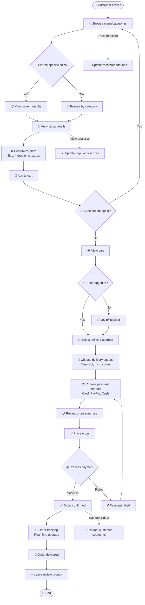
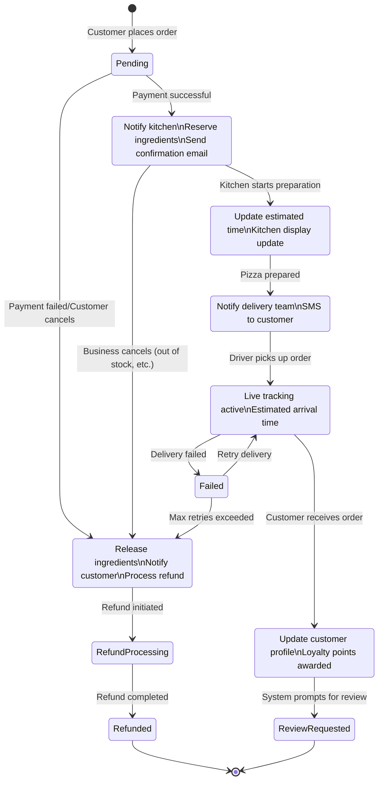
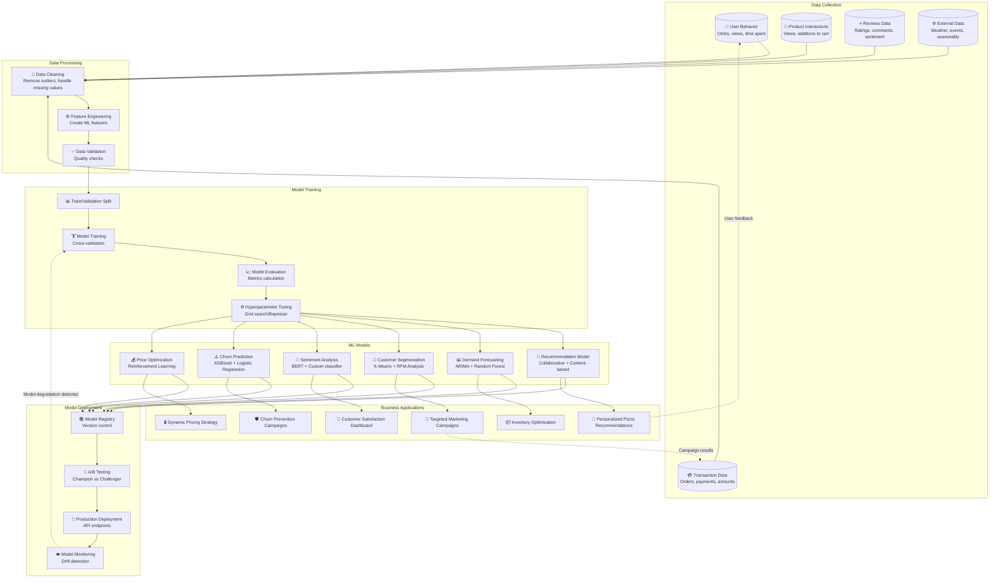
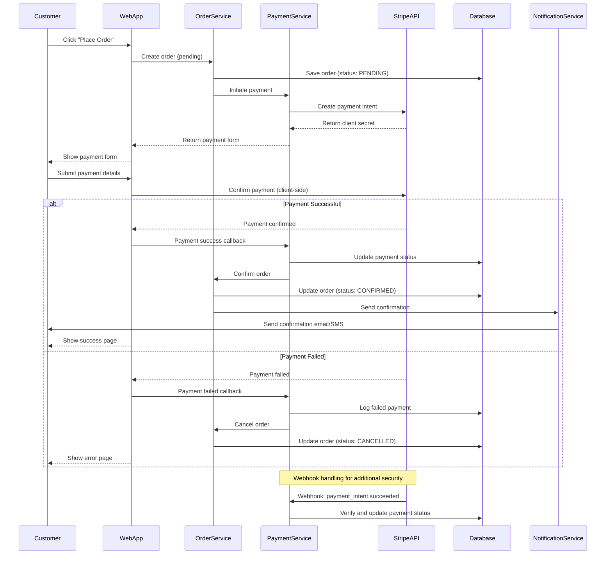
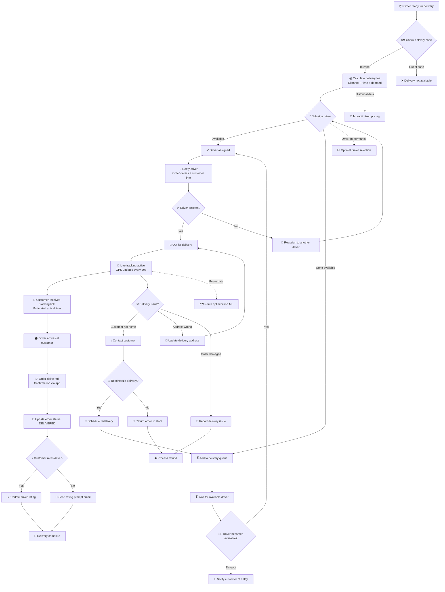
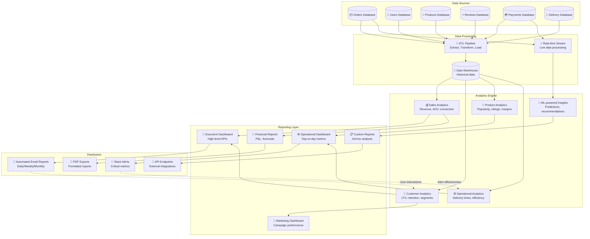

# PizzaMama Enterprise - Flowchart Globale

## 🎯 System Architecture Flow

Questo documento presenta i flowchart principali del sistema PizzaMama Enterprise, organizzati per area funzionale e stakeholder.

---

## 🏗️ High-Level System Architecture Flow

```mermaid
graph TB
    subgraph "External Users"
        Customer[👤 Customer]
        BusinessOwner[🏪 Business Owner]
        Staff[👨‍💼 Staff/Admin]
    end

    subgraph "Frontend Layer"
        WebApp[🌐 Web Application<br/>Django Templates + HTMX]
        MobileApp[📱 Mobile App<br/>React Native/Flutter]
        AdminDash[📊 Admin Dashboard<br/>Django Admin + Custom]
    end

    subgraph "API Layer"
        APIGateway[🔄 API Gateway<br/>Django REST Framework]
        AuthAPI[🔐 Authentication API]
        ProductAPI[🍕 Products API]
        OrderAPI[📦 Orders API]
        PaymentAPI[💳 Payments API]
        AnalyticsAPI[📊 Analytics API]
    end

    subgraph "Business Logic Layer"
        AccountsApp[👥 Accounts Service]
        ProductsApp[🛒 Products Service]
        OrdersApp[📋 Orders Service]
        PaymentsApp[💰 Payments Service]
        DeliveryApp[🚚 Delivery Service]
        ReviewsApp[⭐ Reviews Service]
        AnalyticsApp[📈 Analytics Service]
        NotificationsApp[📧 Notifications Service]
    end

    subgraph "ML/AI Layer"
        RecommendationEngine[🤖 Recommendation Engine]
        DemandForecast[📊 Demand Forecasting]
        SentimentAnalysis[💭 Sentiment Analysis]
        CustomerSegmentation[👥 Customer Segmentation]
        ChurnPrediction[⚠️ Churn Prediction]
    end

    subgraph "Data Layer"
        PostgreSQL[(🗄️ PostgreSQL<br/>Primary Database)]
        Redis[(⚡ Redis<br/>Cache + Sessions)]
        S3[(☁️ AWS S3<br/>Media Storage)]
        DataWarehouse[(📊 Data Warehouse<br/>Analytics)]
    end

    subgraph "External Services"
        Stripe[💳 Stripe<br/>Payment Processing]
        SendGrid[📧 SendGrid<br/>Email Service]
        Twilio[📱 Twilio<br/>SMS Service]
        GoogleMaps[🗺️ Google Maps<br/>Delivery Zones]
    end

    subgraph "Infrastructure"
        LoadBalancer[⚖️ Load Balancer<br/>Nginx]
        AppServer[🖥️ App Servers<br/>Gunicorn]
        TaskQueue[📋 Task Queue<br/>Celery + Redis]
        Monitoring[📊 Monitoring<br/>Prometheus + Grafana]
    end

    %% User Flows
    Customer --> WebApp
    Customer --> MobileApp
    BusinessOwner --> AdminDash
    Staff --> AdminDash

    %% Frontend to API
    WebApp --> APIGateway
    MobileApp --> APIGateway
    AdminDash --> APIGateway

    %% API Gateway Routes
    APIGateway --> AuthAPI
    APIGateway --> ProductAPI
    APIGateway --> OrderAPI
    APIGateway --> PaymentAPI
    APIGateway --> AnalyticsAPI

    %% API to Business Logic
    AuthAPI --> AccountsApp
    ProductAPI --> ProductsApp
    OrderAPI --> OrdersApp
    PaymentAPI --> PaymentsApp
    AnalyticsAPI --> AnalyticsApp

    %% Business Logic Interactions
    OrdersApp --> DeliveryApp
    OrdersApp --> PaymentsApp
    OrdersApp --> NotificationsApp
    ProductsApp --> AnalyticsApp
    ReviewsApp --> AnalyticsApp

    %% ML Integrations
    ProductsApp --> RecommendationEngine
    AnalyticsApp --> DemandForecast
    ReviewsApp --> SentimentAnalysis
    AccountsApp --> CustomerSegmentation
    AnalyticsApp --> ChurnPrediction

    %% Data Connections
    AccountsApp --> PostgreSQL
    ProductsApp --> PostgreSQL
    OrdersApp --> PostgreSQL
    PaymentsApp --> PostgreSQL
    DeliveryApp --> PostgreSQL
    ReviewsApp --> PostgreSQL

    ProductsApp --> S3
    AccountsApp --> S3

    APIGateway --> Redis
    OrdersApp --> Redis
    AnalyticsApp --> DataWarehouse

    %% External Service Connections
    PaymentsApp --> Stripe
    NotificationsApp --> SendGrid
    NotificationsApp --> Twilio
    DeliveryApp --> GoogleMaps

    %% Infrastructure
    LoadBalancer --> AppServer
    AppServer --> TaskQueue
    TaskQueue --> NotificationsApp
    Monitoring --> AppServer
```

---

## 🛒 Customer Purchase Journey Flow

---

## 🏪 Business Owner Dashboard Flow

```mermaid
graph TD
    OwnerLogin([🏪 Business Owner Login]) --> Dashboard[📊 Main Dashboard]
    
    Dashboard --> OrderManagement[📦 Order Management]
    Dashboard --> ProductManagement[🛒 Product Management]
    Dashboard --> Analytics[📈 Analytics & Reports]
    Dashboard --> CustomerInsights[👥 Customer Insights]
    Dashboard --> InventoryManagement[📋 Inventory Management]
    Dashboard --> MarketingTools[📢 Marketing Tools]
    
    %% Order Management Flow
    OrderManagement --> ActiveOrders[🔥 Active Orders<br/>Pending, Preparing, Ready]
    OrderManagement --> OrderHistory[📚 Order History]
    OrderManagement --> KitchenDisplay[👨‍🍳 Kitchen Display System]
    
    ActiveOrders --> UpdateOrderStatus[🔄 Update order status]
    UpdateOrderStatus --> NotifyCustomer[📧 Auto-notify customer]
    
    %% Product Management Flow
    ProductManagement --> AddProduct[➕ Add new pizza]
    ProductManagement --> EditProduct[✏️ Edit existing products]
    ProductManagement --> ManageCategories[📂 Manage categories]
    ProductManagement --> ManageIngredients[🥕 Manage ingredients]
    
    AddProduct --> ProductForm[📝 Product creation form]
    EditProduct --> ProductForm
    ProductForm --> UpdateCatalog[🔄 Update catalog]
    
    %% Analytics Flow
    Analytics --> SalesReports[💰 Sales Reports<br/>Daily, Weekly, Monthly]
    Analytics --> CustomerAnalytics[👥 Customer Analytics<br/>Retention, LTV, Segments]
    Analytics --> ProductAnalytics[🍕 Product Analytics<br/>Best sellers, ratings]
    Analytics --> RevenueForecasting[📊 Revenue Forecasting]
    
    %% Customer Insights Flow
    CustomerInsights --> CustomerSegments[👥 Customer Segments<br/>VIP, Regular, At-risk]
    CustomerInsights --> CustomerFeedback[💬 Customer Feedback<br/>Reviews, ratings]
    CustomerInsights --> ChurnAnalysis[⚠️ Churn Analysis]
    
    %% Inventory Management Flow
    InventoryManagement --> StockLevels[📦 Current stock levels]
    InventoryManagement --> LowStockAlerts[⚠️ Low stock alerts]
    InventoryManagement --> IngredientUsage[📊 Ingredient usage analytics]
    InventoryManagement --> AutoReorderSuggestions[🔄 Auto-reorder suggestions]
    
    StockLevels --> UpdateStock[🔄 Update stock quantities]
    LowStockAlerts --> CreatePurchaseOrder[📝 Create purchase order]
    
    %% Marketing Tools Flow
    MarketingTools --> PromotionsManager[🎯 Create promotions<br/>Discounts, coupons]
    MarketingTools --> EmailCampaigns[📧 Email campaigns]
    MarketingTools --> LoyaltyProgram[⭐ Loyalty program management]
    MarketingTools --> ABTesting[🧪 A/B testing campaigns]

    %% ML Integration Points
    Analytics -.->|Data analysis| MLAnalytics[🤖 ML-powered insights]
    CustomerInsights -.->|Behavior analysis| CustomerML[👥 Customer segmentation ML]
    InventoryManagement -.->|Usage patterns| DemandML[📊 Demand forecasting ML]
    ProductAnalytics -.->|Performance data| RecommendationML[🤖 Recommendation tuning]
```

---

## 📦 Order Processing Workflow

---

## 🤖 Machine Learning Pipeline Flow

---

## 💳 Payment Processing Flow

---

## 🚚 Delivery Management Flow

---

## 📊 Analytics & Reporting Flow

---

## 🔄 Development & Deployment Flow

```mermaid
graph LR
    subgraph "Development"
        LocalDev[👨‍💻 Local Development<br/>Docker Compose]
        FeatureBranch[🌿 Feature Branch<br/>Git workflow]
        UnitTests[🧪 Unit Tests<br/>Pytest coverage]
        CodeReview[👥 Code Review<br/>Pull requests]
    end

    subgraph "CI/CD Pipeline"
        GitHubActions[⚡ GitHub Actions<br/>Automated pipeline]
        QualityGate[🛡️ Quality Gate<br/>Tests, linting, security]
        BuildArtifacts[📦 Build Artifacts<br/>Docker images]
        SecurityScan[🔐 Security Scan<br/>Dependencies, code]
    end

    subgraph "Environments"
        Staging[🧪 Staging Environment<br/>Pre-production testing]
        Production[🚀 Production Environment<br/>Live system]
        Rollback[🔄 Rollback Strategy<br/>Blue-green deployment]
    end

    subgraph "Monitoring"
        HealthChecks[❤️ Health Checks<br/>System status]
        Metrics[📊 Metrics Collection<br/>Prometheus]
        Logging[📝 Centralized Logging<br/>ELK Stack]
        Alerting[🚨 Alerting<br/>PagerDuty/Slack]
    end

    %% Development Flow
    LocalDev --> FeatureBranch
    FeatureBranch --> UnitTests
    UnitTests --> CodeReview

    %% CI/CD Flow
    CodeReview --> GitHubActions
    GitHubActions --> QualityGate
    QualityGate --> BuildArtifacts
    BuildArtifacts --> SecurityScan

    %% Deployment Flow
    SecurityScan --> Staging
    Staging --> Production
    Production --> Rollback

    %% Monitoring Flow
    Staging --> HealthChecks
    Production --> HealthChecks
    HealthChecks --> Metrics
    Metrics --> Logging
    Logging --> Alerting

    %% Feedback Loop
    Alerting -.->|Issues detected| Rollback
    Metrics -.->|Performance data| LocalDev
```

---

## 🎯 Key Integration Points

### **Frontend ↔ Backend**
- RESTful API communication
- Real-time updates via WebSockets
- Session management
- CSRF protection

### **ML ↔ Application**
- Feature store integration
- Real-time prediction APIs
- Batch processing jobs
- Model performance monitoring

### **External Services**
- Payment gateway webhooks
- Email/SMS delivery confirmations
- Maps API for delivery zones
- CDN for media delivery

### **Monitoring ↔ Operations**
- Automated alerting
- Performance dashboards
- Log aggregation
- Incident response workflows

---

## 📋 Workflow Orchestration

Tutti i flowchart sono interconnessi attraverso:

1. **Event-driven architecture** → Microservizi comunicano via eventi
2. **Message queues** → Celery per task asincroni
3. **API contracts** → Interfacce ben definite tra componenti
4. **Data consistency** → ACID transactions dove necessario
5. **Failure handling** → Retry policies e circuit breakers

Questo sistema di flowchart fornisce una visione completa dell'architettura PizzaMama Enterprise, dalle interazioni utente fino all'infrastruttura di deployment.