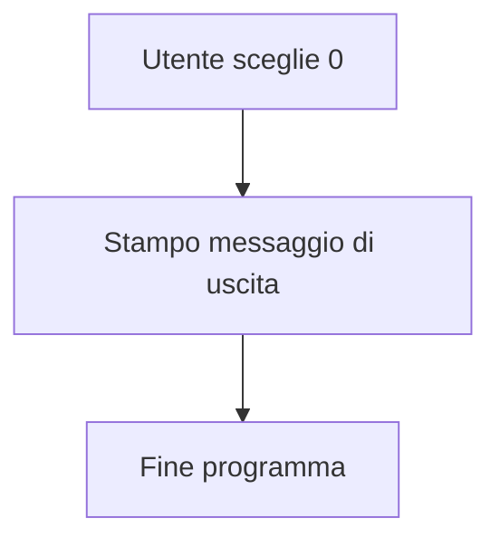
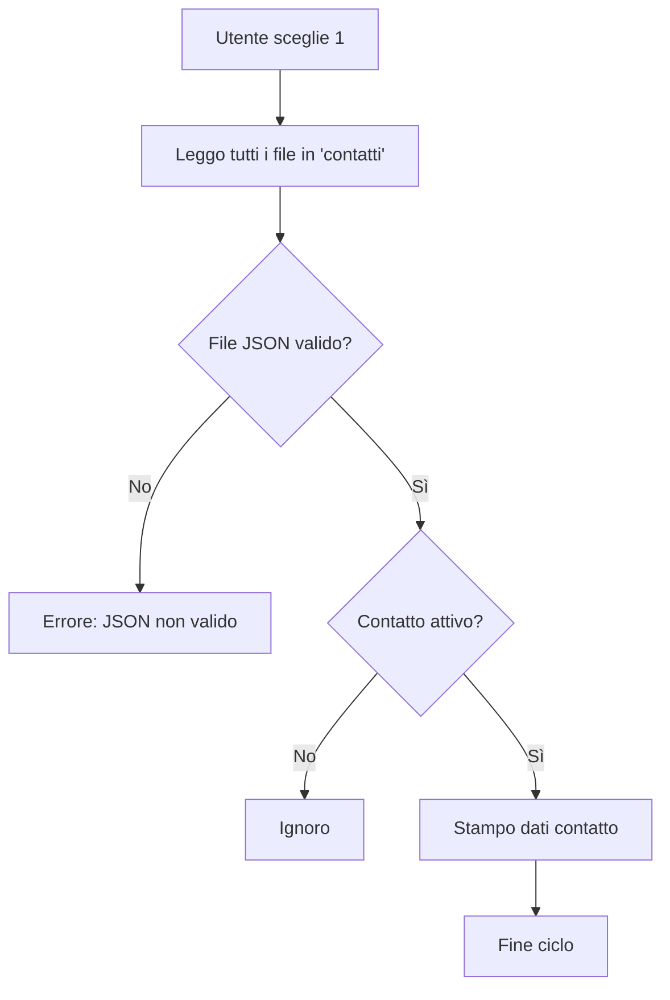
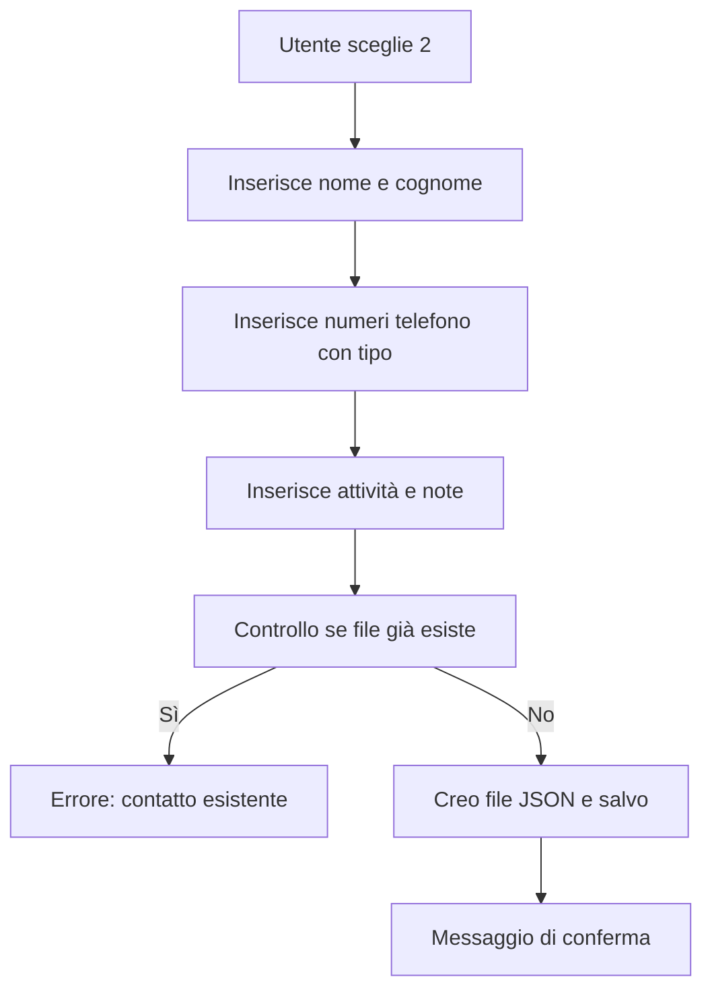
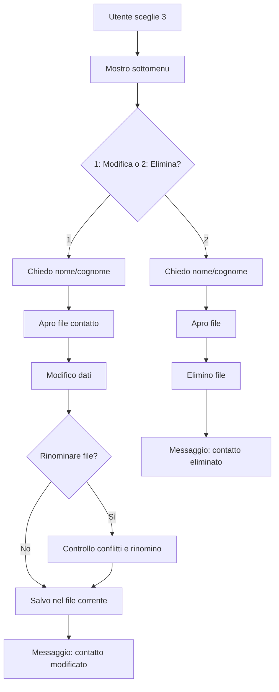

# Rubrica Telefonica

## Descrizione

Programma da terminale per gestire una rubrica telefonica. I contatti vengono salvati in file `.json` all'interno della cartella `contatti`.

### Funzioni principali

- Visualizza contatti attivi
- Aggiunge nuovi contatti
- Modifica o elimina contatti esistenti
- Usa `match-case` per la gestione del menu

---

## Avvio

```bash
python rubrica.py
```

---

## Menu principale

```
0: Esci
1: Visualizza i contatti attivi
2: Aggiungi
3: Modifica o elimina un contatto
```

---

## Struttura dei file contatto

Ogni contatto è salvato come file JSON:

```json
{
  "nome": "Mario",
  "cognome": "Rossi",
  "telefono": [
    {"tipo": "cellulare", "numero": "3331234567"}
  ],
  "attivita": ["Amico"],
  "note": "Porta gli occhiali",
  "attivo": true,
  "data_creazione": "2025-04-16 15:20:00"
}
```

---

## MAI / DMAI con Diagrammi

---

### Case `"0"` – Esci

**Cosa fa**: termina il programma

**MAI/DMAI**  
- Nessuna modifica necessaria



---

### Case `"1"` – Visualizza contatti attivi

**Cosa fa**: legge tutti i file `.json`, mostra solo quelli con `"attivo": true`.

**MAI**  
- Aggiungere opzione per mostrare anche i non attivi

**DMAI**  
- Ordinare alfabeticamente i contatti prima della stampa



---

### Case `"2"` – Aggiungi contatto

**Cosa fa**: chiede dati, controlla se il file esiste, salva nuovo contatto

**MAI**  
- Controllo su numero (ValueError)
- Aggiunta di campi obbligatori

**DMAI**  
- Validazione del numero
- Lista predefinita per i tipi di telefono



---

### Case `"3"` – Modifica o elimina un contatto

**Cosa fa**:  
- Chiede se modificare o eliminare  
- Apre il file  
- In base alla scelta: modifica i dati o elimina il file

**MAI**  
- Permettere modifica anche di numero, attività, note

**DMAI**  
- Disattivare invece di eliminare il contatto
- Aggiungere conferma prima di eliminare



---
