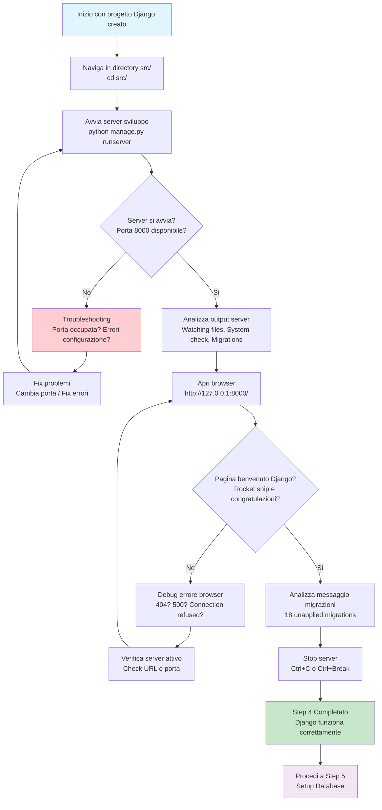

# Step 4: Test Installazione

## Obiettivo
Avviare il server di sviluppo Django, verificare la pagina di benvenuto e testare che l'installazione sia completa e funzionante prima di procedere con la configurazione database.

---

## Prerequisiti
- **Step 3 completato** → Progetto Django creato
- **manage.py disponibile** → File CLI Django
- **Configurazione base** → settings.py e urls.py presenti

---

## Flowchart Step 4



---

## Comandi Step by Step

### 4.1 Naviga alla directory src/
```powershell
# Assicurati di essere nella directory con manage.py
cd src

# Verifica presenza manage.py
ls manage.py

# Se non trovi manage.py, sei nella directory sbagliata
pwd  # Dovrebbe mostrare: .../pizzamama-enreprise/src
```

### 4.2 Avvia server di sviluppo
```powershell
# Avvia server Django sulla porta default 8000
python manage.py runserver
```

**Spiegazione comando:**
- **python manage.py** → Usa Python dell'ambiente virtuale
- **runserver** → Subcommand per server di sviluppo
- **Porta default** → 8000, accessibile solo da localhost

### 4.3 Analizza output del server
Output atteso dopo avvio:
```
Watching for file changes with StatReloader
Performing system checks...

System check identified no issues (0 silenced).

You have 18 unapplied migration(s). Your project may not work properly until you apply the migrations for app(s): admin, auth, contenttypes, sessions.
Run 'python manage.py migrate' to apply them.

July 22, 2025 - 22:06:18
Django version 5.0.1, using settings 'pizzamama.settings'
Starting development server at http://127.0.0.1:8000/
Quit the server with CTRL-BREAK.
```

**Analisi componenti output:**

#### **StatReloader**
- **Auto-reload** → Server riavvia automaticamente quando modifichi file
- **File watching** → Monitora cambiamenti in tempo reale
- **Development only** → Non disponibile in produzione

#### **System Check**
- **Validazione configurazione** → Controlla settings.py, models, etc.
- **0 silenced** → Tutti i check sono stati eseguiti
- **No issues** → Configurazione valida

#### **Unapplied Migrations**
- **18 migrations** → Django ha app built-in che richiedono tabelle database
- **Apps coinvolte:** admin, auth, contenttypes, sessions
- **Non critico ora** → Risolveremo nel Step 5

#### **Server Information**
- **Django version** → 5.0.1 (conferma installazione corretta)
- **Settings module** → pizzamama.settings (configurazione corretta)
- **URL server** → http://127.0.0.1:8000/ (indirizzo di test)

---

## Verifica nel Browser

### 4.4 Apri browser e naviga al server
```
URL: http://127.0.0.1:8000/
Alternativa: http://localhost:8000/
```

### Pagina di benvenuto attesa
Dovresti vedere una pagina con:

- **Titolo:** "The install worked successfully! Congratulations!"
- **Immagine:** Razzo Django (rocket ship)
- **Testo:** Messaggio di congratulazioni
- **Istruzioni:** Link alla documentazione Django

**Elementi specifici da verificare:**
- Background colorato (solitamente verde/blu)
- Logo Django prominente
- Testo "You are seeing this page because DEBUG=True"
- Link "Django Documentation"

---

## Troubleshooting

### Problema: "Port is already in use"
**Errore completo:**
```
Error: That port is already in use.
```

**Soluzioni:**
```powershell
# Opzione 1: Usa porta diversa
python manage.py runserver 8001

# Opzione 2: Trova processo che usa porta 8000
netstat -ano | findstr :8000

# Opzione 3: Termina processo specifico
taskkill /PID [PROCESS_ID] /F
```

### Problema: "ConnectionRefusedError" nel browser
**Cause possibili:**
- Server non avviato
- Firewall blocca connessione
- URL errato

**Debug:**
```powershell
# Verifica server attivo nel terminale
# Dovresti vedere: "Starting development server at..."

# Test connessione locale
ping 127.0.0.1

# Verifica URL corretto
# http://127.0.0.1:8000/ (non https://)
```

### Problema: "ModuleNotFoundError" all'avvio
**Errore tipico:**
```
ModuleNotFoundError: No module named 'pizzamama'
```

**Soluzioni:**
```powershell
# Verifica directory corrente
pwd
# Deve essere .../pizzamama-enreprise/src

# Verifica ambiente virtuale attivo
echo $env:VIRTUAL_ENV

# Se ambiente non attivo:
cd ..
.\venv\Scripts\activate
cd src
```

### Problema: "SyntaxError in settings.py"
**Debug configurazione:**
```powershell
# Test syntax settings
python -c "import pizzamama.settings"

# Se errore di sintassi, apri settings.py
code pizzamama/settings.py

# Controlla:
# - Virgole mancanti
# - Parentesi non chiuse
# - Indentazione corretta
```

### Problema: Pagina 404 invece di benvenuto
**Cause:**
- DEBUG=False in settings.py
- URL patterns modificati

**Verifica:**
```powershell
# Controlla DEBUG in settings.py
python -c "from pizzamama.settings import DEBUG; print('DEBUG:', DEBUG)"

# Deve stampare: DEBUG: True

# Se False, modifica settings.py
# DEBUG = True
```

---

## Interpretazione Messaggi Server

### Warning sui migrations (normale)
```
You have 18 unapplied migration(s)...
```
**Significato:**
- Django ha app built-in (admin, auth, sessions)
- Queste app necessitano tabelle database
- **Non è un errore** → Risolveremo nel prossimo step

### Log richieste HTTP
```
[22/Jul/2025 22:06:57] "GET / HTTP/1.1" 200 10697
```
**Decodifica:**
- **Data/ora** → Timestamp richiesta
- **GET /** → Metodo HTTP e path
- **200** → Status code success
- **10697** → Bytes risposta inviata

### Auto-reload messages
```
.../pizzamama/settings.py changed, reloading.
```
**Significato:**
- StatReloader ha rilevato modifica file
- Server si riavvia automaticamente
- **Normale durante sviluppo**

---

## Stop del Server

### 4.5 Ferma il server di sviluppo
```powershell
# Nel terminale dove è attivo il server
# Premi Ctrl+C (Linux/Mac)
# Oppure Ctrl+Break (Windows)

# Output atteso:
Performing system checks...
System check identified no issues (0 silenced).
Quit the server with CTRL-BREAK.
^C  # ← Ctrl+C pressed
```

**Metodi alternativi:**
- Chiudi terminale (non consigliato)
- Ctrl+Z per sospendere (Linux/Mac)
- Taskkill command (Windows)

---

## Struttura Post-Test

Dopo completamento Step 4, nessun file nuovo è stato creato, ma hai verificato:

```
pizzamama-enreprise/
├── venv/                          ← Ambiente virtuale
└── src/                           ← Codice sorgente
    ├── manage.py                  ← Testato: runserver funziona
    └── pizzamama/
        ├── settings.py            ← Verificato: DEBUG=True, configurazione valida
        ├── urls.py                ← Testato: URL routing base
        ├── wsgi.py                ← Preparato per produzione
        └── asgi.py                ← Preparato per async
```

---

## Cosa Abbiamo Verificato

### **Server di Sviluppo Funzionante**
- **Auto-reload** → File watching attivo
- **HTTP server** → Binding su localhost:8000
- **Static files** → Pagina benvenuto caricata correttamente

### **Configurazione Django Valida**
- **Settings** → Sintassi corretta, DEBUG attivo
- **URL routing** → Dispatcher funzionante
- **System checks** → Validazione passed

### **Ambiente Integro**
- **Virtual environment** → Isolamento dipendenze
- **Python path** → Import modules corretti
- **File permissions** → Accesso lettura/scrittura

---

## Prossimi Passi Identificati

### **Database Setup Necessario**
- **18 migrations pending** → Tabelle Django built-in da creare
- **SQLite default** → Database file da inizializzare
- **Superuser creation** → Admin access da configurare

### **Development Workflow**
- **Auto-reload** → Modifiche file rilevate automaticamente
- **Debug mode** → Error pages dettagliate
- **Static files** → CSS/JS serving per development

---

## Prossimo Step

Una volta completato con successo questo step:

1. **Verifica** server Django si avvia senza errori
2. **Conferma** pagina benvenuto visibile nel browser
3. **Procedi** a **Step 5: Setup Database**

### Collegamento al prossimo step:
```
README-Step5-Database.md
Applicheremo le migrazioni database iniziali
Creeremo il superuser per l'admin panel
Testeremo l'accesso all'interfaccia amministrativa
```

---

## Note Importanti

### **Server di Sviluppo**
- **Solo per development** → Non usare in produzione
- **Single-threaded** → Requests seriali, non concorrenti
- **Auto-reload** → Performance impatto, solo debug

### **Sicurezza Development**
- **DEBUG=True** → Espone informazioni sensibili
- **ALLOWED_HOSTS=[]** → Accetta solo localhost
- **Secret key** → Visibile in settings.py (cambiarla per produzione)

### **Performance Considerations**
- **File watching** → CPU overhead per progetti grandi
- **SQLite** → Database file-based, limitazioni concorrenza
- **Static files** → Serviti da Django, non ottimizzato

---

## Checklist Completamento Step 4

- [ ] **Server avviato** → python manage.py runserver senza errori
- [ ] **Pagina benvenuto** → http://127.0.0.1:8000/ mostra rocket Django
- [ ] **Auto-reload funziona** → File watching attivo
- [ ] **System check passed** → Configurazione validata
- [ ] **Server fermato** → Ctrl+C termina processo correttamente
- [ ] **Pronto per Step 5** → Database setup e migrazioni

**Una volta completata la checklist, sei pronto per configurare il database e creare l'admin user!**