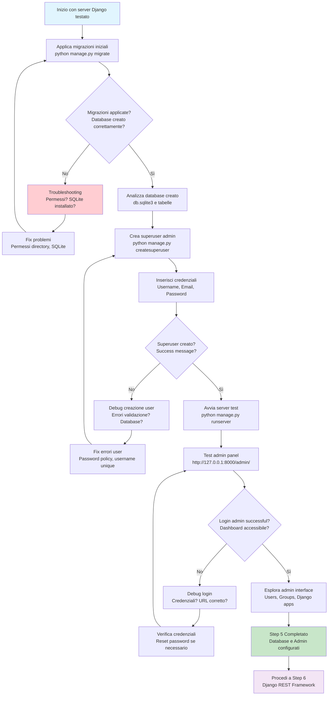

# Step 5: Setup Database

## Obiettivo
Configurare il database SQLite applicando le migrazioni iniziali Django, creare un superuser per l'admin panel e testare l'accesso all'interfaccia amministrativa.

---

## Prerequisiti
- **Step 4 completato** → Server Django funzionante
- **18 migrations pending** → Identificate nel test server
- **manage.py disponibile** → CLI Django pronto

---

## Flowchart Step 5



---

## Comandi Step by Step

### 5.1 Applica migrazioni database iniziali
```powershell
# Dalla directory src/ (dove si trova manage.py)
python manage.py migrate
```

**Spiegazione comando:**
- **migrate** → Applica tutte le migrazioni pending al database
- **Automatico** → Trova e applica migrazioni in ordine corretto
- **Sicuro** → Operazione idempotente (ripetibile senza danni)

**Output atteso:**
```
Operations to perform:
  Apply all migrations: admin, auth, contenttypes, sessions
Running migrations:
  Applying contenttypes.0001_initial... OK
  Applying auth.0001_initial... OK
  Applying admin.0001_initial... OK
  Applying admin.0002_logentry_remove_auto_add... OK
  Applying admin.0003_logentry_add_action_flag_choices... OK
  Applying contenttypes.0002_remove_content_type_name... OK
  Applying auth.0002_alter_permission_name_max_length... OK
  Applying auth.0003_alter_user_email_max_length... OK
  Applying auth.0004_alter_user_username_opts... OK
  Applying auth.0005_alter_user_last_login_null... OK
  Applying auth.0006_require_contenttypes_0002... OK
  Applying auth.0007_alter_validators_add_error_messages... OK
  Applying auth.0008_alter_user_username_max_length... OK
  Applying auth.0009_alter_user_last_name_max_length... OK
  Applying auth.0010_alter_group_name_max_length... OK
  Applying auth.0011_update_proxy_permissions... OK
  Applying auth.0012_alter_user_first_name_max_length... OK
  Applying sessions.0001_initial... OK
```

### 5.2 Verifica database creato
```powershell
# Controlla che il file database sia stato creato
ls db.sqlite3

# Verifica dimensione file (dovrebbe essere > 0 bytes)
Get-ChildItem db.sqlite3 | Select-Object Name, Length
```

---

## Analisi Migrazioni Applicate

### **App: contenttypes**
- **Scopo:** Sistema tipi di contenuto Django
- **Tabelle:** django_content_type
- **Funzione:** Supporta relazioni generiche tra models

### **App: auth**
- **Scopo:** Sistema autenticazione e autorizzazione
- **Tabelle:** auth_user, auth_group, auth_permission, auth_user_groups, auth_user_user_permissions, auth_group_permissions
- **Funzione:** Gestione utenti, gruppi, permessi

### **App: admin**
- **Scopo:** Interfaccia amministrativa Django
- **Tabelle:** django_admin_log
- **Funzione:** Log azioni admin, audit trail

### **App: sessions**
- **Scopo:** Gestione sessioni utente
- **Tabelle:** django_session
- **Funzione:** Storage sessioni, autenticazione persistente

---

## Creazione Superuser

### 5.3 Crea superuser amministratore
```powershell
# Comando per creare utente amministratore
python manage.py createsuperuser
```

**Processo interattivo:**

#### **Username**
```
Username (leave blank to use 'defaultuser'): admin
```
**Consigli:**
- Usa nomi semplici come "admin", "superuser"
- Evita spazi e caratteri speciali
- Sarà usato per login admin panel

#### **Email (opzionale)**
```
Email address: admin@pizzamama.com
```
**Consigli:**
- Campo opzionale, puoi premere Enter per saltare
- Se inserisci, usa formato email valido
- Non deve essere email reale per development

#### **Password**
```
Password: 
Password (again):
```
**Requisiti password Django:**
- Minimo 8 caratteri
- Non può essere troppo simile a username/email
- Non può essere password comune (password123, qwerty)
- Non può essere completamente numerica

**Consigli sicurezza:**
- Per development: "adminpassword123" va bene
- Per produzione: password complessa con simboli
- Password non si vede mentre digiti (normale)

### 5.4 Verifica creazione superuser
**Output di successo:**
```
Superuser created successfully.
```

---

## Test Admin Panel

### 5.5 Avvia server per test admin
```powershell
# Avvia server di sviluppo
python manage.py runserver
```

### 5.6 Accedi all'admin panel
```
URL: http://127.0.0.1:8000/admin/
```

### 5.7 Effettua login
- **Username:** quello inserito durante creazione
- **Password:** quella inserita durante creazione

### 5.8 Esplora interfaccia admin
Dopo login successful dovresti vedere:

#### **Dashboard Admin**
- **Site administration** header
- **Django administration** welcome
- **Recent actions** sidebar (vuota per ora)

#### **Sezioni disponibili**
- **AUTHENTICATION AND AUTHORIZATION**
  - **Groups** → Gestione gruppi utenti
  - **Users** → Gestione utenti sistema

#### **User management**
- Click su "Users" per vedere lista utenti
- Dovresti vedere il superuser appena creato
- Possibilità di modificare, aggiungere, eliminare utenti

---

## Troubleshooting

### Problema: "No such table: django_migrations"
**Causa:** Database non inizializzato correttamente

**Soluzione:**
```powershell
# Rimuovi database e ricrea
rm db.sqlite3
python manage.py migrate
```

### Problema: "Permission denied" durante migrate
**Soluzioni:**
```powershell
# Opzione 1: Verifica permessi directory
# Directory src/ deve essere scrivibile

# Opzione 2: Esegui come amministratore
# Right-click PowerShell → "Run as Administrator"

# Opzione 3: Cambia directory di lavoro
cd C:\temp
mkdir django-test
cd django-test
# Ricrea progetto in directory con permessi
```

### Problema: Password validation error
**Errori comuni:**
```
This password is too short. It must contain at least 8 characters.
This password is too common.
This password is entirely numeric.
```

**Soluzioni:**
```powershell
# Riprova comando createsuperuser
python manage.py createsuperuser

# Usa password più complessa:
# Esempio: "MyAdmin2025!"
# Almeno 8 caratteri, mix lettere/numeri/simboli
```

### Problema: "Page not found" su /admin/
**Debug:**
```powershell
# Verifica URL corretto
# http://127.0.0.1:8000/admin/ (con slash finale)

# Verifica server attivo
# Dovrebbe mostrare "Starting development server..."

# Test homepage prima
# http://127.0.0.1:8000/ dovrebbe funzionare
```

### Problema: Login fallito con credenziali corrette
**Debug:**
```powershell
# Verifica superuser nel database
python manage.py shell
>>> from django.contrib.auth.models import User
>>> User.objects.filter(is_superuser=True)
>>> exit()

# Se nessun superuser, ricrea
python manage.py createsuperuser
```

---

## Struttura Database SQLite

Dopo migrazioni, il file `db.sqlite3` contiene queste tabelle:

```sql
-- Tabelle Django core
django_migrations          -- Tracking migrazioni applicate
django_content_type        -- Tipi contenuto sistema
django_admin_log           -- Log azioni admin

-- Tabelle autenticazione
auth_user                  -- Utenti sistema (incluso superuser)
auth_group                 -- Gruppi utenti
auth_permission            -- Permessi sistema
auth_user_groups           -- Relazione user-groups (many-to-many)
auth_user_user_permissions -- Permessi diretti utenti
auth_group_permissions     -- Permessi gruppi

-- Tabelle sessioni
django_session             -- Sessioni utente attive
```

---

## Struttura Finale Step 5

Dopo completamento, nuovi file creati:

```
pizzamama-enreprise/
├── venv/
└── src/
    ├── manage.py
    ├── db.sqlite3                ← Database SQLite (NEW)
    └── pizzamama/
        ├── settings.py
        ├── urls.py
        ├── wsgi.py
        └── asgi.py
```

---

## Cosa Abbiamo Realizzato

### **Database Funzionante**
- **SQLite configurato** → File database persistente
- **Schema Django** → Tabelle core create
- **Migrazioni tracking** → Sistema versioning database

### **Sistema Autenticazione**
- **User model** → Gestione utenti completa
- **Permissions system** → Controllo accessi granulare
- **Groups support** → Organizzazione utenti

### **Admin Interface**
- **Superuser account** → Accesso amministrativo
- **Web interface** → Gestione dati via browser
- **CRUD operations** → Create, Read, Update, Delete

### **Development Ready**
- **Local database** → Sviluppo offline
- **Admin tools** → Debug e gestione dati
- **User management** → Test autenticazione

---

## Prossimo Step

Una volta completato con successo questo step:

1. **Verifica** db.sqlite3 file creato e > 0 bytes
2. **Conferma** superuser login successful in admin
3. **Procedi** a **Step 6: Django REST Framework**

### Collegamento al prossimo step:
```
README-Step6-DRF.md
Installeremo Django REST Framework
Configureremo API endpoints
Creeremo la prima API di benvenuto
```

---

## Note Importanti

### **SQLite per Development**
- **File-based** → Database in singolo file
- **Zero configuration** → Nessun server da installare
- **Portabile** → Facile backup e condivisione
- **Limitazioni** → Non adatto per alta concorrenza

### **Migrazioni Django**
- **Version control** → Schema database versionato
- **Automatic** → Applicazione automatica
- **Reversible** → Possibile rollback (con cautela)
- **Team development** → Sincronizzazione schema team

### **Admin Security**
- **Development only** → Credenziali semplici OK
- **Production** → Password complesse obbligatorie
- **Logging** → Tutte le azioni sono loggate
- **Permissions** → Sistema granulare per controllo accessi

---

## Checklist Completamento Step 5

- [ ] **Migrazioni applicate** → python manage.py migrate successful
- [ ] **Database creato** → db.sqlite3 file exists e > 0 bytes
- [ ] **Superuser creato** → Credenziali admin configurate
- [ ] **Admin panel accessibile** → Login su /admin/ funziona
- [ ] **User management** → Lista utenti visibile in admin
- [ ] **Pronto per Step 6** → Django REST Framework setup

**Una volta completata la checklist, sei pronto per installare e configurare le API REST!**