# Step 8: Database Modeling Enterprise - Accounts

## Obiettivo
Installare Pillow per gestione immagini, creare modelli database enterprise per l'app accounts con CustomUser esteso, Profile utente e Address multipli, configurare AUTH_USER_MODEL e reset database.

---

## Prerequisiti
- **Step 7 completato** → Apps enterprise configurate
- **python manage.py check** → Nessun errore configurazione
- **Apps accounts** → Pronta per modeling

---

## Flowchart Step 8

```mermaid
flowchart TD
    A[Inizio con apps configurate] --> B[Installa Pillow<br/>py -m pip install Pillow==10.2.0]
    
    B --> C{Pillow installato?<br/>ImageField support disponibile?}
    C -->|No| D[Troubleshooting Pillow<br/>Compiler issues? Dependencies?]
    C -->|Sì| E[Crea CustomUser model<br/>apps/accounts/models.py]
    
    D --> F[Fix Pillow installation<br/>Visual Studio tools? Alternative versions?]
    F --> B
    
    E --> G[Implementa Address model<br/>Indirizzi multipli per delivery]
    G --> H[Implementa Profile model<br/>Loyalty system e preferences]
    
    H --> I{Models syntax corretti?<br/>Import e field definitions?}
    I -->|No| J[Debug models syntax<br/>Field types? Relationships?]
    I -->|Sì| K[Configura AUTH_USER_MODEL<br/>settings.py update]
    
    J --> L[Fix syntax errors<br/>Models relationships, field options]
    L --> I
    
    K --> M[RESET DATABASE NECESSARIO<br/>CustomUser requires clean DB]
    M --> N[Backup data importante<br/>Se necessario]
    N --> O[Delete db.sqlite3<br/>rm db.sqlite3]
    
    O --> P[Crea nuove migrazioni<br/>makemigrations accounts]
    P --> Q{Migrazioni create?<br/>CustomUser migration successful?}
    
    Q -->|No| R[Debug migration errors<br/>Model issues? Field conflicts?]
    Q -->|Sì| S[Applica migrazioni<br/>python manage.py migrate]
    
    R --> T[Fix model definitions<br/>Field types, relationships]
    T --> P
    
    S --> U{Database creato?<br/>Tabelle CustomUser presenti?}
    U -->|No| V[Debug database creation<br/>Migration errors? SQL issues?]
    U -->|Sì| W[Crea nuovo superuser<br/>createsuperuser con CustomUser]
    
    V --> X[Fix database issues<br/>Clean migration, check SQL]
    X --> S
    
    W --> Y[Test admin interface<br/>CustomUser in admin panel]
    Y --> Z[Step 8 Completato<br/>CustomUser system ready]
    Z --> AA[Procedi a Step 9<br/>Models Products]

    style A fill:#e1f5fe
    style Z fill:#c8e6c9
    style D fill:#ffcdd2
    style AA fill:#f3e5f5
```



---

## Installazione Pillow

### 8.1 Installa Pillow per gestione immagini
```powershell
# Installa Pillow per supporto ImageField
py -m pip install Pillow==10.2.0
```

**Spiegazione Pillow:**
- **Python Imaging Library** → Fork moderno di PIL
- **ImageField support** → Django richiede Pillow per campi immagine
- **Formats** → JPEG, PNG, GIF, WebP, TIFF support
- **Operations** → Resize, crop, thumbnail, validation

**Funzionalità principali:**
- **Image validation** → Verifica formato file upload
- **Thumbnail generation** → Resize automatico immagini
- **Format conversion** → Conversione tra formati
- **Metadata extraction** → EXIF data, dimensions

### 8.2 Verifica installazione Pillow
```powershell
# Verifica package installato
pip show Pillow

# Test import Python
python -c "from PIL import Image; print('Pillow OK')"
```

---

## Creazione Modelli Database

### 8.3 Crea CustomUser model enterprise
```powershell
# Apri file models dell'app accounts
code apps/accounts/models.py
```

**Sostituisci tutto il contenuto con:**

```python
from django.contrib.auth.models import AbstractUser
from django.db import models
from django.core.validators import RegexValidator

class CustomUser(AbstractUser):
    """
    Custom User model esteso per PizzaMama Enterprise
    """
    # Contact information
    phone_regex = RegexValidator(
        regex=r'^\+?1?\d{9,15}$',
        message="Phone number must be entered in the format: '+999999999'. Up to 15 digits allowed."
    )
    phone = models.CharField(validators=[phone_regex], max_length=17, blank=True)
    
    # Personal information
    date_of_birth = models.DateField(null=True, blank=True)
    
    # Preferences
    preferred_language = models.CharField(
        max_length=5, 
        choices=[('it', 'Italiano'), ('en', 'English')], 
        default='it'
    )
    
    # Privacy & Marketing
    marketing_consent = models.BooleanField(default=False)
    is_verified = models.BooleanField(default=False)
    
    # Timestamps
    created_at = models.DateTimeField(auto_now_add=True)
    updated_at = models.DateTimeField(auto_now=True)
    
    class Meta:
        db_table = 'accounts_user'
        verbose_name = 'Utente'
        verbose_name_plural = 'Utenti'
    
    def __str__(self):
        return f"{self.username} - {self.get_full_name()}"

class Address(models.Model):
    """
    Indirizzi di consegna multipli per utente
    """
    user = models.ForeignKey(CustomUser, on_delete=models.CASCADE, related_name='addresses')
    label = models.CharField(max_length=50, help_text="es. Casa, Ufficio, Altro")
    street_address = models.CharField(max_length=200)
    city = models.CharField(max_length=100)
    postal_code = models.CharField(max_length=10)
    province = models.CharField(max_length=50)
    country = models.CharField(max_length=50, default='Italia')
    
    # Coordinate per delivery tracking (opzionale)
    latitude = models.DecimalField(max_digits=9, decimal_places=6, null=True, blank=True)
    longitude = models.DecimalField(max_digits=9, decimal_places=6, null=True, blank=True)
    
    is_default = models.BooleanField(default=False)
    created_at = models.DateTimeField(auto_now_add=True)
    
    class Meta:
        db_table = 'accounts_address'
        verbose_name = 'Indirizzo'
        verbose_name_plural = 'Indirizzi'
        unique_together = [['user', 'label']]
    
    def __str__(self):
        return f"{self.user.username} - {self.label}"

class Profile(models.Model):
    """
    Profilo utente esteso con loyalty system e preferences
    """
    user = models.OneToOneField(CustomUser, on_delete=models.CASCADE, related_name='profile')
    avatar = models.ImageField(upload_to='avatars/', blank=True)
    bio = models.TextField(max_length=500, blank=True)
    
    # Loyalty system
    loyalty_points = models.PositiveIntegerField(default=0)
    total_orders = models.PositiveIntegerField(default=0)
    total_spent = models.DecimalField(max_digits=10, decimal_places=2, default=0.00)
    
    # Preferences JSON field per dietary restrictions, favorite pizzas, etc.
    preferences = models.JSONField(default=dict, blank=True)
    
    created_at = models.DateTimeField(auto_now_add=True)
    updated_at = models.DateTimeField(auto_now=True)
    
    class Meta:
        db_table = 'accounts_profile'
        verbose_name = 'Profilo'
        verbose_name_plural = 'Profili'
    
    def __str__(self):
        return f"Profilo di {self.user.username}"
```

---

## Analisi Modelli Enterprise

### **CustomUser Model**

#### **AbstractUser Extension**
- **Inherits** → All Django User functionality (username, email, password, etc.)
- **Extensible** → Add custom fields without losing Django features
- **Migration safe** → Proper way to customize User

#### **Business Fields**
- **phone** → Validated phone number with regex
- **date_of_birth** → Demographics for marketing
- **preferred_language** → Internationalization support
- **marketing_consent** → GDPR compliance
- **is_verified** → Email/phone verification status

#### **Metadata**
- **db_table** → Custom table name for clarity
- **verbose_name** → Italian labels for admin
- **Timestamps** → Created/updated tracking

### **Address Model**

#### **Multi-address Support**
- **ForeignKey to CustomUser** → One user, many addresses
- **related_name='addresses'** → user.addresses.all() access
- **label field** → "Casa", "Ufficio", "Altro" for UX

#### **Delivery Features**
- **GPS coordinates** → Latitude/longitude for delivery routing
- **is_default** → Primary address selection
- **unique_together** → Prevent duplicate labels per user

### **Profile Model**

#### **OneToOne Relationship**
- **Profile per User** → Extended user information
- **related_name='profile'** → user.profile access
- **CASCADE delete** → Remove profile when user deleted

#### **Loyalty System**
- **loyalty_points** → Reward system
- **total_orders** → Business analytics
- **total_spent** → Customer value tracking

#### **Flexible Preferences**
- **JSONField** → Store complex preferences
- **Examples** → Dietary restrictions, favorite pizzas, delivery preferences
- **Schema-less** → Easy to add new preference types

---

## Configurazione AUTH_USER_MODEL

### 8.4 Configura CustomUser in settings.py
```powershell
# Apri file configurazione Django
code pizzamama/settings.py
```

**Aggiungi alla fine del file settings.py:**
```python
# Custom User Model
AUTH_USER_MODEL = 'accounts.CustomUser'
```

**Spiegazione AUTH_USER_MODEL:**
- **Django setting** → Specifica quale model usare per User
- **Must be set early** → Prima delle migrazioni
- **Format** → 'app_label.ModelName'
- **One-time decision** → Difficile cambiare dopo prime migrazioni

---

## Reset Database (NECESSARIO per CustomUser)

### 8.5 Reset database per CustomUser
**IMPORTANTE:** Cambiare AUTH_USER_MODEL richiede database pulito

```powershell
# 1. Cancella database esistente (ATTENZIONE: perdi tutti i dati)
del db.sqlite3

# Linux/Mac: rm db.sqlite3
```

**Spiegazione reset:**
- **CustomUser incompatible** → Con User model esistente
- **Clean start required** → Django non può migrar User → CustomUser
- **Development OK** → In produzione serve strategia diversa

### 8.6 Crea migrazioni per CustomUser
```powershell
# Crea migrazioni per app accounts con CustomUser
python manage.py makemigrations accounts
```

**Output atteso:**
```
Migrations for 'accounts':
  apps\accounts\migrations\0001_initial.py
    - Create model CustomUser
    - Create model Address
    - Create model Profile
```

### 8.7 Crea migrazioni per altre app (se necessario)
```powershell
# Crea migrazioni per altre app
python manage.py makemigrations products
python manage.py makemigrations orders

# Probabile output: "No changes detected"
```

### 8.8 Applica tutte le migrazioni
```powershell
# Applica tutte le migrazioni al database
python manage.py migrate
```

**Output atteso:**
```
Operations to perform:
  Apply all migrations: accounts, admin, auth, contenttypes, orders, products, sessions
Running migrations:
  Applying contenttypes.0001_initial... OK
  Applying accounts.0001_initial... OK
  Applying admin.0001_initial... OK
  Applying admin.0002_logentry_remove_auto_add... OK
  ...
  Applying sessions.0001_initial... OK
```

---

## Creazione Nuovo Superuser

### 8.9 Crea nuovo superuser con CustomUser
```powershell
# Crea superuser usando il nuovo CustomUser model
python manage.py createsuperuser
```

**Processo con CustomUser:**
- **Username** → Come prima
- **Email** → Come prima  
- **Password** → Come prima
- **Custom fields** → Nuovi campi hanno valori default

### 8.10 Test admin panel con CustomUser
```powershell
# Avvia server per test
python manage.py runserver
```

**Verifica in admin (`http://127.0.0.1:8000/admin/`):**
- **ACCOUNTS section** → Dovrebbe apparire
- **Utenti** → CustomUser model
- **Indirizzi** → Address model
- **Profili** → Profile model

---
### 8.11 Configura admin interface enterprise

```powershell
# Apri file admin dell'app accounts
code apps/accounts/admin.py
```

Sostituiamo tutto il contenuto con:
```python
from django.contrib import admin
from django.utils.html import format_html
from django.contrib.auth.admin import UserAdmin
from .models import CustomUser, Profile, Address

@admin.register(CustomUser)
class CustomUserAdmin(UserAdmin):
    list_display = [
        'username', 'email', 'get_full_name', 'phone', 
        'is_verified', 'marketing_consent', 'is_active', 'date_joined'
    ]
    list_filter = [
        'is_active', 'is_staff', 'is_superuser', 'is_verified', 
        'marketing_consent', 'preferred_language', 'date_joined'
    ]
    search_fields = ['username', 'email', 'first_name', 'last_name', 'phone']
    ordering = ['-date_joined']
    filter_horizontal = ['groups', 'user_permissions']
    
    fieldsets = UserAdmin.fieldsets + (
        ('Informazioni Aggiuntive', {
            'fields': ('phone', 'date_of_birth', 'preferred_language')
        }),
        ('Privacy & Marketing', {
            'fields': ('marketing_consent', 'is_verified'),
            'classes': ('collapse',)
        }),
        ('Timestamps', {
            'fields': ('created_at', 'updated_at'),
            'classes': ('collapse',)
        }),
    )
    
    readonly_fields = ['created_at', 'updated_at', 'date_joined', 'last_login']
    
    actions = ['verify_users', 'unverify_users', 'enable_marketing']
    
    def verify_users(self, request, queryset):
        updated = queryset.update(is_verified=True)
        self.message_user(request, f'{updated} utenti verificati.')
    verify_users.short_description = 'Verifica utenti selezionati'
    
    def unverify_users(self, request, queryset):
        updated = queryset.update(is_verified=False)
        self.message_user(request, f'{updated} utenti non verificati.')
    unverify_users.short_description = 'Rimuovi verifica utenti'
    
    def enable_marketing(self, request, queryset):
        updated = queryset.update(marketing_consent=True)
        self.message_user(request, f'{updated} utenti hanno acconsentito al marketing.')
    enable_marketing.short_description = 'Abilita consenso marketing'

class AddressInline(admin.TabularInline):
    model = Address
    extra = 1
    fields = ['label', 'street_address', 'city', 'postal_code', 'is_default']
    
@admin.register(Profile)
class ProfileAdmin(admin.ModelAdmin):
    list_display = [
        'user', 'loyalty_points', 'total_orders', 'total_spent', 
        'loyalty_tier', 'has_avatar', 'created_at'
    ]
    list_filter = ['created_at', 'updated_at']
    search_fields = ['user__username', 'user__email', 'bio']
    readonly_fields = ['created_at', 'updated_at']
    inlines = [AddressInline]
    
    fieldsets = (
        ('Utente', {
            'fields': ('user', 'avatar', 'bio')
        }),
        ('Loyalty System', {
            'fields': ('loyalty_points', 'total_orders', 'total_spent')
        }),
        ('Preferenze', {
            'fields': ('preferences',),
            'classes': ('collapse',)
        }),
        ('Timestamps', {
            'fields': ('created_at', 'updated_at'),
            'classes': ('collapse',)
        }),
    )
    
    def loyalty_tier(self, obj):
        if obj.loyalty_points >= 1000:
            return format_html(
                '<span style="color: gold; font-weight: bold;">🥇 Gold</span>'
            )
        elif obj.loyalty_points >= 500:
            return format_html(
                '<span style="color: silver; font-weight: bold;">🥈 Silver</span>'
            )
        elif obj.loyalty_points >= 100:
            return format_html(
                '<span style="color: #cd7f32; font-weight: bold;">🥉 Bronze</span>'
            )
        else:
            return format_html(
                '<span style="color: gray;">👤 Basic</span>'
            )
    loyalty_tier.short_description = 'Tier'
    
    def has_avatar(self, obj):
        if obj.avatar:
            return format_html(
                '<span style="color: green;">✅ Sì</span>'
            )
        return format_html(
            '<span style="color: red;">❌ No</span>'
        )
    has_avatar.short_description = 'Avatar'
    has_avatar.boolean = True

@admin.register(Address)
class AddressAdmin(admin.ModelAdmin):
    list_display = [
        'user', 'label', 'city', 'postal_code', 
        'country', 'is_default', 'has_coordinates'
    ]
    list_filter = ['is_default', 'country', 'province', 'created_at']
    search_fields = [
        'user__username', 'label', 'street_address', 
        'city', 'postal_code'
    ]
    ordering = ['user__username', '-is_default', 'label']
    
    fieldsets = (
        ('Utente', {
            'fields': ('user', 'label', 'is_default')
        }),
        ('Indirizzo', {
            'fields': ('street_address', 'city', 'postal_code', 'province', 'country')
        }),
        ('Coordinate GPS', {
            'fields': ('latitude', 'longitude'),
            'classes': ('collapse',),
            'description': 'Coordinate per ottimizzazione delivery'
        }),
        ('Timestamps', {
            'fields': ('created_at',),
            'classes': ('collapse',)
        }),
    )
    
    readonly_fields = ['created_at']
    
    def has_coordinates(self, obj):
        if obj.latitude and obj.longitude:
            return format_html(
                '<span style="color: green;">📍 Sì</span>'
            )
        return format_html(
            '<span style="color: orange;">📍 No</span>'
        )
    has_coordinates.short_description = 'GPS'
    has_coordinates.boolean = True
    
    actions = ['set_as_default', 'add_gps_coordinates']
    
    def set_as_default(self, request, queryset):
        for address in queryset:
            # Reset all other addresses for this user
            Address.objects.filter(user=address.user).update(is_default=False)
            # Set selected as default
            address.is_default = True
            address.save()
        self.message_user(request, f'{queryset.count()} indirizzi impostati come default.')
    set_as_default.short_description = 'Imposta come indirizzo principale'
    
    def add_gps_coordinates(self, request, queryset):
        # Placeholder per integrazione futura con geocoding API
        self.message_user(request, 'Funzione geocoding in sviluppo.')
    add_gps_coordinates.short_description = 'Aggiungi coordinate GPS'

# Personalizzazione admin site
admin.site.site_header = "PizzaMama Enterprise Admin"
admin.site.site_title = "PizzaMama Admin" 
admin.site.index_title = "Gestione Accounts & Profili"
```


---

## Troubleshooting

### Problema: "No module named 'PIL'"
**Causa:** Pillow non installato correttamente

**Soluzioni:**
```powershell
# Reinstalla Pillow
py -m pip uninstall Pillow
py -m pip install Pillow==10.2.0

# Se problemi compiler su Windows:
py -m pip install --upgrade pip
py -m pip install Pillow --no-cache-dir
```

### Problema: "You cannot change AUTH_USER_MODEL"
**Errore completo:**
```
ValueError: Dependency on app with no migrations: accounts
You cannot change the AUTH_USER_MODEL after the first migration.
```

**Soluzione:**
```powershell
# DEVE resettare database completamente
del db.sqlite3
del apps\accounts\migrations\0001_initial.py  # Se esiste

# Ricrea tutto
python manage.py makemigrations accounts
python manage.py migrate
```

### Problema: "Foreign key constraint failed"
**Causa:** Relazioni rotte nel database

**Soluzione:**
```powershell
# Reset completo database
del db.sqlite3

# Rimuovi tutte le migrazioni custom (mantieni __init__.py)
del apps\accounts\migrations\000*.py
del apps\products\migrations\000*.py
del apps\orders\migrations\000*.py

# Ricrea tutto
python manage.py makemigrations
python manage.py migrate
```

### Problema: "Field 'id' expected a number but got 'CustomUser'"
**Causa:** Relazioni model errate

**Debug:**
```python
# Verifica field definitions in models.py
# ForeignKey dovrebbe puntare a CustomUser:
user = models.ForeignKey(CustomUser, ...)

# Non a User:
user = models.ForeignKey(User, ...)  # SBAGLIATO
```

---

## Struttura Database Risultante

Dopo migrazioni, tabelle create:

### **Tabelle CustomUser System:**
- **accounts_user** → CustomUser data (estende auth_user)
- **accounts_address** → Indirizzi multipli utenti
- **accounts_profile** → Profili utenti estesi

### **Tabelle Django Core:**
- **django_migrations** → Tracking migrazioni
- **django_content_type** → Content types system
- **django_admin_log** → Admin actions log
- **django_session** → User sessions

### **Permissions System:**
- **auth_group** → User groups
- **auth_permission** → System permissions
- **auth_group_permissions** → Group permissions
- **auth_user_groups** → User group memberships
- **auth_user_user_permissions** → Direct user permissions

---

## Struttura Finale Step 8

```
pizzamama-enreprise/
├── venv/
│   └── Lib/site-packages/
│       └── PIL/                   ← Pillow package (NEW)
└── src/
    ├── manage.py
    ├── db.sqlite3                 ← Reset database con CustomUser (NEW)
    ├── apps/
    │   └── accounts/
    │       ├── migrations/
    │       │   └── 0001_initial.py ← CustomUser migration (NEW)
    │       └── models.py          ← CustomUser + Address + Profile (NEW)
    └── pizzamama/
        └── settings.py            ← AUTH_USER_MODEL configured (NEW)
```

---

## Cosa Abbiamo Realizzato

### **Sistema Utenti Enterprise**
- **CustomUser model** → Estensione User Django con business fields
- **Multi-address support** → Delivery addresses multiple per user
- **Profile system** → Loyalty points, preferences, avatar

### **Business Intelligence Ready**
- **Customer analytics** → Total orders, spent tracking
- **Loyalty system** → Points accumulation
- **Preferences tracking** → JSON flexible storage

### **Production Features**
- **GDPR compliance** → Marketing consent, privacy fields
- **Internationalization** → Language preferences
- **Verification system** → Email/phone verification ready

### **Development Infrastructure**
- **Pillow installed** → Image handling ready
- **Admin interface** → CustomUser management
- **Migration system** → Database versioning

---

## Prossimo Step

Una volta completato con successo questo step:

1. **Verifica** CustomUser in admin panel accessibile
2. **Testa** creazione Address e Profile funziona
3. **Procedi** a **Step 9: Models Products**

### Collegamento al prossimo step:
```
README-Step9-ModelsProducts.md
Creeremo modelli enterprise per catalogo pizze
Implementeremo Category, Ingredient, Pizza, Allergen
Configureremo sistema pricing e inventory management
```

---

## Note Importanti

### **CustomUser Best Practices**
- **Early decision** → AUTH_USER_MODEL deve essere settato subito
- **AbstractUser vs AbstractBaseUser** → AbstractUser più semplice
- **Database reset** → Necessario per progetti esistenti

### **Image Handling**
- **upload_to='avatars/'** → Directory per avatar utenti
- **MEDIA_ROOT** → Configureremo nei prossimi step
- **Storage backends** → S3, Cloudinary per produzione

### **JSON Preferences**
```python
# Example preferences structure:
user.profile.preferences = {
    "dietary_restrictions": ["vegetarian", "no_mushrooms"],
    "favorite_pizzas": ["margherita", "quattro_stagioni"],
    "delivery_notes": "Suonare due volte",
    "notification_preferences": {
        "email": True,
        "sms": False,
        "push": True
    }
}
```

---

## Checklist Completamento Step 8

- [ ] **Pillow installato** → pip show Pillow successful
- [ ] **CustomUser model creato** → Estende AbstractUser
- [ ] **Address e Profile models** → Relazioni configurate
- [ ] **AUTH_USER_MODEL configurato** → settings.py updated
- [ ] **Database reset e migrato** → CustomUser tables created
- [ ] **Nuovo superuser** → Login admin con CustomUser
- [ ] **Admin interface testata** → ACCOUNTS section visibile
- [ ] **Pronto per Step 9** → Products modeling

**Una volta completata la checklist, sei pronto per creare il sistema catalogo pizze enterprise!**