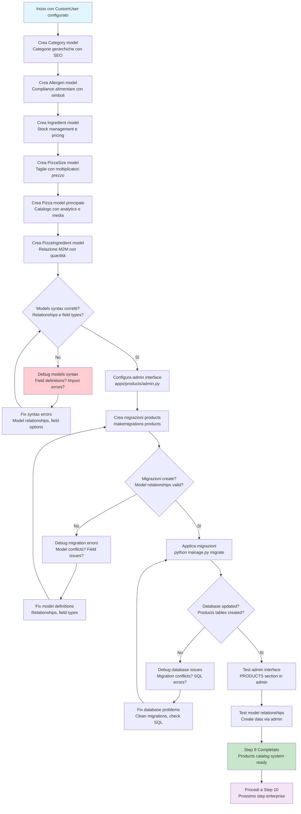

# Step 9: Database Modeling Enterprise - Products

## Obiettivo
Creare modelli database enterprise per il catalogo pizze con Category gerarchiche, Ingredient con stock management, Pizza con pricing dinamico, Allergen compliance e sistema analytics per business intelligence.

---

## Prerequisiti
- **Step 8 completato** → CustomUser system funzionante
- **Pillow installato** → ImageField support disponibile
- **Admin panel testato** → ACCOUNTS section accessibile

---

## Flowchart Step 9



---

## Creazione Modelli Products Enterprise

### 9.1 Crea modelli Products completi
```powershell
# Apri file models dell'app products
code apps/products/models.py
```

**Sostituisci tutto il contenuto con:**

```python
from django.db import models
from django.utils.text import slugify
from django.core.validators import MinValueValidator, MaxValueValidator
from django.urls import reverse

class Category(models.Model):
    """
    Categorie gerarchiche per organizzazione catalogo pizze
    """
    name = models.CharField(max_length=100, unique=True)
    slug = models.SlugField(max_length=100, unique=True, blank=True)
    parent = models.ForeignKey('self', null=True, blank=True, on_delete=models.CASCADE, related_name='children')
    
    # SEO e content
    description = models.TextField(blank=True)
    image = models.ImageField(upload_to='categories/', blank=True)
    meta_title = models.CharField(max_length=150, blank=True)
    meta_description = models.CharField(max_length=300, blank=True)
    
    # Business logic
    is_active = models.BooleanField(default=True)
    sort_order = models.PositiveIntegerField(default=0)
    
    # Analytics
    view_count = models.PositiveIntegerField(default=0)
    
    created_at = models.DateTimeField(auto_now_add=True)
    updated_at = models.DateTimeField(auto_now=True)
    
    class Meta:
        db_table = 'products_category'
        verbose_name = 'Categoria'
        verbose_name_plural = 'Categorie'
        ordering = ['sort_order', 'name']
    
    def save(self, *args, **kwargs):
        if not self.slug:
            self.slug = slugify(self.name)
        super().save(*args, **kwargs)
    
    def __str__(self):
        return self.name
    
    def get_absolute_url(self):
        return reverse('category_detail', kwargs={'slug': self.slug})

class Allergen(models.Model):
    """
    Gestione allergeni per compliance alimentare
    """
    name = models.CharField(max_length=50, unique=True)
    symbol = models.CharField(max_length=10, help_text="es. G per Glutine")
    description = models.TextField()
    color_code = models.CharField(max_length=7, default="#FF0000", help_text="Hex color per badge")
    
    # Compliance
    regulation_code = models.CharField(max_length=20, blank=True, help_text="Codice normativa EU")
    is_major_allergen = models.BooleanField(default=True)
    
    created_at = models.DateTimeField(auto_now_add=True)
    
    class Meta:
        db_table = 'products_allergen'
        verbose_name = 'Allergene'
        verbose_name_plural = 'Allergeni'
        ordering = ['name']
    
    def __str__(self):
        return f"{self.name} ({self.symbol})"

class Ingredient(models.Model):
    """
    Ingredienti con stock management e pricing dinamico
    """
    name = models.CharField(max_length=100, unique=True)
    slug = models.SlugField(max_length=100, unique=True, blank=True)
    
    # Pricing
    cost_per_unit = models.DecimalField(max_digits=6, decimal_places=2, help_text="Costo per unità (grammi)")
    price_per_extra = models.DecimalField(max_digits=6, decimal_places=2, default=0.00, help_text="Prezzo extra per cliente")
    
    # Inventory
    stock_quantity = models.PositiveIntegerField(default=0, help_text="Quantità in stock (grammi)")
    minimum_stock = models.PositiveIntegerField(default=100, help_text="Alert scorte basse")
    unit_of_measure = models.CharField(max_length=20, default='g', help_text="g, kg, pz, ml")
    
    # Nutritional e dietary
    allergens = models.ManyToManyField(Allergen, blank=True)
    is_vegetarian = models.BooleanField(default=True)
    is_vegan = models.BooleanField(default=False)
    is_gluten_free = models.BooleanField(default=False)
    
    # Content
    description = models.TextField(blank=True)
    image = models.ImageField(upload_to='ingredients/', blank=True)
    
    # Business
    is_active = models.BooleanField(default=True)
    supplier = models.CharField(max_length=100, blank=True)
    
    # Analytics
    usage_count = models.PositiveIntegerField(default=0, help_text="Volte usato in pizze")
    
    created_at = models.DateTimeField(auto_now_add=True)
    updated_at = models.DateTimeField(auto_now=True)
    
    class Meta:
        db_table = 'products_ingredient'
        verbose_name = 'Ingrediente'
        verbose_name_plural = 'Ingredienti'
        ordering = ['name']
    
    def save(self, *args, **kwargs):
        if not self.slug:
            self.slug = slugify(self.name)
        super().save(*args, **kwargs)
    
    @property
    def is_low_stock(self):
        return self.stock_quantity <= self.minimum_stock
    
    @property
    def stock_status(self):
        if self.stock_quantity == 0:
            return "Esaurito"
        elif self.is_low_stock:
            return "Scorte basse"
        return "Disponibile"
    
    def __str__(self):
        return f"{self.name} ({self.stock_status})"

class PizzaSize(models.Model):
    """
    Taglie pizza con pricing differenziato
    """
    name = models.CharField(max_length=20, unique=True, help_text="es. Piccola, Media, Grande")
    diameter_cm = models.PositiveIntegerField(help_text="Diametro in centimetri")
    price_multiplier = models.DecimalField(max_digits=3, decimal_places=2, default=1.0, help_text="Moltiplicatore prezzo base")
    
    # Business
    is_active = models.BooleanField(default=True)
    sort_order = models.PositiveIntegerField(default=0)
    
    # Analytics
    order_count = models.PositiveIntegerField(default=0)
    
    created_at = models.DateTimeField(auto_now_add=True)
    
    class Meta:
        db_table = 'products_pizza_size'
        verbose_name = 'Taglia Pizza'
        verbose_name_plural = 'Taglie Pizza'
        ordering = ['sort_order', 'diameter_cm']
    
    def __str__(self):
        return f"{self.name} ({self.diameter_cm}cm)"

class Pizza(models.Model):
    """
    Modello principale pizza con analytics e media
    """
    name = models.CharField(max_length=100, unique=True)
    slug = models.SlugField(max_length=100, unique=True, blank=True)
    category = models.ForeignKey(Category, on_delete=models.CASCADE, related_name='pizzas')
    
    # Content
    description = models.TextField()
    short_description = models.CharField(max_length=200, blank=True)
    ingredients = models.ManyToManyField(Ingredient, through='PizzaIngredient')
    
    # Pricing
    base_price = models.DecimalField(max_digits=8, decimal_places=2, help_text="Prezzo base (taglia media)")
    
    # Media
    image = models.ImageField(upload_to='pizzas/')
    gallery = models.JSONField(default=list, blank=True, help_text="Array URL immagini aggiuntive")
    
    # SEO
    meta_title = models.CharField(max_length=150, blank=True)
    meta_description = models.CharField(max_length=300, blank=True)
    
    # Business logic
    is_active = models.BooleanField(default=True)
    is_featured = models.BooleanField(default=False)
    is_vegetarian = models.BooleanField(default=False)
    is_vegan = models.BooleanField(default=False)
    is_spicy = models.BooleanField(default=False)
    
    # Analytics
    view_count = models.PositiveIntegerField(default=0)
    order_count = models.PositiveIntegerField(default=0)
    avg_rating = models.DecimalField(max_digits=3, decimal_places=2, default=0.00)
    review_count = models.PositiveIntegerField(default=0)
    
    # Nutritional info
    calories_per_100g = models.PositiveIntegerField(null=True, blank=True)
    preparation_time = models.PositiveIntegerField(default=15, help_text="Minuti preparazione")
    
    created_at = models.DateTimeField(auto_now_add=True)
    updated_at = models.DateTimeField(auto_now=True)
    
    class Meta:
        db_table = 'products_pizza'
        verbose_name = 'Pizza'
        verbose_name_plural = 'Pizze'
        ordering = ['-is_featured', 'name']
    
    def save(self, *args, **kwargs):
        if not self.slug:
            self.slug = slugify(self.name)
        super().save(*args, **kwargs)
    
    @property
    def popularity_score(self):
        """Score popolarità basato su views e ordini"""
        return (self.view_count * 0.1) + (self.order_count * 2.0) + (self.avg_rating * 10)
    
    def get_price_for_size(self, size):
        """Calcola prezzo per taglia specifica"""
        return self.base_price * size.price_multiplier
    
    def get_absolute_url(self):
        return reverse('pizza_detail', kwargs={'slug': self.slug})
    
    def __str__(self):
        return self.name

class PizzaIngredient(models.Model):
    """
    Tabella intermedia per relazione Pizza-Ingredient con quantità
    """
    pizza = models.ForeignKey(Pizza, on_delete=models.CASCADE)
    ingredient = models.ForeignKey(Ingredient, on_delete=models.CASCADE)
    quantity = models.DecimalField(max_digits=6, decimal_places=2, help_text="Quantità in grammi")
    is_removable = models.BooleanField(default=True, help_text="Cliente può rimuovere")
    extra_cost = models.DecimalField(max_digits=6, decimal_places=2, default=0.00, help_text="Costo extra se aggiunto")
    
    created_at = models.DateTimeField(auto_now_add=True)
    
    class Meta:
        db_table = 'products_pizza_ingredient'
        verbose_name = 'Ingrediente Pizza'
        verbose_name_plural = 'Ingredienti Pizza'
        unique_together = [['pizza', 'ingredient']]
    
    def __str__(self):
        return f"{self.pizza.name} - {self.ingredient.name} ({self.quantity}g)"
```

---

## Analisi Modelli Products Enterprise

### **Category Model - Gerarchia e SEO**

#### **Hierarchical Structure**
- **self-referencing ForeignKey** → parent field per sottocategorie infinite
- **related_name='children'** → category.children.all() per navigazione
- **CASCADE delete** → Rimuove sottocategorie quando parent eliminata

#### **SEO Optimization**
- **slug field** → URL-friendly per category pages
- **meta_title/description** → SEO meta tags
- **auto-generated slug** → Da nome categoria via slugify()

#### **Business Features**
- **sort_order** → Controllo ordine visualizzazione
- **view_count** → Analytics visualizzazioni categoria
- **is_active** → Attivazione/disattivazione senza eliminare

### **Allergen Model - Compliance Alimentare**

#### **Regulatory Compliance**
- **regulation_code** → Codice normativa EU per allergeni
- **is_major_allergen** → Distinzione allergeni principali
- **symbol** → Codice breve per etichette (G=Glutine)

#### **UI/UX Features**
- **color_code** → Hex color per badge colorati
- **description** → Informazioni dettagliate allergene

### **Ingredient Model - Inventory Management**

#### **Stock Management**
- **stock_quantity** → Quantità attuale in grammi
- **minimum_stock** → Soglia alert scorte basse
- **unit_of_measure** → Unità misura flessibile

#### **Pricing Strategy**
- **cost_per_unit** → Costo ingrediente per business
- **price_per_extra** → Prezzo extra per cliente
- **supplier** → Tracking fornitori

#### **Dietary Classification**
- **allergens M2M** → Relazione con allergeni
- **is_vegetarian/vegan/gluten_free** → Classificazione dietetica
- **Smart properties** → is_low_stock, stock_status

### **PizzaSize Model - Pricing Dinamico**

#### **Size-Based Pricing**
- **diameter_cm** → Dimensione fisica pizza
- **price_multiplier** → Moltiplicatore per prezzo base
- **order_count** → Analytics ordini per taglia

### **Pizza Model - Catalogo Principale**

#### **Content Management**
- **description/short_description** → Content marketing
- **gallery JSONField** → Array URL immagini multiple
- **meta fields** → SEO optimization

#### **Business Intelligence**
- **Analytics fields** → view_count, order_count, avg_rating
- **popularity_score property** → Algorithm ranking
- **preparation_time** → Operations management

#### **Dietary & Features**
- **Boolean flags** → is_vegetarian, is_vegan, is_spicy
- **nutritional info** → calories_per_100g
- **pricing method** → get_price_for_size()

### **PizzaIngredient Model - Advanced M2M**

#### **Quantified Relationships**
- **quantity field** → Grammi specifici per pizza
- **is_removable** → Controllo customization cliente
- **extra_cost** → Pricing per ingredienti aggiuntivi

#### **Business Logic**
- **unique_together** → Evita duplicati pizza-ingrediente
- **Intermediary model** → Più potente di M2M semplice

---

## Configurazione Admin Interface

### 9.2 Configura admin interface avanzata
```powershell
# Apri file admin dell'app products
code apps/products/admin.py
```

**Sostituisci tutto il contenuto con:**

```python
from django.contrib import admin
from django.utils.html import format_html
from .models import Category, Allergen, Ingredient, Pizza, PizzaSize, PizzaIngredient

@admin.register(Category)
class CategoryAdmin(admin.ModelAdmin):
    list_display = ['name', 'parent', 'is_active', 'sort_order', 'view_count']
    list_filter = ['is_active', 'parent', 'created_at']
    search_fields = ['name', 'description']
    prepopulated_fields = {'slug': ('name',)}
    ordering = ['sort_order', 'name']
    
    fieldsets = (
        ('Basic Info', {
            'fields': ('name', 'slug', 'parent', 'description')
        }),
        ('SEO', {
            'fields': ('meta_title', 'meta_description'),
            'classes': ('collapse',)
        }),
        ('Settings', {
            'fields': ('image', 'is_active', 'sort_order')
        }),
        ('Analytics', {
            'fields': ('view_count',),
            'classes': ('collapse',)
        })
    )

@admin.register(Allergen)
class AllergenAdmin(admin.ModelAdmin):
    list_display = ['name', 'symbol', 'colored_badge', 'is_major_allergen']
    list_filter = ['is_major_allergen']
    search_fields = ['name', 'symbol']
    
    def colored_badge(self, obj):
        return format_html(
            '<span style="background-color: {}; color: white; padding: 2px 6px; border-radius: 3px;">{}</span>',
            obj.color_code,
            obj.symbol
        )
    colored_badge.short_description = 'Badge'

@admin.register(Ingredient)
class IngredientAdmin(admin.ModelAdmin):
    list_display = ['name', 'price_per_extra', 'stock_status_colored', 'is_vegetarian', 'is_vegan']
    list_filter = ['is_vegetarian', 'is_vegan', 'is_gluten_free', 'allergens', 'is_active']
    search_fields = ['name', 'description']
    filter_horizontal = ['allergens']
    prepopulated_fields = {'slug': ('name',)}
    
    def stock_status_colored(self, obj):
        color = '#dc3545' if obj.stock_quantity == 0 else '#ffc107' if obj.is_low_stock else '#28a745'
        return format_html(
            '<span style="color: {}; font-weight: bold;">{}</span>',
            color,
            obj.stock_status
        )
    stock_status_colored.short_description = 'Stock Status'
    
    fieldsets = (
        ('Basic Info', {
            'fields': ('name', 'slug', 'description', 'image')
        }),
        ('Pricing & Inventory', {
            'fields': ('cost_per_unit', 'price_per_extra', 'stock_quantity', 'minimum_stock', 'unit_of_measure')
        }),
        ('Dietary Info', {
            'fields': ('allergens', 'is_vegetarian', 'is_vegan', 'is_gluten_free')
        }),
        ('Business', {
            'fields': ('supplier', 'is_active'),
            'classes': ('collapse',)
        })
    )

class PizzaIngredientInline(admin.TabularInline):
    model = PizzaIngredient
    extra = 1
    fields = ['ingredient', 'quantity', 'is_removable', 'extra_cost']

@admin.register(Pizza)
class PizzaAdmin(admin.ModelAdmin):
    list_display = ['name', 'category', 'base_price', 'avg_rating', 'is_featured', 'popularity_score']
    list_filter = ['category', 'is_featured', 'is_vegetarian', 'is_vegan', 'is_spicy', 'is_active']
    search_fields = ['name', 'description']
    prepopulated_fields = {'slug': ('name',)}
    inlines = [PizzaIngredientInline]
    
    fieldsets = (
        ('Basic Info', {
            'fields': ('name', 'slug', 'category', 'description', 'short_description')
        }),
        ('Pricing & Media', {
            'fields': ('base_price', 'image', 'gallery')
        }),
        ('Features', {
            'fields': ('is_vegetarian', 'is_vegan', 'is_spicy', 'preparation_time', 'calories_per_100g')
        }),
        ('SEO', {
            'fields': ('meta_title', 'meta_description'),
            'classes': ('collapse',)
        }),
        ('Settings', {
            'fields': ('is_active', 'is_featured')
        }),
        ('Analytics', {
            'fields': ('view_count', 'order_count', 'avg_rating', 'review_count'),
            'classes': ('collapse',)
        })
    )

@admin.register(PizzaSize)
class PizzaSizeAdmin(admin.ModelAdmin):
    list_display = ['name', 'diameter_cm', 'price_multiplier', 'order_count', 'is_active']
    list_filter = ['is_active']
    ordering = ['sort_order', 'diameter_cm']
```

---

## Applicazione Migrazioni

### 9.3 Crea e applica migrazioni products
```powershell
# Crea migrazioni per modelli products
python manage.py makemigrations products
```

**Output atteso:**
```
Migrations for 'products':
  apps\products\migrations\0001_initial.py
    - Create model Allergen
    - Create model Category
    - Create model Ingredient
    - Create model PizzaSize
    - Create model Pizza
    - Create model PizzaIngredient
```

### 9.4 Applica migrazioni
```powershell
# Applica migrazioni al database
python manage.py migrate
```

**Output atteso:**
```
Operations to perform:
  Apply all migrations: accounts, admin, auth, contenttypes, products, sessions
Running migrations:
  Applying products.0001_initial... OK
```

---

## Test Admin Interface

### 9.5 Test admin panel con Products
```powershell
# Avvia server per test
python manage.py runserver
```

### 9.6 Verifica sezione PRODUCTS in admin
**Naviga a:** `http://127.0.0.1:8000/admin/`

**Verifica sezioni:**
- **PRODUCTS** section dovrebbe apparire
- **Allergeni** → Allergen management
- **Categorie** → Category hierarchy
- **Ingredienti** → Ingredient con stock status colorato
- **Pizze** → Pizza catalog con inline ingredients
- **Taglie Pizza** → Size management

### 9.7 Test creazione dati esempio
**Crea dati di test via admin:**

#### **Allergeni esempio:**
- Nome: "Glutine", Symbol: "G", Color: "#FF0000"
- Nome: "Lattosio", Symbol: "L", Color: "#FFA500"

#### **Categoria esempio:**
- Nome: "Classiche", Description: "Pizze tradizionali"

#### **Ingrediente esempio:**
- Nome: "Mozzarella", Cost: 2.50, Price extra: 1.00, Stock: 1000g

#### **Taglia esempio:**
- Nome: "Media", Diameter: 30cm, Multiplier: 1.0

---

## Troubleshooting

### Problema: "No such table: products_category"
**Causa:** Migrazioni non applicate

**Soluzione:**
```powershell
# Verifica migrazioni pending
python manage.py showmigrations

# Applica migrazioni mancanti
python manage.py migrate products
```

### Problema: "IntegrityError: UNIQUE constraint failed"
**Causa:** Duplicati in campi unique

**Debug:**
```powershell
# Verifica duplicati nella shell Django
python manage.py shell
>>> from apps.products.models import Pizza
>>> Pizza.objects.values('name').annotate(count=models.Count('name')).filter(count__gt=1)
```

### Problema: "Invalid model name 'PizzaIngredient'"
**Causa:** Through model non riconosciuto

**Verifica:**
```python
# In models.py, verifica sintassi:
ingredients = models.ManyToManyField(Ingredient, through='PizzaIngredient')

# Classe PizzaIngredient deve essere DOPO Pizza class
```

### Problema: Admin interface non mostra colored badges
**Causa:** HTML escaping in admin

**Fix:**
```python
# Usa format_html invece di direct HTML
from django.utils.html import format_html

def colored_badge(self, obj):
    return format_html('<span style="...">{}</span>', obj.symbol)
colored_badge.short_description = 'Badge'
```

---

## Struttura Database Finale

Dopo Step 9, tabelle products create:

### **Tabelle Products:**
- **products_category** → Categorie gerarchiche
- **products_allergen** → Allergeni compliance
- **products_ingredient** → Ingredienti con stock
- **products_pizza_size** → Taglie pizza
- **products_pizza** → Catalogo principale
- **products_pizza_ingredient** → M2M con quantità

### **Relationships:**
- **Category self-referencing** → Gerarchia infinita
- **Pizza → Category** → ForeignKey
- **Pizza ↔ Ingredient** → Through PizzaIngredient
- **Ingredient ↔ Allergen** → ManyToMany

---

## Struttura Finale Step 9

```
pizzamama-enreprise/
└── src/
    ├── apps/
    │   ├── accounts/              ← CustomUser system
    │   └── products/              ← Catalog system (NEW)
    │       ├── migrations/
    │       │   └── 0001_initial.py ← Products models migration (NEW)
    │       ├── models.py          ← Pizza, Category, Ingredient models (NEW)
    │       └── admin.py           ← Advanced admin interface (NEW)
    └── db.sqlite3                 ← Updated con products tables (NEW)
```

---

## Cosa Abbiamo Realizzato

### **Catalogo E-commerce Completo**
- **Category hierarchy** → Organizzazione catalogo scalabile
- **Ingredient management** → Stock e pricing dinamico
- **Pizza catalog** → Prodotto principale con analytics

### **Business Intelligence**
- **Analytics fields** → View count, order count, popularity score
- **Stock management** → Low stock alerts, inventory tracking
- **Pricing strategy** → Size-based multipliers, extra costs

### **Compliance & UX**
- **Allergen management** → Regulatory compliance
- **Dietary classification** → Vegetarian, vegan, gluten-free
- **Admin interface** → Colored status, advanced filtering

### **Enterprise Features**
- **SEO optimization** → Slugs, meta tags, URL structure
- **Content management** → Descriptions, image galleries
- **Scalable architecture** → Ready per migliaia di prodotti

---

## Prossimo Step

Una volta completato con successo questo step:

1. **Verifica** PRODUCTS section in admin accessibile
2. **Testa** creazione Pizza con ingredienti funziona
3. **Procedi** al completamento setup enterprise

### Collegamento finale:
```
Setup enterprise completato!
Database modeling completo per:
- CustomUser system (accounts)
- Product catalog (products)
- Ready per orders modeling e API development
```

---

## Note Importanti

### **Performance Considerations**
- **Indexing** → slug fields automaticamente indexed
- **Queries optimization** → select_related, prefetch_related da usare
- **Image handling** → Thumbnail generation da implementare

### **Business Logic Examples**
```python
# Calcolo prezzo pizza con taglia
pizza = Pizza.objects.get(slug='margherita')
size_media = PizzaSize.objects.get(name='Media')
prezzo_finale = pizza.get_price_for_size(size_media)

# Check ingredienti disponibili
ingredienti_disponibili = Ingredient.objects.filter(
    stock_quantity__gt=0,
    is_active=True
)

# Pizze vegetariane
pizze_vegetariane = Pizza.objects.filter(
    is_vegetarian=True,
    is_active=True
).order_by('-popularity_score')
```

---

## Checklist Completamento Step 9

- [ ] **Models products creati** → Category, Allergen, Ingredient, Pizza, PizzaSize
- [ ] **Admin interface configurata** → Colored status, advanced filtering
- [ ] **Migrazioni applicate** → products.0001_initial successful
- [ ] **PRODUCTS section testata** → Admin panel accessibile
- [ ] **Relationships funzionanti** → Pizza-Ingredient M2M con quantità
- [ ] **Setup enterprise completato** → Database modeling pronto

**Congratulazioni! Hai completato il setup enterprise di PizzaMama con database modeling completo!**