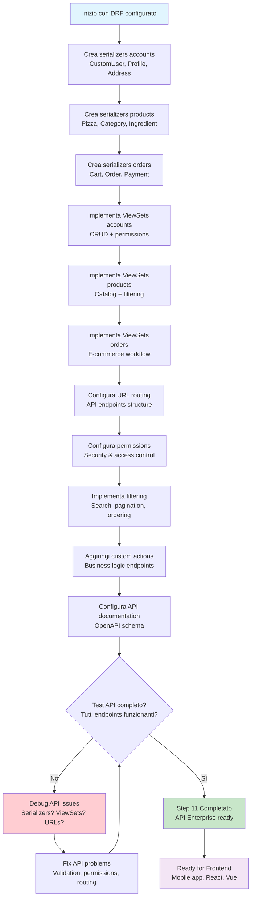

# Step 11: API Development Enterprise - Django REST Framework

## Obiettivo
Creare API REST complete per tutti i modelli enterprise con serializers avanzati, viewsets con permissions granulari, filtering intelligente e documentazione automatica per un sistema e-commerce professionale.

---

## Prerequisiti
- **Step 10 completato** → Database modeling enterprise completo
- **Tutte le app configurate** → ACCOUNTS, PRODUCTS, ORDERS
- **Django REST Framework** → Già installato e configurato

---

## Flowchart Step 11



---

## Struttura File da Creare/Modificare

```
src/
├── apps/
│   ├── accounts/
│   │   ├── api/                    ← Directory API (NEW)
│   │   │   ├── __init__.py        ← Package marker (NEW)
│   │   │   ├── serializers.py     ← Account serializers (NEW)
│   │   │   ├── views.py           ← Account ViewSets (NEW)
│   │   │   └── urls.py            ← Account API URLs (NEW)
│   │   └── models.py              ← Existing
│   ├── products/
│   │   ├── api/                    ← Directory API (NEW)
│   │   │   ├── __init__.py        ← Package marker (NEW)
│   │   │   ├── serializers.py     ← Product serializers (NEW)
│   │   │   ├── views.py           ← Product ViewSets (NEW)
│   │   │   └── urls.py            ← Product API URLs (NEW)
│   │   └── models.py              ← Existing
│   └── orders/
│       ├── api/                    ← Directory API (NEW)
│       │   ├── __init__.py        ← Package marker (NEW)
│       │   ├── serializers.py     ← Order serializers (NEW)
│       │   ├── views.py           ← Order ViewSets (NEW)
│       │   └── urls.py            ← Order API URLs (NEW)
│       └── models.py              ← Existing
├── pizzamama/
│   ├── settings.py                ← Update DRF config (MODIFIED)
│   └── urls.py                    ← Add API routes (MODIFIED)
└── requirements.txt               ← Add new dependencies (MODIFIED)
```

---

## 11.1 Installazione Dipendenze Aggiuntive

```powershell
# Installa dipendenze per API avanzate
py -m pip install django-filter==23.5
py -m pip install drf-spectacular==0.27.1
py -m pip install django-cors-headers==4.3.1
```

**Spiegazione dipendenze:**
- **django-filter** → Filtering avanzato per API
- **drf-spectacular** → Documentazione OpenAPI automatica
- **django-cors-headers** → CORS per frontend separation

---

## 11.2 Aggiorna settings.py per API Enterprise

**File:** `pizzamama/settings.py`

**Aggiungi queste configurazioni alla fine del file:**

```python
# API Enterprise Configuration
INSTALLED_APPS += [
    'django_filters',
    'corsheaders',
    'drf_spectacular',
]

MIDDLEWARE.insert(0, 'corsheaders.middleware.CorsMiddleware')

# Django REST Framework Advanced
REST_FRAMEWORK = {
    'DEFAULT_AUTHENTICATION_CLASSES': [
        'rest_framework.authentication.SessionAuthentication',
        'rest_framework.authentication.TokenAuthentication',
    ],
    'DEFAULT_PERMISSION_CLASSES': [
        'rest_framework.permissions.IsAuthenticated',
    ],
    'DEFAULT_PAGINATION_CLASS': 'rest_framework.pagination.PageNumberPagination',
    'PAGE_SIZE': 20,
    'DEFAULT_FILTER_BACKENDS': [
        'django_filters.rest_framework.DjangoFilterBackend',
        'rest_framework.filters.SearchFilter',
        'rest_framework.filters.OrderingFilter',
    ],
    'DEFAULT_SCHEMA_CLASS': 'drf_spectacular.openapi.AutoSchema',
}

# API Documentation
SPECTACULAR_SETTINGS = {
    'TITLE': 'PizzaMama Enterprise API',
    'DESCRIPTION': 'Complete REST API for PizzaMama e-commerce platform',
    'VERSION': '1.0.0',
    'SERVE_INCLUDE_SCHEMA': False,
    'COMPONENT_SPLIT_REQUEST': True,
}

# CORS Configuration (for frontend development)
CORS_ALLOWED_ORIGINS = [
    "http://localhost:3000",  # React dev server
    "http://127.0.0.1:3000",
    "http://localhost:8080",  # Vue dev server
    "http://127.0.0.1:8080",
]

CORS_ALLOW_CREDENTIALS = True

# Token Authentication
REST_USE_JWT = False  # Per ora usiamo Token standard
```

---

## 11.3 Accounts API Implementation

### File: `apps/accounts/api/__init__.py`
```python
# Package marker
```

### File: `apps/accounts/api/serializers.py`

```python
from rest_framework import serializers
from django.contrib.auth import authenticate
from apps.accounts.models import CustomUser, Profile, Address

class AddressSerializer(serializers.ModelSerializer):
    """Serializer per indirizzi di delivery"""
    
    class Meta:
        model = Address
        fields = [
            'id', 'label', 'street_address', 'city', 'postal_code', 
            'province', 'country', 'latitude', 'longitude', 'is_default', 'created_at'
        ]
        read_only_fields = ['id', 'created_at']
    
    def validate(self, data):
        """Validazione business logic"""
        user = self.context['request'].user
        
        # Solo un indirizzo default per utente
        if data.get('is_default') and Address.objects.filter(user=user, is_default=True).exists():
            if not self.instance or not self.instance.is_default:
                raise serializers.ValidationError("Hai già un indirizzo principale. Disattiva quello attuale prima.")
        
        return data

class ProfileSerializer(serializers.ModelSerializer):
    """Serializer per profilo utente con loyalty system"""
    addresses = AddressSerializer(many=True, read_only=True, source='user.addresses')
    loyalty_tier = serializers.SerializerMethodField()
    
    class Meta:
        model = Profile
        fields = [
            'avatar', 'bio', 'loyalty_points', 'total_orders', 'total_spent',
            'preferences', 'loyalty_tier', 'addresses', 'created_at', 'updated_at'
        ]
        read_only_fields = ['loyalty_points', 'total_orders', 'total_spent', 'created_at', 'updated_at']
    
    def get_loyalty_tier(self, obj):
        """Calcola tier loyalty in base ai punti"""
        points = obj.loyalty_points
        if points >= 1000:
            return {'name': 'Gold', 'icon': '🥇', 'benefits': 'Free delivery + 15% discount'}
        elif points >= 500:
            return {'name': 'Silver', 'icon': '🥈', 'benefits': 'Free delivery + 10% discount'}
        elif points >= 100:
            return {'name': 'Bronze', 'icon': '🥉', 'benefits': '5% discount'}
        else:
            return {'name': 'Basic', 'icon': '👤', 'benefits': 'Earn points on orders'}

class CustomUserSerializer(serializers.ModelSerializer):
    """Serializer per CustomUser con profilo integrato"""
    profile = ProfileSerializer(read_only=True)
    password = serializers.CharField(write_only=True, min_length=8)
    
    class Meta:
        model = CustomUser
        fields = [
            'id', 'username', 'email', 'first_name', 'last_name', 'phone',
            'date_of_birth', 'preferred_language', 'marketing_consent', 
            'is_verified', 'profile', 'password', 'date_joined'
        ]
        read_only_fields = ['id', 'is_verified', 'date_joined']
        extra_kwargs = {
            'password': {'write_only': True},
            'email': {'required': True},
        }
    
    def create(self, validated_data):
        """Crea utente con password hashata e profilo"""
        password = validated_data.pop('password')
        user = CustomUser.objects.create_user(**validated_data)
        user.set_password(password)
        user.save()
        
        # Crea profilo automaticamente
        Profile.objects.create(user=user)
        
        return user
    
    def update(self, instance, validated_data):
        """Update con gestione password"""
        password = validated_data.pop('password', None)
        
        for attr, value in validated_data.items():
            setattr(instance, attr, value)
        
        if password:
            instance.set_password(password)
        
        instance.save()
        return instance

class LoginSerializer(serializers.Serializer):
    """Serializer per login con token response"""
    username = serializers.CharField()
    password = serializers.CharField()
    
    def validate(self, data):
        username = data.get('username')
        password = data.get('password')
        
        if username and password:
            user = authenticate(username=username, password=password)
            if not user:
                raise serializers.ValidationError('Credenziali non valide.')
            if not user.is_active:
                raise serializers.ValidationError('Account disattivato.')
            data['user'] = user
        else:
            raise serializers.ValidationError('Username e password richiesti.')
        
        return data

class UserRegistrationSerializer(serializers.ModelSerializer):
    """Serializer per registrazione nuovi utenti"""
    password = serializers.CharField(write_only=True, min_length=8)
    password_confirm = serializers.CharField(write_only=True)
    
    class Meta:
        model = CustomUser
        fields = [
            'username', 'email', 'first_name', 'last_name', 'phone',
            'password', 'password_confirm', 'marketing_consent', 'preferred_language'
        ]
    
    def validate(self, data):
        """Validazione password match"""
        if data['password'] != data['password_confirm']:
            raise serializers.ValidationError("Le password non corrispondono.")
        return data
    
    def create(self, validated_data):
        """Crea utente con profilo"""
        validated_data.pop('password_confirm')
        password = validated_data.pop('password')
        
        user = CustomUser.objects.create_user(**validated_data)
        user.set_password(password)
        user.save()
        
        # Crea profilo automaticamente
        Profile.objects.create(user=user)
        
        return user
```

### File: `apps/accounts/api/views.py`

```python
from rest_framework import viewsets, status, permissions
from rest_framework.decorators import action
from rest_framework.response import Response
from rest_framework.authtoken.models import Token
from django_filters.rest_framework import DjangoFilterBackend
from rest_framework.filters import SearchFilter, OrderingFilter
from apps.accounts.models import CustomUser, Profile, Address
from .serializers import (
    CustomUserSerializer, ProfileSerializer, AddressSerializer,
    LoginSerializer, UserRegistrationSerializer
)

class CustomUserViewSet(viewsets.ModelViewSet):
    """ViewSet per gestione utenti con azioni custom"""
    queryset = CustomUser.objects.all()
    serializer_class = CustomUserSerializer
    permission_classes = [permissions.IsAuthenticated]
    filter_backends = [DjangoFilterBackend, SearchFilter, OrderingFilter]
    filterset_fields = ['is_verified', 'preferred_language', 'marketing_consent']
    search_fields = ['username', 'email', 'first_name', 'last_name']
    ordering_fields = ['date_joined', 'username']
    ordering = ['-date_joined']
    
    def get_permissions(self):
        """Permissions diverse per azioni diverse"""
        if self.action in ['create', 'register']:
            permission_classes = [permissions.AllowAny]
        elif self.action in ['me', 'update_profile']:
            permission_classes = [permissions.IsAuthenticated]
        else:
            permission_classes = [permissions.IsAdminUser]
        
        return [permission() for permission in permission_classes]
    
    @action(detail=False, methods=['get', 'put', 'patch'])
    def me(self, request):
        """Endpoint per profilo utente corrente"""
        if request.method == 'GET':
            serializer = self.get_serializer(request.user)
            return Response(serializer.data)
        else:
            serializer = self.get_serializer(request.user, data=request.data, partial=True)
            if serializer.is_valid():
                serializer.save()
                return Response(serializer.data)
            return Response(serializer.errors, status=status.HTTP_400_BAD_REQUEST)
    
    @action(detail=False, methods=['post'])
    def register(self, request):
        """Registrazione nuovo utente"""
        serializer = UserRegistrationSerializer(data=request.data)
        if serializer.is_valid():
            user = serializer.save()
            token, created = Token.objects.get_or_create(user=user)
            return Response({
                'user': CustomUserSerializer(user).data,
                'token': token.key,
                'message': 'Registrazione completata con successo!'
            }, status=status.HTTP_201_CREATED)
        return Response(serializer.errors, status=status.HTTP_400_BAD_REQUEST)
    
    @action(detail=False, methods=['post'])
    def login(self, request):
        """Login con token response"""
        serializer = LoginSerializer(data=request.data)
        if serializer.is_valid():
            user = serializer.validated_data['user']
            token, created = Token.objects.get_or_create(user=user)
            return Response({
                'user': CustomUserSerializer(user).data,
                'token': token.key,
                'message': 'Login effettuato con successo!'
            })
        return Response(serializer.errors, status=status.HTTP_400_BAD_REQUEST)
    
    @action(detail=False, methods=['post'])
    def logout(self, request):
        """Logout con eliminazione token"""
        try:
            request.user.auth_token.delete()
            return Response({'message': 'Logout effettuato con successo!'})
        except:
            return Response({'error': 'Token non trovato.'}, status=status.HTTP_400_BAD_REQUEST)

class ProfileViewSet(viewsets.ModelViewSet):
    """ViewSet per gestione profili utente"""
    queryset = Profile.objects.all()
    serializer_class = ProfileSerializer
    permission_classes = [permissions.IsAuthenticated]
    filter_backends = [DjangoFilterBackend, OrderingFilter]
    filterset_fields = ['loyalty_points']
    ordering_fields = ['loyalty_points', 'total_orders', 'total_spent']
    ordering = ['-loyalty_points']
    
    def get_queryset(self):
        """Utenti vedono solo il proprio profilo"""
        if self.request.user.is_staff:
            return Profile.objects.all()
        return Profile.objects.filter(user=self.request.user)
    
    @action(detail=True, methods=['post'])
    def add_loyalty_points(self, request, pk=None):
        """Aggiunge punti loyalty (solo admin)"""
        if not request.user.is_staff:
            return Response({'error': 'Permission denied'}, status=status.HTTP_403_FORBIDDEN)
        
        profile = self.get_object()
        points = request.data.get('points', 0)
        
        if points > 0:
            profile.loyalty_points += points
            profile.save()
            return Response({
                'message': f'{points} punti aggiunti!',
                'new_total': profile.loyalty_points
            })
        return Response({'error': 'Punti devono essere > 0'}, status=status.HTTP_400_BAD_REQUEST)

class AddressViewSet(viewsets.ModelViewSet):
    """ViewSet per gestione indirizzi di delivery"""
    queryset = Address.objects.all()
    serializer_class = AddressSerializer
    permission_classes = [permissions.IsAuthenticated]
    filter_backends = [DjangoFilterBackend, SearchFilter]
    filterset_fields = ['is_default', 'city', 'country']
    search_fields = ['label', 'street_address', 'city']
    
    def get_queryset(self):
        """Utenti vedono solo i propri indirizzi"""
        return Address.objects.filter(user=self.request.user)
    
    def perform_create(self, serializer):
        """Associa indirizzo all'utente corrente"""
        serializer.save(user=self.request.user)
    
    @action(detail=True, methods=['post'])
    def set_default(self, request, pk=None):
        """Imposta indirizzo come principale"""
        address = self.get_object()
        
        # Reset tutti gli altri indirizzi
        Address.objects.filter(user=request.user).update(is_default=False)
        
        # Imposta questo come default
        address.is_default = True
        address.save()
        
        return Response({
            'message': f'Indirizzo "{address.label}" impostato come principale',
            'address': AddressSerializer(address).data
        })
```

### File: `apps/accounts/api/urls.py`

```python
from django.urls import path, include
from rest_framework.routers import DefaultRouter
from .views import CustomUserViewSet, ProfileViewSet, AddressViewSet

router = DefaultRouter()
router.register(r'users', CustomUserViewSet)
router.register(r'profiles', ProfileViewSet)
router.register(r'addresses', AddressViewSet)

urlpatterns = [
    path('', include(router.urls)),
]
```

---

## 11.4 Products API Implementation

### File: `apps/products/api/__init__.py`
```python
# Package marker
```

### File: `apps/products/api/serializers.py`

```python
from rest_framework import serializers
from apps.products.models import Category, Allergen, Ingredient, Pizza, PizzaSize, PizzaIngredient

class AllergenSerializer(serializers.ModelSerializer):
    """Serializer per allergeni con badge colorato"""
    
    class Meta:
        model = Allergen
        fields = ['id', 'name', 'symbol', 'description', 'color_code', 'regulation_code', 'is_major_allergen']

class CategorySerializer(serializers.ModelSerializer):
    """Serializer per categorie con gerarchia"""
    children = serializers.SerializerMethodField()
    pizza_count = serializers.SerializerMethodField()
    
    class Meta:
        model = Category
        fields = [
            'id', 'name', 'slug', 'description', 'image', 'parent', 'children',
            'is_active', 'sort_order', 'pizza_count', 'view_count'
        ]
        read_only_fields = ['view_count']
    
    def get_children(self, obj):
        """Sottocategorie annidate"""
        if obj.children.exists():
            return CategorySerializer(obj.children.filter(is_active=True), many=True).data
        return []
    
    def get_pizza_count(self, obj):
        """Numero pizze in categoria"""
        return obj.pizzas.filter(is_active=True).count()

class IngredientSerializer(serializers.ModelSerializer):
    """Serializer per ingredienti con info stock"""
    allergens = AllergenSerializer(many=True, read_only=True)
    stock_status = serializers.CharField(read_only=True)
    is_low_stock = serializers.BooleanField(read_only=True)
    
    class Meta:
        model = Ingredient
        fields = [
            'id', 'name', 'slug', 'description', 'image', 'price_per_extra',
            'stock_quantity', 'minimum_stock', 'unit_of_measure', 'stock_status',
            'is_low_stock', 'allergens', 'is_vegetarian', 'is_vegan', 'is_gluten_free',
            'is_active', 'supplier', 'usage_count'
        ]
        read_only_fields = ['usage_count', 'stock_status', 'is_low_stock']

class PizzaSizeSerializer(serializers.ModelSerializer):
    """Serializer per taglie pizza"""
    
    class Meta:
        model = PizzaSize
        fields = ['id', 'name', 'diameter_cm', 'price_multiplier', 'is_active', 'sort_order']

class PizzaIngredientSerializer(serializers.ModelSerializer):
    """Serializer per ingredienti pizza con quantità"""
    ingredient = IngredientSerializer(read_only=True)
    ingredient_id = serializers.IntegerField(write_only=True)
    
    class Meta:
        model = PizzaIngredient
        fields = ['ingredient', 'ingredient_id', 'quantity', 'is_removable', 'extra_cost']

class PizzaListSerializer(serializers.ModelSerializer):
    """Serializer leggero per lista pizze"""
    category = CategorySerializer(read_only=True)
    avg_rating = serializers.DecimalField(max_digits=3, decimal_places=2, read_only=True)
    price_range = serializers.SerializerMethodField()
    
    class Meta:
        model = Pizza
        fields = [
            'id', 'name', 'slug', 'short_description', 'base_price', 'price_range',
            'image', 'category', 'is_vegetarian', 'is_vegan', 'is_spicy',
            'avg_rating', 'review_count', 'preparation_time', 'is_featured'
        ]
    
    def get_price_range(self, obj):
        """Calcola range prezzi per tutte le taglie"""
        sizes = PizzaSize.objects.filter(is_active=True)
        if sizes.exists():
            prices = [obj.base_price * size.price_multiplier for size in sizes]
            return {
                'min_price': min(prices),
                'max_price': max(prices)
            }
        return {'min_price': obj.base_price, 'max_price': obj.base_price}

class PizzaDetailSerializer(serializers.ModelSerializer):
    """Serializer completo per dettaglio pizza"""
    category = CategorySerializer(read_only=True)
    ingredients = PizzaIngredientSerializer(source='pizzaingredient_set', many=True, read_only=True)
    available_sizes = PizzaSizeSerializer(many=True, read_only=True, source='pizzasize_set')
    popularity_score = serializers.FloatField(read_only=True)
    
    class Meta:
        model = Pizza
        fields = [
            'id', 'name', 'slug', 'description', 'short_description', 'base_price',
            'category', 'ingredients', 'available_sizes', 'image', 'gallery',
            'is_vegetarian', 'is_vegan', 'is_spicy', 'is_featured', 'is_active',
            'avg_rating', 'review_count', 'view_count', 'order_count',
            'popularity_score', 'calories_per_100g', 'preparation_time',
            'meta_title', 'meta_description', 'created_at', 'updated_at'
        ]
        read_only_fields = [
            'view_count', 'order_count', 'avg_rating', 'review_count',
            'popularity_score', 'created_at', 'updated_at'
        ]

class PizzaCreateUpdateSerializer(serializers.ModelSerializer):
    """Serializer per creazione/modifica pizze"""
    ingredients = PizzaIngredientSerializer(many=True, required=False)
    
    class Meta:
        model = Pizza
        fields = [
            'name', 'description', 'short_description', 'base_price', 'category',
            'image', 'gallery', 'is_vegetarian', 'is_vegan', 'is_spicy',
            'is_featured', 'is_active', 'calories_per_100g', 'preparation_time',
            'meta_title', 'meta_description', 'ingredients'
        ]
    
    def create(self, validated_data):
        ingredients_data = validated_data.pop('ingredients', [])
        pizza = Pizza.objects.create(**validated_data)
        
        for ingredient_data in ingredients_data:
            PizzaIngredient.objects.create(pizza=pizza, **ingredient_data)
        
        return pizza
    
    def update(self, instance, validated_data):
        ingredients_data = validated_data.pop('ingredients', None)
        
        # Update pizza fields
        for attr, value in validated_data.items():
            setattr(instance, attr, value)
        instance.save()
        
        # Update ingredients if provided
        if ingredients_data is not None:
            instance.pizzaingredient_set.all().delete()
            for ingredient_data in ingredients_data:
                PizzaIngredient.objects.create(pizza=instance, **ingredient_data)
        
        return instance
```

### File: `apps/products/api/views.py`

```python
from rest_framework import viewsets, filters, permissions
from rest_framework.decorators import action
from rest_framework.response import Response
from django_filters.rest_framework import DjangoFilterBackend
from django.db.models import Q, F
from apps.products.models import Category, Allergen, Ingredient, Pizza, PizzaSize
from .serializers import (
    CategorySerializer, AllergenSerializer, IngredientSerializer,
    PizzaListSerializer, PizzaDetailSerializer, PizzaCreateUpdateSerializer,
    PizzaSizeSerializer
)

class CategoryViewSet(viewsets.ModelViewSet):
    """ViewSet per categorie con gerarchia"""
    queryset = Category.objects.filter(is_active=True)
    serializer_class = CategorySerializer
    permission_classes = [permissions.AllowAny]
    filter_backends = [DjangoFilterBackend, filters.SearchFilter, filters.OrderingFilter]
    filterset_fields = ['parent', 'is_active']
    search_fields = ['name', 'description']
    ordering_fields = ['sort_order', 'name', 'view_count']
    ordering = ['sort_order', 'name']
    lookup_field = 'slug'
    
    @action(detail=False)
    def hierarchy(self, request):
        """Ritorna gerarchia completa categorie"""
        root_categories = Category.objects.filter(parent=None, is_active=True)
        serializer = CategorySerializer(root_categories, many=True)
        return Response(serializer.data)
    
    @action(detail=True, methods=['post'])
    def increment_view(self, request, slug=None):
        """Incrementa contatore visualizzazioni"""
        category = self.get_object()
        category.view_count = F('view_count') + 1
        category.save()
        return Response({'message': 'View count updated'})

class AllergenViewSet(viewsets.ReadOnlyModelViewSet):
    """ViewSet read-only per allergeni"""
    queryset = Allergen.objects.all()
    serializer_class = AllergenSerializer
    permission_classes = [permissions.AllowAny]
    filter_backends = [filters.SearchFilter]
    search_fields = ['name', 'symbol']

class IngredientViewSet(viewsets.ModelViewSet):
    """ViewSet per ingredienti con gestione stock"""
    queryset = Ingredient.objects.filter(is_active=True)
    serializer_class = IngredientSerializer
    permission_classes = [permissions.AllowAny]
    filter_backends = [DjangoFilterBackend, filters.SearchFilter, filters.OrderingFilter]
    filterset_fields = ['is_vegetarian', 'is_vegan', 'is_gluten_free', 'allergens']
    search_fields = ['name', 'description']
    ordering_fields = ['name', 'price_per_extra', 'stock_quantity']
    ordering = ['name']
    lookup_field = 'slug'
    
    def get_permissions(self):
        """Read-only per non-staff"""
        if self.action in ['list', 'retrieve']:
            permission_classes = [permissions.AllowAny]
        else:
            permission_classes = [permissions.IsAdminUser]
        return [permission() for permission in permission_classes]
    
    @action(detail=False)
    def low_stock(self, request):
        """Ingredienti con scorte basse"""
        low_stock_ingredients = Ingredient.objects.filter(
            stock_quantity__lte=F('minimum_stock'),
            is_active=True
        )
        serializer = self.get_serializer(low_stock_ingredients, many=True)
        return Response(serializer.data)
    
    @action(detail=False)
    def dietary(self, request):
        """Filtra per esigenze dietetiche"""
        dietary_type = request.query_params.get('type', 'vegetarian')
        
        if dietary_type == 'vegetarian':
            queryset = self.get_queryset().filter(is_vegetarian=True)
        elif dietary_type == 'vegan':
            queryset = self.get_queryset().filter(is_vegan=True)
        elif dietary_type == 'gluten_free':
            queryset = self.get_queryset().filter(is_gluten_free=True)
        else:
            queryset = self.get_queryset()
        
        serializer = self.get_serializer(queryset, many=True)
        return Response(serializer.data)

class PizzaSizeViewSet(viewsets.ReadOnlyModelViewSet):
    """ViewSet read-only per taglie pizza"""
    queryset = PizzaSize.objects.filter(is_active=True)
    serializer_class = PizzaSizeSerializer
    permission_classes = [permissions.AllowAny]
    ordering = ['sort_order', 'diameter_cm']

class PizzaViewSet(viewsets.ModelViewSet):
    """ViewSet per pizze con filtering avanzato"""
    queryset = Pizza.objects.filter(is_active=True)
    permission_classes = [permissions.AllowAny]
    filter_backends = [DjangoFilterBackend, filters.SearchFilter, filters.OrderingFilter]
    filterset_fields = ['category', 'is_vegetarian', 'is_vegan', 'is_spicy', 'is_featured']
    search_fields = ['name', 'description', 'short_description']
    ordering_fields = ['name', 'base_price', 'avg_rating', 'popularity_score', 'created_at']
    ordering = ['-is_featured', '-popularity_score', 'name']
    lookup_field = 'slug'
    
    def get_serializer_class(self):
        """Serializer diverso per lista e dettaglio"""
        if self.action == 'list':
            return PizzaListSerializer
        elif self.action in ['create', 'update', 'partial_update']:
            return PizzaCreateUpdateSerializer
        else:
            return PizzaDetailSerializer
    
    def get_permissions(self):
        """Read-only per non-staff"""
        if self.action in ['list', 'retrieve', 'popular', 'featured', 'search_advanced']:
            permission_classes = [permissions.AllowAny]
        else:
            permission_classes = [permissions.IsAdminUser]
        return [permission() for permission in permission_classes]
    
    def retrieve(self, request, *args, **kwargs):
        """Incrementa view count quando si visualizza dettaglio"""
        instance = self.get_object()
        instance.view_count = F('view_count') + 1
        instance.save()
        serializer = self.get_serializer(instance)
        return Response(serializer.data)
    
    @action(detail=False)
    def featured(self, request):
        """Pizze in evidenza"""
        featured_pizzas = self.get_queryset().filter(is_featured=True)
        serializer = PizzaListSerializer(featured_pizzas, many=True)
        return Response(serializer.data)
    
    @action(detail=False)
    def popular(self, request):
        """Pizze più popolari"""
        popular_pizzas = self.get_queryset().order_by('-popularity_score')[:10]
        serializer = PizzaListSerializer(popular_pizzas, many=True)
        return Response(serializer.data)
    
    @action(detail=False)
    def by_category(self, request):
        """Pizze per categoria"""
        category_slug = request.query_params.get('category')
        if category_slug:
            pizzas = self.get_queryset().filter(category__slug=category_slug)
            serializer = PizzaListSerializer(pizzas, many=True)
            return Response(serializer.data)
        return Response({'error': 'Category parameter required'}, status=400)
    
    @action(detail=False, methods=['post'])
    def search_advanced(self, request):
        """Ricerca avanzata con filtri multipli"""
        filters = Q()
        
        # Filtri dalla request
        price_min = request.data.get('price_min')
        price_max = request.data.get('price_max')
        vegetarian = request.data.get('vegetarian')
        vegan = request.data.get('vegan')
        spicy = request.data.get('spicy')
        preparation_time_max = request.data.get('preparation_time_max')
        excluded_allergens = request.data.get('excluded_allergens', [])
        
        if price_min:
            filters &= Q(base_price__gte=price_min)
        if price_max:
            filters &= Q(base_price__lte=price_max)
        if vegetarian:
            filters &= Q(is_vegetarian=True)
        if vegan:
            filters &= Q(is_vegan=True)
        if spicy is not None:
            filters &= Q(is_spicy=spicy)
        if preparation_time_max:
            filters &= Q(preparation_time__lte=preparation_time_max)
        
        pizzas = self.get_queryset().filter(filters)
        
        # Escludi pizze con allergeni specificati
        if excluded_allergens:
            for allergen_id in excluded_allergens:
                pizzas = pizzas.exclude(
                    pizzaingredient__ingredient__allergens__id=allergen_id
                )
        
        pizzas = pizzas.distinct()
        serializer = PizzaListSerializer(pizzas, many=True)
        return Response({
            'results': serializer.data,
            'count': pizzas.count(),
            'filters_applied': request.data
        })
```

### File: `apps/products/api/urls.py`

```python
from django.urls import path, include
from rest_framework.routers import DefaultRouter
from .views import CategoryViewSet, AllergenViewSet, IngredientViewSet, PizzaViewSet, PizzaSizeViewSet

router = DefaultRouter()
router.register(r'categories', CategoryViewSet)
router.register(r'allergens', AllergenViewSet)
router.register(r'ingredients', IngredientViewSet)
router.register(r'pizzas', PizzaViewSet)
router.register(r'sizes', PizzaSizeViewSet)

urlpatterns = [
    path('', include(router.urls)),
]
```

---

## 11.5 Orders API Implementation

### File: `apps/orders/api/__init__.py`
```python
# Package marker
```

### File: `apps/orders/api/serializers.py`

```python
from rest_framework import serializers
from decimal import Decimal
from apps.orders.models import Cart, CartItem, Order, OrderItem, Payment, DeliveryInfo
from apps.products.api.serializers import PizzaListSerializer, PizzaSizeSerializer, IngredientSerializer
from apps.accounts.api.serializers import AddressSerializer

class CartItemSerializer(serializers.ModelSerializer):
    """Serializer per elementi carrello con dettagli prodotto"""
    pizza = PizzaListSerializer(read_only=True)
    pizza_id = serializers.IntegerField(write_only=True)
    size = PizzaSizeSerializer(read_only=True)
    size_id = serializers.IntegerField(write_only=True)
    extra_ingredients = IngredientSerializer(many=True, read_only=True)
    extra_ingredients_ids = serializers.ListField(
        child=serializers.IntegerField(), write_only=True, required=False
    )
    removed_ingredients = IngredientSerializer(many=True, read_only=True)
    removed_ingredients_ids = serializers.ListField(
        child=serializers.IntegerField(), write_only=True, required=False
    )
    subtotal = serializers.DecimalField(max_digits=8, decimal_places=2, read_only=True)
    
    class Meta:
        model = CartItem
        fields = [
            'id', 'pizza', 'pizza_id', 'size', 'size_id', 'quantity',
            'extra_ingredients', 'extra_ingredients_ids', 'removed_ingredients', 
            'removed_ingredients_ids', 'special_instructions', 'unit_price', 
            'extra_cost', 'subtotal', 'created_at', 'updated_at'
        ]
        read_only_fields = ['id', 'unit_price', 'extra_cost', 'subtotal', 'created_at', 'updated_at']
    
    def create(self, validated_data):
        extra_ingredients_ids = validated_data.pop('extra_ingredients_ids', [])
        removed_ingredients_ids = validated_data.pop('removed_ingredients_ids', [])
        
        # Calcola prezzo con taglia
        pizza_id = validated_data['pizza_id']
        size_id = validated_data['size_id']
        pizza = validated_data['pizza_id']
        size = validated_data['size_id']
        
        from apps.products.models import Pizza, PizzaSize
        pizza_obj = Pizza.objects.get(id=pizza_id)
        size_obj = PizzaSize.objects.get(id=size_id)
        
        unit_price = pizza_obj.base_price * size_obj.price_multiplier
        
        # Calcola costo extra ingredienti
        extra_cost = Decimal('0.00')
        if extra_ingredients_ids:
            from apps.products.models import Ingredient
            extra_ingredients = Ingredient.objects.filter(id__in=extra_ingredients_ids)
            extra_cost = sum(ing.price_per_extra for ing in extra_ingredients)
        
        validated_data['unit_price'] = unit_price
        validated_data['extra_cost'] = extra_cost
        
        cart_item = CartItem.objects.create(**validated_data)
        
        # Associa ingredienti extra e rimossi
        if extra_ingredients_ids:
            cart_item.extra_ingredients.set(extra_ingredients_ids)
        if removed_ingredients_ids:
            cart_item.removed_ingredients.set(removed_ingredients_ids)
        
        return cart_item

class CartSerializer(serializers.ModelSerializer):
    """Serializer per carrello con totali"""
    items = CartItemSerializer(many=True, read_only=True)
    total_items = serializers.IntegerField(read_only=True)
    total_price = serializers.DecimalField(max_digits=10, decimal_places=2, read_only=True)
    
    class Meta:
        model = Cart
        fields = ['id', 'items', 'total_items', 'total_price', 'created_at', 'updated_at']
        read_only_fields = ['id', 'created_at', 'updated_at']

class OrderItemSerializer(serializers.ModelSerializer):
    """Serializer per elementi ordine con snapshot"""
    pizza_name = serializers.CharField(source='pizza.name', read_only=True)
    size_name = serializers.CharField(source='size.name', read_only=True)
    subtotal = serializers.DecimalField(max_digits=8, decimal_places=2, read_only=True)
    
    class Meta:
        model = OrderItem
        fields = [
            'id', 'pizza_name', 'size_name', 'quantity', 'unit_price', 'extra_cost',
            'subtotal', 'extra_ingredients_snapshot', 'removed_ingredients_snapshot',
            'special_instructions', 'preparation_status'
        ]
        read_only_fields = ['id', 'subtotal']

class PaymentSerializer(serializers.ModelSerializer):
    """Serializer per pagamenti"""
    is_successful = serializers.BooleanField(read_only=True)
    remaining_amount = serializers.DecimalField(max_digits=10, decimal_places=2, read_only=True)
    
    class Meta:
        model = Payment
        fields = [
            'id', 'amount', 'method', 'status', 'transaction_id', 'gateway_response',
            'refund_amount', 'refund_reason', 'is_successful', 'remaining_amount',
            'created_at', 'processed_at'
        ]
        read_only_fields = ['id', 'gateway_response', 'created_at', 'processed_at']

class DeliveryInfoSerializer(serializers.ModelSerializer):
    """Serializer per info delivery"""
    
    class Meta:
        model = DeliveryInfo
        fields = [
            'driver_name', 'driver_phone', 'vehicle_info', 'status',
            'estimated_arrival', 'actual_arrival', 'current_latitude',
            'current_longitude', 'delivery_notes', 'customer_rating'
        ]

class OrderListSerializer(serializers.ModelSerializer):
    """Serializer leggero per lista ordini"""
    customer_name = serializers.CharField(read_only=True)
    status_display = serializers.CharField(source='get_status_display', read_only=True)
    total_items = serializers.IntegerField(read_only=True)
    
    class Meta:
        model = Order
        fields = [
            'id', 'order_number', 'customer_name', 'status', 'status_display',
            'order_type', 'total_amount', 'total_items', 'created_at'
        ]

class OrderDetailSerializer(serializers.ModelSerializer):
    """Serializer completo per dettaglio ordine"""
    items = OrderItemSerializer(many=True, read_only=True)
    payments = PaymentSerializer(many=True, read_only=True)
    delivery_info = DeliveryInfoSerializer(read_only=True)
    delivery_address_details = AddressSerializer(source='delivery_address', read_only=True)
    status_display = serializers.CharField(source='get_status_display', read_only=True)
    order_type_display = serializers.CharField(source='get_order_type_display', read_only=True)
    total_items = serializers.IntegerField(read_only=True)
    is_delivered = serializers.BooleanField(read_only=True)
    can_be_cancelled = serializers.BooleanField(read_only=True)
    
    class Meta:
        model = Order
        fields = [
            'id', 'order_number', 'customer_name', 'customer_email', 'customer_phone',
            'status', 'status_display', 'order_type', 'order_type_display',
            'delivery_address_details', 'delivery_address_text', 'special_instructions',
            'subtotal', 'delivery_fee', 'tax_amount', 'discount_amount', 'total_amount',
            'items', 'payments', 'delivery_info', 'total_items', 'is_delivered',
            'can_be_cancelled', 'estimated_delivery_time', 'actual_delivery_time',
            'created_at', 'confirmed_at', 'delivered_at'
        ]

class OrderCreateSerializer(serializers.ModelSerializer):
    """Serializer per creazione ordini da carrello"""
    delivery_address_id = serializers.IntegerField(required=False)
    
    class Meta:
        model = Order
        fields = [
            'order_type', 'delivery_address_id', 'special_instructions'
        ]
    
    def validate(self, data):
        """Validazione ordine"""
        if data.get('order_type') == 'delivery' and not data.get('delivery_address_id'):
            raise serializers.ValidationError('Delivery address required for delivery orders')
        return data
    
    def create(self, validated_data):
        """Crea ordine da carrello utente"""
        user = self.context['request'].user
        
        # Trova carrello utente
        try:
            cart = Cart.objects.get(user=user)
        except Cart.DoesNotExist:
            raise serializers.ValidationError('Carrello vuoto')
        
        if not cart.items.exists():
            raise serializers.ValidationError('Carrello vuoto')
        
        # Calcola totali
        subtotal = cart.total_price
        delivery_fee = Decimal('3.00') if validated_data.get('order_type') == 'delivery' else Decimal('0.00')
        tax_amount = subtotal * Decimal('0.22')  # IVA 22%
        total_amount = subtotal + delivery_fee + tax_amount
        
        # Crea ordine
        order_data = {
            'user': user,
            'customer_name': f"{user.first_name} {user.last_name}".strip() or user.username,
            'customer_email': user.email,
            'customer_phone': user.phone or '',
            'subtotal': subtotal,
            'delivery_fee': delivery_fee,
            'tax_amount': tax_amount,
            'total_amount': total_amount,
            **validated_data
        }
        
        # Gestisci indirizzo delivery
        if validated_data.get('delivery_address_id'):
            from apps.accounts.models import Address
            try:
                address = Address.objects.get(id=validated_data['delivery_address_id'], user=user)
                order_data['delivery_address'] = address
                order_data['delivery_address_text'] = f"{address.street_address}, {address.city}, {address.postal_code}"
            except Address.DoesNotExist:
                raise serializers.ValidationError('Indirizzo delivery non valido')
        
        order = Order.objects.create(**order_data)
        
        # Crea order items da cart items
        for cart_item in cart.items.all():
            OrderItem.objects.create(
                order=order,
                pizza=cart_item.pizza,
                size=cart_item.size,
                quantity=cart_item.quantity,
                unit_price=cart_item.unit_price,
                extra_cost=cart_item.extra_cost,
                extra_ingredients_snapshot=[ing.name for ing in cart_item.extra_ingredients.all()],
                removed_ingredients_snapshot=[ing.name for ing in cart_item.removed_ingredients.all()],
                special_instructions=cart_item.special_instructions
            )
        
        # Svuota carrello
        cart.items.all().delete()
        
        return order
```

### File: `apps/orders/api/views.py`

```python
from rest_framework import viewsets, status, permissions
from rest_framework.decorators import action
from rest_framework.response import Response
from django_filters.rest_framework import DjangoFilterBackend
from rest_framework.filters import OrderingFilter
from django.utils import timezone
from apps.orders.models import Cart, CartItem, Order, OrderItem, Payment, DeliveryInfo
from .serializers import (
    CartSerializer, CartItemSerializer, OrderListSerializer, 
    OrderDetailSerializer, OrderCreateSerializer, PaymentSerializer
)

class CartViewSet(viewsets.ModelViewSet):
    """ViewSet per gestione carrello"""
    serializer_class = CartSerializer
    permission_classes = [permissions.IsAuthenticated]
    
    def get_queryset(self):
        """Carrello dell'utente corrente"""
        return Cart.objects.filter(user=self.request.user)
    
    def get_object(self):
        """Get or create cart per utente"""
        cart, created = Cart.objects.get_or_create(user=self.request.user)
        return cart
    
    @action(detail=False, methods=['post'])
    def add_item(self, request):
        """Aggiungi item al carrello"""
        cart, created = Cart.objects.get_or_create(user=request.user)
        
        serializer = CartItemSerializer(data=request.data)
        if serializer.is_valid():
            serializer.save(cart=cart)
            
            # Ritorna carrello aggiornato
            cart_serializer = CartSerializer(cart)
            return Response({
                'message': 'Item aggiunto al carrello',
                'cart': cart_serializer.data
            }, status=status.HTTP_201_CREATED)
        
        return Response(serializer.errors, status=status.HTTP_400_BAD_REQUEST)
    
    @action(detail=False, methods=['post'])
    def update_item(self, request):
        """Aggiorna quantità item carrello"""
        cart = self.get_object()
        item_id = request.data.get('item_id')
        quantity = request.data.get('quantity', 1)
        
        try:
            item = cart.items.get(id=item_id)
            if quantity <= 0:
                item.delete()
                message = 'Item rimosso dal carrello'
            else:
                item.quantity = quantity
                item.save()
                message = 'Quantità aggiornata'
            
            cart_serializer = CartSerializer(cart)
            return Response({
                'message': message,
                'cart': cart_serializer.data
            })
        except CartItem.DoesNotExist:
            return Response({'error': 'Item non trovato'}, status=status.HTTP_404_NOT_FOUND)
    
    @action(detail=False, methods=['post'])
    def remove_item(self, request):
        """Rimuovi item dal carrello"""
        cart = self.get_object()
        item_id = request.data.get('item_id')
        
        try:
            item = cart.items.get(id=item_id)
            item.delete()
            
            cart_serializer = CartSerializer(cart)
            return Response({
                'message': 'Item rimosso dal carrello',
                'cart': cart_serializer.data
            })
        except CartItem.DoesNotExist:
            return Response({'error': 'Item non trovato'}, status=status.HTTP_404_NOT_FOUND)
    
    @action(detail=False, methods=['post'])
    def clear(self, request):
        """Svuota carrello"""
        cart = self.get_object()
        cart.items.all().delete()
        
        return Response({'message': 'Carrello svuotato'})

class OrderViewSet(viewsets.ModelViewSet):
    """ViewSet per gestione ordini"""
    permission_classes = [permissions.IsAuthenticated]
    filter_backends = [DjangoFilterBackend, OrderingFilter]
    filterset_fields = ['status', 'order_type']
    ordering_fields = ['created_at', 'total_amount']
    ordering = ['-created_at']
    
    def get_queryset(self):
        """Ordini dell'utente corrente (o tutti per admin)"""
        if self.request.user.is_staff:
            return Order.objects.all()
        return Order.objects.filter(user=self.request.user)
    
    def get_serializer_class(self):
        """Serializer diverso per azioni diverse"""
        if self.action == 'list':
            return OrderListSerializer
        elif self.action == 'create':
            return OrderCreateSerializer
        else:
            return OrderDetailSerializer
    
    def perform_create(self, serializer):
        """Crea ordine per utente corrente"""
        serializer.save()
    
    @action(detail=True, methods=['post'])
    def cancel(self, request, pk=None):
        """Annulla ordine se possibile"""
        order = self.get_object()
        
        if not order.can_be_cancelled:
            return Response({
                'error': 'Ordine non può essere annullato in questo stato'
            }, status=status.HTTP_400_BAD_REQUEST)
        
        order.status = 'cancelled'
        order.save()
        
        return Response({
            'message': f'Ordine {order.order_number} annullato',
            'order': OrderDetailSerializer(order).data
        })
    
    @action(detail=True, methods=['post'])
    def confirm(self, request, pk=None):
        """Conferma ordine (solo staff)"""
        if not request.user.is_staff:
            return Response({'error': 'Permission denied'}, status=status.HTTP_403_FORBIDDEN)
        
        order = self.get_object()
        order.status = 'confirmed'
        order.confirmed_at = timezone.now()
        order.save()
        
        return Response({
            'message': f'Ordine {order.order_number} confermato',
            'order': OrderDetailSerializer(order).data
        })
    
    @action(detail=True, methods=['post'])
    def update_status(self, request, pk=None):
        """Aggiorna status ordine (solo staff)"""
        if not request.user.is_staff:
            return Response({'error': 'Permission denied'}, status=status.HTTP_403_FORBIDDEN)
        
        order = self.get_object()
        new_status = request.data.get('status')
        
        if new_status not in dict(Order.ORDER_STATUS_CHOICES):
            return Response({'error': 'Status non valido'}, status=status.HTTP_400_BAD_REQUEST)
        
        order.status = new_status
        
        # Aggiorna timestamp specifici
        if new_status == 'confirmed':
            order.confirmed_at = timezone.now()
        elif new_status == 'delivered':
            order.delivered_at = timezone.now()
        
        order.save()
        
        return Response({
            'message': f'Status ordine aggiornato a {order.get_status_display()}',
            'order': OrderDetailSerializer(order).data
        })
    
    @action(detail=True)
    def track(self, request, pk=None):
        """Tracking ordine con info delivery"""
        order = self.get_object()
        
        tracking_info = {
            'order_number': order.order_number,
            'status': order.status,
            'status_display': order.get_status_display(),
            'estimated_delivery': order.estimated_delivery_time,
            'created_at': order.created_at,
            'confirmed_at': order.confirmed_at,
            'delivered_at': order.delivered_at,
        }
        
        # Aggiungi info delivery se disponibili
        if hasattr(order, 'delivery_info'):
            delivery = order.delivery_info
            tracking_info.update({
                'driver_name': delivery.driver_name,
                'driver_phone': delivery.driver_phone,
                'delivery_status': delivery.status,
                'estimated_arrival': delivery.estimated_arrival,
                'current_location': {
                    'latitude': delivery.current_latitude,
                    'longitude': delivery.current_longitude
                } if delivery.current_latitude and delivery.current_longitude else None
            })
        
        return Response(tracking_info)

class PaymentViewSet(viewsets.ReadOnlyModelViewSet):
    """ViewSet read-only per pagamenti"""
    queryset = Payment.objects.all()
    serializer_class = PaymentSerializer
    permission_classes = [permissions.IsAuthenticated]
    filter_backends = [DjangoFilterBackend, OrderingFilter]
    filterset_fields = ['status', 'method']
    ordering = ['-created_at']
    
    def get_queryset(self):
        """Pagamenti dell'utente corrente"""
        if self.request.user.is_staff:
            return Payment.objects.all()
        return Payment.objects.filter(order__user=self.request.user)
```

### File: `apps/orders/api/urls.py`

```python
from django.urls import path, include
from rest_framework.routers import DefaultRouter
from .views import CartViewSet, OrderViewSet, PaymentViewSet

router = DefaultRouter()
router.register(r'cart', CartViewSet, basename='cart')
router.register(r'orders', OrderViewSet, basename='orders')
router.register(r'payments', PaymentViewSet)

urlpatterns = [
    path('', include(router.urls)),
]
```

---

## 11.6 Configurazione URL Principali

### File: `pizzamama/urls.py` (AGGIORNATO)

```python
from django.contrib import admin
from django.urls import path, include
from rest_framework.decorators import api_view
from rest_framework.response import Response
from drf_spectacular.views import SpectacularAPIView, SpectacularSwaggerView, SpectacularRedocView

@api_view(['GET'])
def api_root(request):
    return Response({
        'message': 'Benvenuto alle API di PizzaMama Enterprise!',
        'version': '2.0',
        'documentation': {
            'swagger': '/api/docs/swagger/',
            'redoc': '/api/docs/redoc/',
            'schema': '/api/docs/schema/'
        },
        'endpoints': {
            'admin': '/admin/',
            'api-auth': '/api/auth/',
            'accounts': '/api/accounts/',
            'products': '/api/products/',
            'orders': '/api/orders/'
        }
    })

urlpatterns = [
    # Admin
    path('admin/', admin.site.urls),
    
    # API Documentation
    path('api/docs/schema/', SpectacularAPIView.as_view(), name='schema'),
    path('api/docs/swagger/', SpectacularSwaggerView.as_view(url_name='schema'), name='swagger-ui'),
    path('api/docs/redoc/', SpectacularRedocView.as_view(url_name='schema'), name='redoc'),
    
    # API Root
    path('api/', api_root, name='api-root'),
    
    # DRF Auth
    path('api/auth/', include('rest_framework.urls')),
    
    # App APIs
    path('api/accounts/', include('apps.accounts.api.urls')),
    path('api/products/', include('apps.products.api.urls')),
    path('api/orders/', include('apps.orders.api.urls')),
]
```

---

## 11.7 Test API Complete

### 11.7.1 Avvia server e testa
```powershell
# Assicurati che tutte le migrazioni siano applicate
python manage.py makemigrations
python manage.py migrate

# Crea token per testing API
python manage.py shell
>>> from django.contrib.auth import get_user_model
>>> from rest_framework.authtoken.models import Token
>>> User = get_user_model()
>>> user = User.objects.get(username='admin')  # Il tuo superuser
>>> token, created = Token.objects.get_or_create(user=user)
>>> print(f"Token: {token.key}")
>>> exit()

# Avvia server
python manage.py runserver
```

### 11.7.2 Test Endpoints Principali

**API Documentation:**
- Swagger UI: `http://127.0.0.1:8000/api/docs/swagger/`
- ReDoc: `http://127.0.0.1:8000/api/docs/redoc/`

**Test con curl (sostituisci YOUR_TOKEN):**

```bash
# 1. Test API Root
curl -H "Authorization: Token YOUR_TOKEN" http://127.0.0.1:8000/api/

# 2. Lista Pizze
curl http://