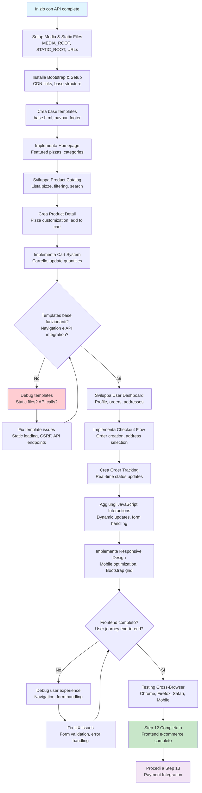

# Step 12: Frontend Templates & UI Development

## Obiettivo
Sviluppare l'interfaccia utente completa per PizzaMama Enterprise utilizzando Django Templates, Bootstrap 5 e JavaScript vanilla per creare un'esperienza e-commerce moderna e responsive che si integra perfettamente con le API già sviluppate.

---

## Prerequisiti
- **Step 11 completato** → API REST completa funzionante
- **Database popolato** → Dati di test per products, categories, users
- **API endpoints testati** → /api/products/, /api/orders/, /api/accounts/ operativi

---

## Flowchart Step 12



---

## Features da Implementare

### 12.1 Media & Static Files Configuration
- **MEDIA_ROOT** setup per upload immagini
- **STATIC_ROOT** per CSS, JS, Bootstrap
- **URL configuration** per servire file statici
- **Image handling** per pizza galleries

### 12.2 Base Template System
- **base.html** template foundation con Bootstrap CDN
- **Navbar** con user authentication status
- **Footer** con business info
- **Messages framework** per notifications
- **Responsive layout** Bootstrap 5

### 12.3 Homepage & Catalog
- **Homepage** con featured pizzas
- **Category navigation** hierarchical
- **Product grid** con Bootstrap cards
- **Search functionality** con JavaScript
- **Filtering system** per dietary needs

### 12.4 Product Detail & Cart
- **Pizza detail page** con image gallery
- **Customization interface** per ingredienti
- **Size selection** con price update
- **Add to cart** con JavaScript fetch API
- **Cart management** real-time updates

### 12.5 User Dashboard
- **Profile management** con avatar upload
- **Address book** CRUD operations
- **Order history** con tracking links
- **Loyalty points** display
- **Preferences** dietary settings

### 12.6 Checkout & Orders
- **Checkout flow** multi-step
- **Address selection** from user addresses
- **Order summary** con totals calculation
- **Order confirmation** page
- **Order tracking** real-time status

---

## Template Structure Enterprise

```
src/
├── static/                           ← Static files (NEW)
│   ├── css/
│   │   └── custom.css               ← Minimal custom CSS
│   ├── js/
│   │   ├── main.js                  ← Main JavaScript
│   │   ├── cart.js                  ← Cart functionality
│   │   ├── products.js              ← Product interactions
│   │   └── auth.js                  ← Authentication handling
│   └── images/
│       ├── logo.png
│       └── hero-bg.jpg
├── media/                           ← User uploads (NEW)
│   ├── pizzas/                      ← Pizza images
│   ├── categories/                  ← Category images
│   └── avatars/                     ← User avatars
└── templates/                       ← Template files (NEW)
    ├── base.html                    ← Base template with Bootstrap
    ├── partials/                    ← Reusable components
    │   ├── navbar.html
    │   ├── footer.html
    │   └── messages.html
    ├── pages/                       ← Main pages
    │   ├── home.html               ← Homepage
    │   └── about.html
    ├── products/                    ← Product templates
    │   ├── catalog.html            ← Product listing
    │   ├── detail.html             ← Product detail
    │   └── search.html             ← Search results
    ├── cart/                        ← Cart templates
    │   ├── cart.html               ← Cart page
    │   └── checkout.html           ← Checkout flow
    ├── orders/                      ← Order templates
    │   ├── detail.html             ← Order detail
    │   ├── tracking.html           ← Tracking page
    │   └── history.html            ← User orders
    ├── accounts/                    ← User account templates
    │   ├── login.html              ← Login page
    │   ├── register.html           ← Registration
    │   ├── profile.html            ← User profile
    │   └── dashboard.html          ← User dashboard
    └── errors/                      ← Error pages
        ├── 404.html
        ├── 500.html
        └── 403.html
```

---

## Tecnologie Frontend

### **Bootstrap 5 (CDN)**
- **Responsive grid** system
- **Component library** (cards, modals, forms)
- **Utility classes** spacing, colors
- **Mobile-first** approach

### **JavaScript Vanilla**
- **Fetch API** per chiamate AJAX
- **DOM manipulation** per interazioni
- **Event handling** per forms
- **Local storage** per cart persistence

### **Minimal Custom CSS**
- **Brand colors** PizzaMama
- **Component tweaks** solo se necessario
- **Custom utilities** minimal
- **Responsive overrides** solo critical

---

## JavaScript Architecture

### **Modular Structure**
```javascript
// main.js - Core functionality
// cart.js - Shopping cart management
// products.js - Product interactions
// auth.js - Authentication handling
```

### **API Integration**
```javascript
// Fetch API per comunicazione con Django REST
// Token authentication handling
// Error handling e user feedback
// Real-time updates
```

### **State Management**
```javascript
// Local storage per cart persistence
// Session management
// User preferences
// Form state handling
```

---

## User Experience Flow

### **Customer Journey**
1. **Homepage** → Browse featured pizzas
2. **Category** → Navigate to specific types
3. **Search** → Find specific pizzas
4. **Product Detail** → Customize order
5. **Cart** → Review selections
6. **Checkout** → Complete order
7. **Tracking** → Monitor delivery

### **Responsive Breakpoints**
- **Mobile:** < 768px → Stacked layout
- **Tablet:** 768px - 1024px → 2-column grid
- **Desktop:** > 1024px → 3-4 column grid
- **Large:** > 1400px → Full width utilization

---

## JavaScript Integration Points

### **Cart Operations**
```javascript
// Add to cart with fetch API
// Update quantities with real-time totals
// Remove items with confirmation
// Persist cart in localStorage
```

### **Search & Filtering**
```javascript
// Live search with debouncing
// Filter updates without page reload
// URL state management
// Results pagination
```

### **Authentication**
```javascript
// Token-based API authentication
// Form validation
// Password strength checking
// Auto-logout on token expiry
```

---

## Performance Strategy

### **Bootstrap Optimization**
- **CDN delivery** per fast loading
- **Selective components** se possibile
- **Minimal custom CSS** overrides
- **Responsive images** con Bootstrap classes

### **JavaScript Optimization**
- **Vanilla JS** per performance
- **Modular loading** per code splitting
- **Debouncing** per search e scroll
- **Lazy loading** per images

### **Caching Strategy**
- **Browser caching** per static assets
- **API response caching** in localStorage
- **Template fragment** caching
- **CDN** per static files

---

## Development Approach

### **Progressive Enhancement**
- **HTML first** → Funziona senza JavaScript
- **Bootstrap styling** → Professional appearance
- **JavaScript enhancement** → Rich interactions
- **Mobile responsive** → Bootstrap grid

### **API-First Integration**
- **RESTful** communication
- **Token authentication**
- **Error handling**
- **Real-time updates**

---

## Cosa Realizzeremo

### **Complete E-commerce Frontend**
- **Responsive** design con Bootstrap 5
- **Modern** UI con minimal custom CSS
- **Interactive** features con JavaScript
- **Performance** optimized

### **Business Features**
- **Product catalog** browsing
- **Shopping cart** management
- **User** authentication
- **Order** tracking

### **Enterprise Quality**
- **Scalable** template architecture
- **Maintainable** code structure
- **SEO** optimized
- **Accessibility** compliant

---

## Files da Creare

### **Configuration Files**
- `pizzamama/settings.py` (update)
- `pizzamama/urls.py` (update)

### **Template Files**
- `templates/base.html`
- `templates/partials/navbar.html`
- `templates/partials/footer.html`
- `templates/pages/home.html`
- `templates/products/catalog.html`
- `templates/products/detail.html`
- `templates/cart/cart.html`
- `templates/accounts/login.html`
- `templates/accounts/register.html`

### **Static Files**
- `static/js/main.js`
- `static/js/cart.js`
- `static/js/products.js`
- `static/css/custom.css`

### **Views Files**
- `apps/products/views.py` (update)
- `apps/accounts/views.py` (update)
- `apps/orders/views.py` (update)
- `pizzamama/views.py` (new)

---

## Prossimo Step

Una volta completato Step 12:

1. **Frontend funzionante** → Complete user interface
2. **E-commerce workflow** → End-to-end customer journey
3. **Procedi** a **Step 13: Payment Integration**

---

## Checklist Completamento Step 12

- [ ] **Media & Static configurati** → MEDIA_ROOT, STATIC_ROOT setup
- [ ] **Bootstrap integrato** → CDN links, responsive grid
- [ ] **Base templates** → base.html, navbar, footer
- [ ] **Homepage** → Featured pizzas, hero section
- [ ] **Product catalog** → Listing, search, filtering
- [ ] **Product detail** → Customization, add to cart
- [ ] **Cart system** → JavaScript interactions, persistence
- [ ] **User authentication** → Login, register, dashboard
- [ ] **Responsive design** → Mobile, tablet, desktop
- [ ] **JavaScript functionality** → API integration, real-time updates

**Una volta completata la checklist, avrai un e-commerce frontend completo!**